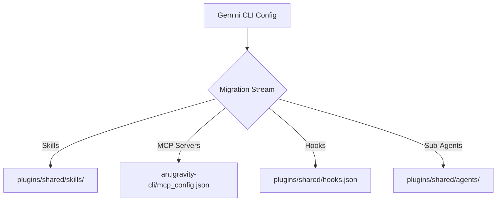

# Concept — Migration Antigravity CLI & Fusion Heartbeat × Symphony (SDK)

## 1. Vision & Objectifs Souverains

Avec la dépréciation programmée de l'ancien écosystème **Gemini CLI** au **18 juin 2026**, le stack A'Space OS V2 doit opérer une transition immédiate, robuste et sans perte d'historique vers **Antigravity CLI**. 

L'opportunité majeure de cette transition réside dans l'intégration d'**Antigravity SDK**. Nous fusionnons ici le modèle **Heartbeat 2026** (exécution éphémère sans démon persistant, "No-Runtime Tick-Based") avec la spécification **OpenAI Symphony** (réconciliation d'état, isolation des tâches et gestion de pannes) au sein d'une couche d'orchestration orchestrée directement par le SDK d'Antigravity.

---

## 2. Étape 1 : Stratégie de Migration & Recyclage de Configuration

La migration ne consiste pas à tout réécrire, mais à encapsuler nos acquis Gemini CLI dans la structure modulaire de **plugins** d'Antigravity CLI.



### A. Recyclage des Skills (Compétences)
Les dossiers de Skills existants (tels que `tdd-workflow`, `adr-architecture`, etc.) sont hautement compatibles car le harnais sous-jacent réutilise le formalisme Markdown/YAML.
* **Cible :** Regrouper les skills dans un plugin partagé appelé `sovereign-core`.
* **Chemin local du workspace :** `<workspace_root>/.agents/plugins/sovereign-core/skills/`
* **Chemin global :** `~/.gemini/antigravity-cli/plugins/sovereign-core/skills/`
* **Vérification :** Chaque skill doit avoir son fichier `SKILL.md` avec le YAML frontmatter validé.

### B. Migration MCP (Model Context Protocol)
Les serveurs MCP configurés dans `~/.claude.json` ou `~/.gemini/mcp_servers` doivent être consolidés.
* **Action :** Fusionner les configurations dans le fichier de configuration centralisé de la CLI Antigravity.
* **Chemin cible :** `~/.gemini/antigravity-cli/mcp_config.json`
* **Commande de migration/configuration :** Utilisez `/mcp` pour ajouter ou modifier dynamiquement les terminaux de serveurs MCP sans risque de corruption manuelle.

### C. Standardisation des Hooks (`hooks.json`)
Les scripts de détection automatique, tels que notre watchdog `skill-reflex-detect.ps1`, doivent être intégrés au cycle d'interception d'Antigravity.
* **Action :** Créer un fichier `hooks.json` dans le plugin `sovereign-core`.
* **Mappage des événements :**
  ```json
  {
    "sovereign-watchdog": {
      "BeforeToolUse": [
        {
          "matcher": "run_command",
          "hooks": [
            {
              "type": "run_command",
              "command": "powershell -File C:/Users/amado/.claude/bin/security-pre-check.ps1"
            }
          ]
        }
      ],
      "PostToolUse": [
        {
          "matcher": "write_to_file",
          "hooks": [
            {
              "type": "run_command",
              "command": "powershell -File C:/Users/amado/.claude/bin/skill-reflex-detect.ps1"
            }
          ]
        }
      ]
    }
  }
  ```

### D. Modernisation des Sous-Agents (Sub-Agents)
Les capsules d'agents existantes (les 5 fichiers standard : `Soul.md`, `Agent.md`, `Heartbeat.md`, `Tools.md`, `Context.md`) migrent dans le sous-dossier `agents` du plugin sovereign.
* **Chemin cible :** `~/.gemini/antigravity-cli/plugins/sovereign-core/agents/<agent_name>/`
* **Exécution :** Invocable à la demande via l'outil natif de sous-agent avec `TypeName="sovereign-core/<agent_name>"`.

### E. Configuration d'Antigravity IDE & Synthèse Vocale (TTS Français)

Lors de la transition, l'interface utilisateur de l'IDE Antigravity et l'agent ont été optimisés pour un support sonore et visuel souverain :
1. **Redirection de la Barre Latérale (Secondary Sidebar)** : L'extension Claude Code v2.1.168 sur Antigravity IDE (basé sur VS Code) tentait de s'enregistrer par défaut dans la Sidebar secondaire droite (`claude-sidebar-secondary`) qui est fermée. Un patch a été appliqué dans `extension.js` (`f>=106` -> `f>=999`) pour forcer `doesNotSupportSecondarySidebar=true` et rediriger la WebView sur la Sidebar principale gauche.
2. **Migration des Voix TTS Françaises (SAPI5)** : Les voix Speech_OneCore de Windows (`fr-FR Hortense/Julie/Paul`) ont été portées dans le registre utilisateur SAPI5 (`HKCU\SOFTWARE\Microsoft\Speech\Voices\Tokens`) pour être exploitables par l'extension de lecture sonore.
3. **Paramétrage par défaut** : Injection de `"read-allowed.voice": "Microsoft Hortense Desktop"` dans `settings.json` des profils utilisateurs d'Antigravity et d'Antigravity IDE.

---

## 3. Étape 2 : Fusion "Heartbeat × Symphony" via Antigravity SDK

La fusion combine la légèreté éphémère du **Heartbeat** (Tick-Based) et la rigueur transactionnelle de **Symphony** en utilisant **Antigravity SDK** comme moteur d'exécution et de réconciliation.

### A. Les Principes Core de la Fusion
1. **Zéro Runtime Persistant (Heartbeat) :** L'orchestrateur ne tourne pas en boucle infinie (pas de daemon RAM/CPU). C'est un simple script (le "Tick Runner") déclenché par le planificateur de tâches de l'OS.
2. **Reconciliation Transactionnelle (Symphony) :** À chaque tick, le runner analyse le dossier de travail (`memory/`) pour synchroniser l'état physique du filesystem avec l'avancement des tâches déclarées.
3. **Persistance par Artifacts :** L'état courant de l'exécution (`task.md`, `implementation_plan.md`) sert de base de données d'état. Si un crash survient, le tick suivant reprend exactement là où le fichier physique s'est arrêté.

```
+-------------------------------------------------------------+
|                     OS Scheduler (Cron)                     |
+------------------------------+------------------------------+
                               | (Tique toutes les X minutes)
                               v
+-------------------------------------------------------------+
|                 Tick Runner (PowerShell/Python)             |
|                                                             |
|  1. WAKE       --> Initialise la session                     |
|  2. RECONCILE --> Scanne memory/inbox/ et memory/outbox/    |
|  3. EXECUTE   --> Appelle Antigravity SDK (Moteur d'Agent)  |
|  4. OBSERVE   --> Traite les fichiers de sortie / Artifacts |
|  5. SIGNAL    --> Écrit dans pulse.log & rejections.log     |
|  6. SLEEP     --> Ferme le processus et libère la RAM       |
+-------------------------------------------------------------+
```

### B. Implémentation de la Spécification Symphony dans le SDK

Le SDK Antigravity fournit les primitives d'exécution de l'agent. Le **Tick Runner** injecte la logique Symphony au-dessus de ces primitives :

#### 1. Machine à États Symphony (File-Based)
Les dossiers physiques `memory/inbox/` et `memory/outbox/` portent l'état des tâches :
* `Pending` : Fichier de mission déposé dans `memory/inbox/`.
* `In-Progress` : Fichier copié dans `memory/outbox/<mission_id>/` avec un timestamp actif.
* `Stalled` : Aucun changement sur les fichiers physiques de `<mission_id>` depuis une durée supérieure à `stall_timeout_min`.
* `Failed` : L'agent a terminé avec un marqueur d'échec ou a atteint le nombre maximum de retries (enregistré dans `rejections.log`).
* `Succeeded` : Présence de l'artifact final ou de la signature `<DONE>` dans la queue de sortie.

#### 2. Logique de Dispatching & Slots
* À chaque tique, le Runner compte les dossiers dans `memory/outbox/` ayant le statut `In-Progress`.
* Si le nombre est inférieur à la limite configurée (ex: 3 slots max), le Runner récupère la tâche la plus prioritaire dans `memory/inbox/` et l'instancie en utilisant le SDK d'Antigravity.

#### 3. Stall Recovery (Récupération Anti-Fragile)
Si une tâche est marquée `Stalled` :
* Le Runner envoie un signal d'interruption au processus en cours.
* Il incrémente le compteur de tentatives et recrée un contexte propre à partir du dernier artifact valide enregistré sur le disque.
* Il ré-exécute l'agent avec une consigne renforcée de reprise sur incident.

---

## 4. Schéma Directeur des Tâches Scheduler

Trois cadences de "Tique" (Heartbeat) régissent le système global selon le niveau de criticité et le budget de tokens :

| Couche | Nom de la Tâche | Cadence | CLI / SDK Cible | Mission Principale |
| :--- | :--- | :--- | :--- | :--- |
| **Shadow L0** | `ASpace-L0-Audit` | 60 min | Antigravity CLI | Audit du LLM Wiki, détection des dérives d'indexation, hygiène des secrets et génération de skills. |
| **Shadow L1** | `ASpace-L1-LifeOS` | 30 min | Antigravity SDK | Synchronisation du Life OS (Baserow, scorecards hebdomadaires, anomalies de calendrier). |
| **Shadow L2** | `ASpace-L2-BizPulse`| 5 min | Antigravity SDK (MiniMax) | Surveillance des pipelines de production (logs, incidents, leads, budgets d'API). |

---

## 5. Prochaines Étapes de Déploiement

1. **Création du Plugin Central :** Initialiser le plugin `sovereign-core` dans `<workspace_root>/.agents/plugins/`.
2. **Migration des Fichiers Physiques :** Déplacer les dossiers de skills et les serveurs MCP.
3. **Scaffolding du Tick Runner SDK :** Écrire un script template Python/PowerShell combinant `import antigravity` (le SDK) avec la réconciliation Symphony.
4. **Validation Supervisée :** Lancer un premier tour manuel (`dry-run`) pour valider la génération correcte des artifacts sans dérive de contexte.
