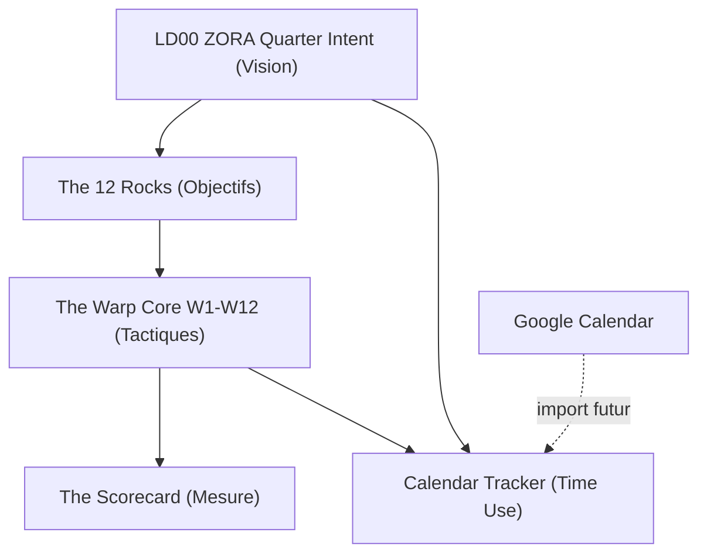

# Life OS Baserow 12WY Architecture Analysis — 2026-05-17

## Executive Summary

La base Life OS a radicalement evolue depuis l'analyse precedente.

L'architecture actuelle n'est plus seulement:

`LD 00 Life Wheel Zora` + `12WY Warp Core`

Elle est maintenant une transposition complete des 5 disciplines du 12 Week Year:

| Discipline 12WY | Table Baserow | Role |
|-----------------|---------------|------|
| Vision | `LD00 ZORA Quarter Intent (Vision)` / table `980285` | Cap trimestriel par domaine, scores ZORA, veto Beth |
| Planning | `The 12 Rocks (Objectifs)` / table `981212` | Objectifs trimestriels, DoD, progression |
| Process Control | `The Warp Core W1-W12 (Tactiques)` / table `980422` | Tactiques hebdo, statuts, semaines |
| Measurement | `The Scorecard (Mesure)` / table `981218` | Lead/Lag metrics, cible/reel/preuve |
| Time Use | `Calandar Tracker (Time Use)` / table `981232` | Blocs temps, discipline, focus |

Diagnostic: la separation conceptuelle est bonne. Le systeme est encore en phase ossature: les tables existent, les relations existent, mais les lignes utiles sont presque toutes vides.

## Tables Detectees

| Table ID | Nom logique | Rows | Etat |
|----------|-------------|------|------|
| `980285` | `LD00 ZORA Quarter Intent (Vision)` | 10 | Structure riche, domaines presents |
| `981212` | `The 12 Rocks (Objectifs)` | 2 | Table creee, lignes vides |
| `980422` | `The Warp Core W1-W12 (Tactiques)` | 2 | Table creee, lignes vides |
| `981218` | `The Scorecard (Mesure)` | 2 | Table creee, lignes vides |
| `981232` | `Calandar Tracker (Time Use)` | 4 | Exemples de blocs crees, champs non renseignes |

## 1. Vision — LD00 ZORA Quarter Intent

Table ID: `980285`

### Role

Cockpit Life Wheel: domaines, intentions trimestrielles, sante systeme, scores ZORA, routage Morty, veto Beth, liens vers Rocks, Tactiques et Time Use.

### Champs Structurants

| Champ | Type | Analyse |
|-------|------|---------|
| `Nom du Domaine` | text primary | Domaine LD00-LD09 |
| `Veto Beth` | boolean | Garde-fou conscience |
| `Morty Routing` | single_select | Route vers 12WY, PARA, GTD, DEAL, ZORA, Ikigai |
| `Sante du Systeme` | single_select | Etat qualitatif ZORA |
| `Score Initial ZORA [T0]` | rating | Baseline |
| `Score ZORA Actuel` | rating | Mesure courante |
| `Score ZORA Cible [T+12]` | rating | Cible fin cycle |
| `Delta Velocite` | formula | `Score ZORA Actuel - Score Initial ZORA [T0]` |
| `Priorite du Cycle Actif` | boolean | Filtre focus |
| `Vision (Intent)` | long_text | 3 intentions par domaine |
| `Anti-Goals` | long_text | Bornes negatives |
| `Nom du Cycle` | text | Cycle a nommer |
| `Horizon Aligne` | single_select | H1, H3, H10, H30, H90 |
| `Statut` | single_select | Preparation, Actif, Cloture |
| `The 12 Rocks (Objectifs)` | link_row -> `981212` | Vision -> Rocks |
| `The Warp Core W1-W12 (Tactiques)` | link_row -> `980422` | Vision -> tactiques |
| `Calandar Tracker (Time Use)` | link_row -> `981232` | Vision -> temps |

### Diagnostic

LD00 est maintenant le bon cockpit. Le pattern le plus important est deja present: Vision -> Rocks -> Tactiques -> Time Use.

Points a corriger:

- `Actif` est false partout alors que plusieurs domaines sont prioritaires.
- Scores ZORA sont a `0`, donc les deltas ne mesurent rien pour l'instant.
- `Nom du Cycle` est vide.
- Certaines valeurs de `Vision (Intent)` sont encore placeholder.

## 2. Planning — The 12 Rocks (Objectifs)

Table ID: `981212`

### Role

Pont strategique entre intentions trimestrielles et tactiques hebdomadaires.

### Champs

| Champ | Type | Analyse |
|-------|------|---------|
| `Nom du Rock` | text primary | Objectif trimestriel |
| `Domaine de Vie` | single_select | Actuellement sans options |
| `Definition of Done (DoD)` | long_text | Tres bon champ, essentiel |
| `Statut` | single_select | On Track, At Risk, Off Track, Done, Cut |
| `Progression %` | number | Mesure de progression |
| `Preuve SSOT` | url | Lien preuve |
| `LD00 ZORA Quarter Intent (Vision)` | link_row -> `980285` | Rock rattache a la vision |
| `The Warp Core W1-W12 (Tactiques)` | link_row -> `980422` | Rock decomposable en tactiques |

### Diagnostic

La table est conceptuellement juste, mais les deux lignes actuelles sont vides.

Point d'attention: `Domaine de Vie` est un `single_select` sans options, alors que le lien `LD00 ZORA Quarter Intent` existe deja. Pour eviter la double saisie, preferer le lien LD00 comme source de verite. `Domaine de Vie` peut devenir un champ derive/lookup plus tard, ou etre supprime si redondant.

## 3. Process Control — The Warp Core W1-W12 (Tactiques)

Table ID: `980422`

### Role

Table tactique hebdomadaire. Elle ne doit pas porter la vision; elle doit porter le comportement executable.

### Champs

| Champ | Type | Analyse |
|-------|------|---------|
| `Nom du Rock` | text primary | Nom actuel ambigu pour une table de tactiques |
| `Domaine ZORA` | link_row -> `980285` | Tactique rattachee a un domaine |
| `Type de Vecteur` | single_select | Projet ou Habitude |
| `Statut` | single_select | Backlog, Doing, Done, Off Track |
| `Semaines d'Activation` | multiple_select | W1-W13 |
| `KPI / Regle de Succes` | text | Definition de completion tactique |
| `Score de Confiance` | rating | Signal subjectif utile |
| `Note Obsidian / PAR` | url | Lien documentation |
| `The 12 Rocks (Objectifs)` | link_row -> `981212` | Tactique rattachee a un Rock |
| `The Scorecard (Mesure)` | link_row -> `981218` | Tactique rattachee aux mesures |
| `Calandar Tracker (Time Use)` | link_row -> `981232` | Tactique rattachee aux blocs temps |

### Diagnostic

La table a les bonnes relations. La fragilite est semantique: le champ primaire s'appelle encore `Nom du Rock`, alors que cette table est celle des tactiques.

Recommandation:

- renommer `Nom du Rock` en `Nom de la Tactique`;
- garder la table `The 12 Rocks` pour les objectifs trimestriels;
- utiliser `The 12 Rocks (Objectifs)` comme lien parent obligatoire.

## 4. Measurement — The Scorecard (Mesure)

Table ID: `981218`

### Role

Table de mesure 12WY: lead indicators et lag indicators.

### Champs

| Champ | Type | Analyse |
|-------|------|---------|
| `ID Metrique` | text primary | Identifiant de mesure |
| `Semaine` | link_row -> `980422` | Actuellement lie aux tactiques, pas a une vraie table semaine |
| `Type de Metrique` | single_select | Lead ou Lag |
| `Indicateur` | number | Valeur indicateur |
| `Cible` | number | Target |
| `Realise` | number | Realise |
| `Preuve` | url | Preuve SSOT |

### Diagnostic

La table est utile, mais `Semaine` pointe vers `The Warp Core W1-W12 (Tactiques)`. Ce n'est pas fatal si une metrique mesure une tactique. Mais si tu veux une scorecard hebdomadaire globale, il faudra soit:

- renommer `Semaine` en `Tactique Mesuree`;
- ou creer une vraie table `Weeks / Cycle W1-W13`;
- ou ajouter un champ `Semaine du Cycle` en single_select W1-W13.

## 5. Time Use — Calandar Tracker (Time Use)

Table ID: `981232`

### Role

Table de discipline temporelle: mesure l'ecart entre calendrier prevu et execution reelle.

### Champs

| Champ | Type | Analyse |
|-------|------|---------|
| `Nom de l'Evenement` | text primary | Bloc temps |
| `Type de Bloc` | single_select | Strategic, Buffer, Breakout, Routine |
| `Date de l'Evenement` | date | Calendrier |
| `Semaine du Cycle` | single_select | W1-W13 META |
| `Domaine Aligne` | link_row -> `980285` | Temps rattache a un domaine |
| `Tactique Executee` | link_row -> `980422` | Temps rattache a une tactique |
| `Duree Prevue` | duration | Temps planifie |
| `Duree Reelle` | duration | Temps reel |
| `Statut de Discipline` | single_select | Tenu, Partiel, Echoue |
| `Score de Focus` | rating | Attention interne |

### Diagnostic

Le design est excellent pour la 5e discipline 12WY. Les 4 lignes actuelles sont des exemples utiles, mais les champs de telemetrie ne sont pas encore renseignes.

Point mineur: le nom de table semble etre `Calandar Tracker` au lieu de `Calendar Tracker`. A corriger si tu veux une convention propre.

## Graphe Relationnel

## Findings

1. Architecture saine: la separation Vision / Rocks / Tactiques / Scorecard / Time Use respecte le 12WY.
2. Donnees encore vides: le systeme est structurellement pret, mais pas encore operationnel.
3. Ambiguite de nommage: `Warp Core` utilise encore `Nom du Rock` comme primaire.
4. Redondance possible: `Domaine de Vie` dans Rocks est un select vide alors que le lien LD00 existe.
5. Scorecard doit clarifier si elle mesure une semaine, une tactique, ou un KPI global.
6. Time Use est la piece la plus mature pour connecter Google Calendar plus tard.

## Ordre De Peuplement Recommande

1. Remplir `LD00`:
   - `Nom du Cycle`;
   - `Vision (Intent)`;
   - `Anti-Goals`;
   - scores ZORA initiaux/cibles;
   - `Actif` coherent avec `Priorite du Cycle Actif`.
2. Creer 1 a 3 Rocks dans `The 12 Rocks`, pas 96 tout de suite.
3. Pour chaque Rock, creer 2 a 5 tactiques dans `The Warp Core`.
4. Creer les lignes Scorecard correspondant aux tactiques critiques.
5. Creer ou importer les blocs Time Use depuis Google Calendar.

## Minimum Viable Cycle

Pour rendre le systeme vivant sans l'alourdir:

- 3 domaines actifs maximum;
- 3 Rocks maximum;
- 9 tactiques maximum;
- 1 Scorecard hebdo;
- 3 blocs temps par semaine: Strategic, Buffer, Breakout.

## Preuves

Analyse via API Baserow, token masque:

- `GET /api/database/fields/table/980285/`
- `GET /api/database/fields/table/981212/`
- `GET /api/database/fields/table/980422/`
- `GET /api/database/fields/table/981218/`
- `GET /api/database/fields/table/981232/`
- `GET /api/database/rows/table/{table_id}/?user_field_names=true&size=5`

Context7 consulte:

- `/baserow/baserow`

## Risques Residuals

- Le token ne permet toujours pas de garantir que toutes les tables de la database sont listables.
- Les tables peuvent changer manuellement dans l'UI apres cette analyse.
- Les lignes exemples vides peuvent fausser les compteurs tant qu'elles ne sont pas supprimees ou renseignees.
- Les integrations Google Calendar / n8n / Symphony ne sont pas encore verifiees.
