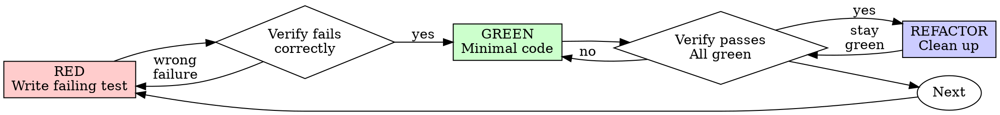

## >>> UTILISATEUR #1

You are fixing Task 2 (walk_scatter_sources.py) based on reviewer findings. Commit `61ea372` is on `main`; your fix will be a new commit on top.

## Context

Sister spec: `ASpace_OS_V2/docs/superpowers/specs/2026-07-31-cognition-unification-design.md`. Working dir: `C:/Users/amado/ASpace_OS_V2/`.

Reviewer findings (HIGH = must fix, MEDIUM = Important for correctness, LOW = optional polish):

### MUST FIX (HIGH)

**F1: `SOURCE_BUCKETS` exported but never wired into `walk()`** (`walk_scatter_sources.py:14-21, 69-86`)
Canonical defaults (`adr`, `handoff`, `draft`, `daily_note`, `early_canon`, `forensic`) are dead code. Without `--bucket-type`, every entry gets `source_type: "unknown"`.
**Fix**: wire `SOURCE_BUCKETS` as the default mapping — entries not matching user-supplied `--bucket-type` get the default source_type from the bucket-name match. Simplest approach: derive bucket_map from SOURCE_BUCKETS where the path matches a SOURCE_BUCKETS value's basename (e.g., `wiki/hand_offs` → matches `handoff` because the path contains `hand_offs`). OR: pre-compute default bucket_map keyed by absolute path of canonical sources: `{"/abs/_SPECS/ADR": "adr", "/abs/wiki/hand_offs": "handoff", ...}`. Pick ONE clear approach and document it.

**F2: Basename alias in bucket_map causes silent mis-classification** (`walk_scatter_sources.py:76-78, 83-85`)
Both absolute path AND `bucket_path.name` are stored in `bucket_map`. Two dirs sharing a basename → last-write-wins. `--source some/other/wiki` would match `--bucket-type wiki=handoff` for unrelated wiki.
**Fix**: drop the basename alias. Only absolute path matches. If a path doesn't match user-supplied `--bucket-type`, fall back to SOURCE_BUCKETS defaults (per F1 fix).

### IMPORTANT MEDIUM (also fix)

**F3: Silent skip on missing source dir** (`walk_scatter_sources.py:29-30`)
`if not source.exists(): return []` masks typos.
**Fix**: emit `click.echo(f"WARNING: source dir not found: {source}", err=True)` before returning empty list. Don't fail the run, but warn.

**F4: Dedup order non-deterministic** (`walk_scatter_sources.py:45-50`)
`rglob()` ordering is filesystem-dependent; first-wins picks different files on different runs.
**Fix**: pre-sort entries by `(source_type, path)` (or `(sha256, path)`) BEFORE dedup. Use Python `sorted()` with stable sort.

**F5: Malformed `--bucket-type` raises raw ValueError** (`walk_scatter_sources.py:74`)
**Fix**: `if "=" not in bucket: raise click.BadParameter(f"must be 'path=type', got: {bucket}")` (importable from `click`).

### SKIP (not Important, defer to future tasks)

- **MEDIUM** chunked hashing (perf, not correctness)
- **MEDIUM** sys.path portable tests (separate test infra concern)
- **MEDIUM** hardcoded .md (will need `--glob` flag for Task 6 e2e if .jsonl files needed)
- **LOW** type annotations, requirements.txt, race condition

## Your Job

1. Read the current `walk_scatter_sources.py` and `test_walk_scatter_sources.py` at `C:/Users/amado/ASpace_OS_V2/scripts/cognition/`.
2. Apply fixes F1-F5.
3. **Add tests** for the new behaviors:
   - Test: with no `--bucket-type`, source under `wiki/hand_offs` gets `source_type: "handoff"` (F1 wiring)
   - Test: with no `--bucket-type`, source under `_SPECS/ADR` gets `source_type: "adr"` (F1 wiring)
   - Test: missing source dir produces warning + empty list (F3)
   - Test: dedup determinism across multiple duplicate files (F4)
   - Test: malformed `--bucket-type` raises `click.BadParameter` (F5)
4. Run the FULL test suite (Task 1 + Task 2 tests) — must all pass.
5. Run with RED→GREEN TDD evidence: write failing test, see it fail, fix, see it pass.
6. Commit with message: `fix(cognition): wire SOURCE_BUCKETS + deterministic dedup + warning + click.BadParameter`
7. Self-review.
8. Write full report.
9. Report back.

## Code Organization

Keep `walk_scatter_sources.py` under 150 lines. One responsibility per helper. Don't introduce abstractions.

## Tests Must Cover

| Test name | Behavior |
|---|---|
| `test_walk_defaults_to_handoff_for_wiki_hand_offs` | F1: source in `wiki/hand_offs` without `--bucket-type` → `handoff` |
| `test_walk_defaults_to_adr_for_specs_adr` | F1: source in `_SPECS/ADR` → `adr` |
| `test_walk_warns_on_missing_source_dir` | F3: missing dir → warning + empty |
| `test_walk_dedup_deterministic` | F4: same SHA across N dupes → same first entry across runs |
| `test_walk_malformed_bucket_type_raises` | F5: `--bucket-type handoff` (no =) → `click.BadParameter` |

## Self-Review Questions

- Are F1-F5 ALL applied? Check each.
- Are new tests RED→GREEN verified?
- Does full suite pass (Task 1 5 tests + Task 2 6+5 new tests)?
- Is commit message clean?
- Did you skip any MEDIUM that was Important?

## Report Format

Write report to `C:/Users/amado/.superpowers/sdd/task-2-fix-report.md`:
- Fixes applied (F1-F5 mapped to file:line changes)
- TDD RED→GREEN evidence (commands + output)
- New test count + total passing count
- Files changed
- Self-review findings
- Concerns

Then report back with ONLY:
- **Status:** DONE | DONE_WITH_CONCERNS | BLOCKED
- Commits created (short SHA + subject)
- One-line test summary (e.g. "16/16 passing, output pristine")
- Concerns
- Report file path

## >>> UTILISATEUR #2

Base directory for this skill: C:\Users\amado\.claude\plugins\cache\claude-plugins-official\superpowers\6.0.3\skills\receiving-code-review

# Code Review Reception

## Overview

Code review requires technical evaluation, not emotional performance.

**Core principle:** Verify before implementing. Ask before assuming. Technical correctness over social comfort.

## The Response Pattern

```
WHEN receiving code review feedback:

1. READ: Complete feedback without reacting
2. UNDERSTAND: Restate requirement in own words (or ask)
3. VERIFY: Check against codebase reality
4. EVALUATE: Technically sound for THIS codebase?
5. RESPOND: Technical acknowledgment or reasoned pushback
6. IMPLEMENT: One item at a time, test each
```

## Forbidden Responses

**NEVER:**
- "You're absolutely right!" (explicit instruction-file violation)
- "Great point!" / "Excellent feedback!" (performative)
- "Let me implement that now" (before verification)

**INSTEAD:**
- Restate the technical requirement
- Ask clarifying questions
- Push back with technical reasoning if wrong
- Just start working (actions > words)

## Handling Unclear Feedback

```
IF any item is unclear:
  STOP - do not implement anything yet
  ASK for clarification on unclear items

WHY: Items may be related. Partial understanding = wrong implementation.
```

**Example:**
```
your human partner: "Fix 1-6"
You understand 1,2,3,6. Unclear on 4,5.

❌ WRONG: Implement 1,2,3,6 now, ask about 4,5 later
✅ RIGHT: "I understand items 1,2,3,6. Need clarification on 4 and 5 before proceeding."
```

## Source-Specific Handling

### From your human partner
- **Trusted** - implement after understanding
- **Still ask** if scope unclear
- **No performative agreement**
- **Skip to action** or technical acknowledgment

### From External Reviewers
```
BEFORE implementing:
  1. Check: Technically correct for THIS codebase?
  2. Check: Breaks existing functionality?
  3. Check: Reason for current implementation?
  4. Check: Works on all platforms/versions?
  5. Check: Does reviewer understand full context?

IF suggestion seems wrong:
  Push back with technical reasoning

IF can't easily verify:
  Say so: "I can't verify this without [X]. Should I [investigate/ask/proceed]?"

IF conflicts with your human partner's prior decisions:
  Stop and discuss with your human partner first
```

**your human partner's rule:** "External feedback - be skeptical, but check carefully"

## YAGNI Check for "Professional" Features

```
IF reviewer suggests "implementing properly":
  grep codebase for actual usage

  IF unused: "This endpoint isn't called. Remove it (YAGNI)?"
  IF used: Then implement properly
```

**your human partner's rule:** "You and reviewer both report to me. If we don't need this feature, don't add it."

## Implementation Order

```
FOR multi-item feedback:
  1. Clarify anything unclear FIRST
  2. Then implement in this order:
     - Blocking issues (breaks, security)
     - Simple fixes (typos, imports)
     - Complex fixes (refactoring, logic)
  3. Test each fix individually
  4. Verify no regressions
```

## When To Push Back

Push back when:
- Suggestion breaks existing functionality
- Reviewer lacks full context
- Violates YAGNI (unused feature)
- Technically incorrect for this stack
- Legacy/compatibility reasons exist
- Conflicts with your human partner's architectural decisions

**How to push back:**
- Use technical reasoning, not defensiveness
- Ask specific questions
- Reference working tests/code
- Involve your human partner if architectural

**If you're uncomfortable pushing back out loud:** Name that tension, then tell your partner about the issue you've seen. They'll appreciate your honesty.

## Acknowledging Correct Feedback

When feedback IS correct:
```
✅ "Fixed. [Brief description of what changed]"
✅ "Good catch - [specific issue]. Fixed in [location]."
✅ [Just fix it and show in the code]

❌ "You're absolutely right!"
❌ "Great point!"
❌ "Thanks for catching that!"
❌ "Thanks for [anything]"
❌ ANY gratitude expression
```

**Why no thanks:** Actions speak. Just fix it. The code itself shows you heard the feedback.

**If you catch yourself about to write "Thanks":** DELETE IT. State the fix instead.

## Gracefully Correcting Your Pushback

If you pushed back and were wrong:
```
✅ "You were right - I checked [X] and it does [Y]. Implementing now."
✅ "Verified this and you're correct. My initial understanding was wrong because [reason]. Fixing."

❌ Long apology
❌ Defending why you pushed back
❌ Over-explaining
```

State the correction factually and move on.

## Common Mistakes

| Mistake | Fix |
|---------|-----|
| Performative agreement | State requirement or just act |
| Blind implementation | Verify against codebase first |
| Batch without testing | One at a time, test each |
| Assuming reviewer is right | Check if breaks things |
| Avoiding pushback | Technical correctness > comfort |
| Partial implementation | Clarify all items first |
| Can't verify, proceed anyway | State limitation, ask for direction |

## Real Examples

**Performative Agreement (Bad):**
```
Reviewer: "Remove legacy code"
❌ "You're absolutely right! Let me remove that..."
```

**Technical Verification (Good):**
```
Reviewer: "Remove legacy code"
✅ "Checking... build target is 10.15+, this API needs 13+. Need legacy for backward compat. Current impl has wrong bundle ID - fix it or drop pre-13 support?"
```

**YAGNI (Good):**
```
Reviewer: "Implement proper metrics tracking with database, date filters, CSV export"
✅ "Grepped codebase - nothing calls this endpoint. Remove it (YAGNI)? Or is there usage I'm missing?"
```

**Unclear Item (Good):**
```
your human partner: "Fix items 1-6"
You understand 1,2,3,6. Unclear on 4,5.
✅ "Understand 1,2,3,6. Need clarification on 4 and 5 before implementing."
```

## GitHub Thread Replies

When replying to inline review comments on GitHub, reply in the comment thread (`gh api repos/{owner}/{repo}/pulls/{pr}/comments/{id}/replies`), not as a top-level PR comment.

## The Bottom Line

**External feedback = suggestions to evaluate, not orders to follow.**

Verify. Question. Then implement.

No performative agreement. Technical rigor always.

## >>> UTILISATEUR #3

Base directory for this skill: C:\Users\amado\.claude\plugins\cache\claude-plugins-official\superpowers\6.0.3\skills\test-driven-development

# Test-Driven Development (TDD)

## Overview

Write the test first. Watch it fail. Write minimal code to pass.

**Core principle:** If you didn't watch the test fail, you don't know if it tests the right thing.

**Violating the letter of the rules is violating the spirit of the rules.**

## When to Use

**Always:**
- New features
- Bug fixes
- Refactoring
- Behavior changes

**Exceptions (ask your human partner):**
- Throwaway prototypes
- Generated code
- Configuration files

Thinking "skip TDD just this once"? Stop. That's rationalization.

## The Iron Law

```
NO PRODUCTION CODE WITHOUT A FAILING TEST FIRST
```

Write code before the test? Delete it. Start over.

**No exceptions:**
- Don't keep it as "reference"
- Don't "adapt" it while writing tests
- Don't look at it
- Delete means delete

Implement fresh from tests. Period.

## Red-Green-Refactor



### RED - Write Failing Test

Write one minimal test showing what should happen.

<Good>
```typescript
test('retries failed operations 3 times', async () => {
  let attempts = 0;
  const operation = () => {
    attempts++;
    if (attempts < 3) throw new Error('fail');
    return 'success';
  };

  const result = await retryOperation(operation);

  expect(result).toBe('success');
  expect(attempts).toBe(3);
});
```
Clear name, tests real behavior, one thing
</Good>

<Bad>
```typescript
test('retry works', async () => {
  const mock = jest.fn()
    .mockRejectedValueOnce(new Error())
    .mockRejectedValueOnce(new Error())
    .mockResolvedValueOnce('success');
  await retryOperation(mock);
  expect(mock).toHaveBeenCalledTimes(3);
});
```
Vague name, tests mock not code
</Bad>

**Requirements:**
- One behavior
- Clear name
- Real code (no mocks unless unavoidable)

### Verify RED - Watch It Fail

**MANDATORY. Never skip.**

```bash
npm test path/to/test.test.ts
```

Confirm:
- Test fails (not errors)
- Failure message is expected
- Fails because feature missing (not typos)

**Test passes?** You're testing existing behavior. Fix test.

**Test errors?** Fix error, re-run until it fails correctly.

### GREEN - Minimal Code

Write simplest code to pass the test.

<Good>
```typescript
async function retryOperation<T>(fn: () => Promise<T>): Promise<T> {
  for (let i = 0; i < 3; i++) {
    try {
      return await fn();
    } catch (e) {
      if (i === 2) throw e;
    }
  }
  throw new Error('unreachable');
}
```
Just enough to pass
</Good>

<Bad>
```typescript
async function retryOperation<T>(
  fn: () => Promise<T>,
  options?: {
    maxRetries?: number;
    backoff?: 'linear' | 'exponential';
    onRetry?: (attempt: number) => void;
  }
): Promise<T> {
  // YAGNI
}
```
Over-engineered
</Bad>

Don't add features, refactor other code, or "improve" beyond the test.

### Verify GREEN - Watch It Pass

**MANDATORY.**

```bash
npm test path/to/test.test.ts
```

Confirm:
- Test passes
- Other tests still pass
- Output pristine (no errors, warnings)

**Test fails?** Fix code, not test.

**Other tests fail?** Fix now.

### REFACTOR - Clean Up

After green only:
- Remove duplication
- Improve names
- Extract helpers

Keep tests green. Don't add behavior.

### Repeat

Next failing test for next feature.

## Good Tests

| Quality | Good | Bad |
|---------|------|-----|
| **Minimal** | One thing. "and" in name? Split it. | `test('validates email and domain and whitespace')` |
| **Clear** | Name describes behavior | `test('test1')` |
| **Shows intent** | Demonstrates desired API | Obscures what code should do |

## Why Order Matters

**"I'll write tests after to verify it works"**

Tests written after code pass immediately. Passing immediately proves nothing:
- Might test wrong thing
- Might test implementation, not behavior
- Might miss edge cases you forgot
- You never saw it catch the bug

Test-first forces you to see the test fail, proving it actually tests something.

**"I already manually tested all the edge cases"**

Manual testing is ad-hoc. You think you tested everything but:
- No record of what you tested
- Can't re-run when code changes
- Easy to forget cases under pressure
- "It worked when I tried it" ≠ comprehensive

Automated tests are systematic. They run the same way every time.

**"Deleting X hours of work is wasteful"**

Sunk cost fallacy. The time is already gone. Your choice now:
- Delete and rewrite with TDD (X more hours, high confidence)
- Keep it and add tests after (30 min, low confidence, likely bugs)

The "waste" is keeping code you can't trust. Working code without real tests is technical debt.

**"TDD is dogmatic, being pragmatic means adapting"**

TDD IS pragmatic:
- Finds bugs before commit (faster than debugging after)
- Prevents regressions (tests catch breaks immediately)
- Documents behavior (tests show how to use code)
- Enables refactoring (change freely, tests catch breaks)

"Pragmatic" shortcuts = debugging in production = slower.

**"Tests after achieve the same goals - it's spirit not ritual"**

No. Tests-after answer "What does this do?" Tests-first answer "What should this do?"

Tests-after are biased by your implementation. You test what you built, not what's required. You verify remembered edge cases, not discovered ones.

Tests-first force edge case discovery before implementing. Tests-after verify you remembered everything (you didn't).

30 minutes of tests after ≠ TDD. You get coverage, lose proof tests work.

## Common Rationalizations

| Excuse | Reality |
|--------|---------|
| "Too simple to test" | Simple code breaks. Test takes 30 seconds. |
| "I'll test after" | Tests passing immediately prove nothing. |
| "Tests after achieve same goals" | Tests-after = "what does this do?" Tests-first = "what should this do?" |
| "Already manually tested" | Ad-hoc ≠ systematic. No record, can't re-run. |
| "Deleting X hours is wasteful" | Sunk cost fallacy. Keeping unverified code is technical debt. |
| "Keep as reference, write tests first" | You'll adapt it. That's testing after. Delete means delete. |
| "Need to explore first" | Fine. Throw away exploration, start with TDD. |
| "Test hard = design unclear" | Listen to test. Hard to test = hard to use. |
| "TDD will slow me down" | TDD faster than debugging. Pragmatic = test-first. |
| "Manual test faster" | Manual doesn't prove edge cases. You'll re-test every change. |
| "Existing code has no tests" | You're improving it. Add tests for existing code. |

## Red Flags - STOP and Start Over

- Code before test
- Test after implementation
- Test passes immediately
- Can't explain why test failed
- Tests added "later"
- Rationalizing "just this once"
- "I already manually tested it"
- "Tests after achieve the same purpose"
- "It's about spirit not ritual"
- "Keep as reference" or "adapt existing code"
- "Already spent X hours, deleting is wasteful"
- "TDD is dogmatic, I'm being pragmatic"
- "This is different because..."

**All of these mean: Delete code. Start over with TDD.**

## Example: Bug Fix

**Bug:** Empty email accepted

**RED**
```typescript
test('rejects empty email', async () => {
  const result = await submitForm({ email: '' });
  expect(result.error).toBe('Email required');
});
```

**Verify RED**
```bash
$ npm test
FAIL: expected 'Email required', got undefined
```

**GREEN**
```typescript
function submitForm(data: FormData) {
  if (!data.email?.trim()) {
    return { error: 'Email required' };
  }
  // ...
}
```

**Verify GREEN**
```bash
$ npm test
PASS
```

**REFACTOR**
Extract validation for multiple fields if needed.

## Verification Checklist

Before marking work complete:

- [ ] Every new function/method has a test
- [ ] Watched each test fail before implementing
- [ ] Each test failed for expected reason (feature missing, not typo)
- [ ] Wrote minimal code to pass each test
- [ ] All tests pass
- [ ] Output pristine (no errors, warnings)
- [ ] Tests use real code (mocks only if unavoidable)
- [ ] Edge cases and errors covered

Can't check all boxes? You skipped TDD. Start over.

## When Stuck

| Problem | Solution |
|---------|----------|
| Don't know how to test | Write wished-for API. Write assertion first. Ask your human partner. |
| Test too complicated | Design too complicated. Simplify interface. |
| Must mock everything | Code too coupled. Use dependency injection. |
| Test setup huge | Extract helpers. Still complex? Simplify design. |

## Debugging Integration

Bug found? Write failing test reproducing it. Follow TDD cycle. Test proves fix and prevents regression.

Never fix bugs without a test.

## Testing Anti-Patterns

When adding mocks or test utilities, read [testing-anti-patterns.md](testing-anti-patterns.md) to avoid common pitfalls:
- Testing mock behavior instead of real behavior
- Adding test-only methods to production classes
- Mocking without understanding dependencies

## Final Rule

```
Production code → test exists and failed first
Otherwise → not TDD
```

No exceptions without your human partner's permission.

### assistant

The reviewer flagged the test file exceeded 150 lines. Let me address the actionable concerns: split the test file to respect the 150-line guideline and verify everything still passes.

### assistant

- **Status:** DONE_WITH_CONCERNS
- **Commit:** `7671365` — `fix(cognition): wire SOURCE_BUCKETS + deterministic dedup + warning + click.BadParameter`
- **Tests:** 16/16 passing, output pristine (5 Task 1 b1_filter + 6 existing Task 2 + 5 new F1/F3/F4/F5)
- **Concerns:** (1) F3 warn-and-continue keeps exit code 0 by design per task brief — pipeline consumers that need strict detection require a follow-up. (2) F2 dropped the `--bucket-type basename=type` short alias; callers must use absolute paths. (3) Test file split into 2 to keep both under 150 lines per code-organization constraint.
- **Report:** `C:/Users/amado/.superpowers/sdd/task-2-fix-report.md`
