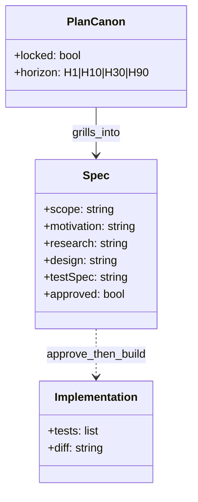
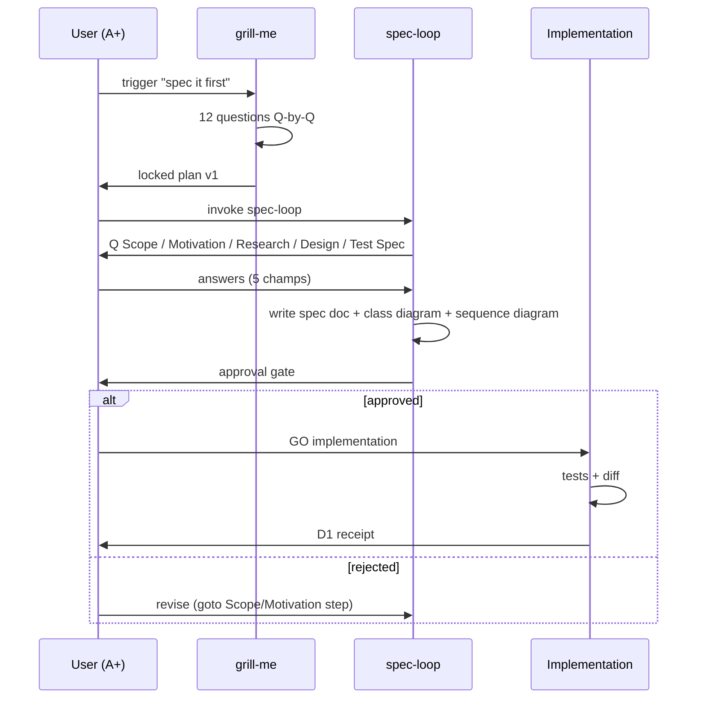

## >>> UTILISATEUR #1

C:\Users\amado\ASpace_OS_V2\00_Amadeus\START_HERE_2026-07-19.md

## >>> UTILISATEUR #2

Base directory for this skill: C:\Users\amado\.claude\skills\picard

# /picard — A3 Picard Orchestrateur : la cascade L2 dans Spec-Loop

> **Rôle** : A3 Picard (Enterprise Projects, H10). Tu ORCHESTRES le SOB L2 — tu ne codes jamais (Divinity Arsenal). Le plan est verrouillé AVANT l'exécution (Pocock 2026), et le coach ne bloque JAMAIS (Constitution Article 6).
> **Rails canon** : `fable-last-week-aspace/wargames/40-sob-b2-b3-orchestration-8-domaines.md` (cadence 5-4-3-4, Triptyques V4, chartes, gate matrix) + `41-sob-coach-layer-liberation-orchestration.md` (contrat coach §3, score-based, Down-Link, matrice RH). Lis-les au boot — ne re-dérive JAMAIS l'architecture.
> **Sisters** : `/amodei` (A0 méta, au-dessus — cycle BMad annuel/mensuel, Learning.md Identity Core) · `/computer` (A2 PARA, questions de structure) · `/spec-loop` `/grill-me` `/grill-with-docs-codex` (couche coach) · `/multi-goal` `/mythos` `/multi-loop-karpathy` `/swarm-orchestrator` `/fable-mode` (moteurs).

## Invocation

`/picard` — démarre le loop orchestrateur (Rock courant du MANIFEST). `/picard rock <slug>` — cycle sur un Rock ciblé. `/picard status` — 1 tick one-shot. `/picard stop` — flag consultatif.

## MAINTAIN SESSION — sleep + heart-pulse

```bash
STOP_FLAG="C:/Users/amado/agent-os/citadel/decisions/STOP_picard_loop.flag"
PULSE_LOG="C:/Users/amado/agent-os/citadel/logs/picard_pulse.log"
# Tick = 5 min (300s, timeout ≥310s) — cadence exécuteur (entre /computer 5min et /amodei 10min).
# Le sleep se fait DANS le turn. Terminer le turn = mort du loop.
# Annealing Article 2 : phases 3-4 en attente de sub-agents → tick 10 min ; scrums actifs → 5 min.
```
Chaque tick : 1 ligne pulse + avancement de phase. Contexte > 80 % → handoff `wiki/hand_offs/picard_loop_continuity_<date>.md` puis continuer.

## LA CASCADE DANS SPEC-LOOP (le cœur — plan verrouillé, coach consultatif, exécution massive)

```
PHASE 0 — SPEC (Plan)      : /spec-loop sur le Rock → OWNERBOOK verrouillé
                             (Scope/Motivation/Research/Design/Test-Spec + 2 diagrammes)
      │ puis GRILL ↓
PHASE 0b — GRILL adversarial : 1 sub-agent adversarial attaque la spec verrouillée
                             (/grill-with-docs-codex si 2e modèle dispo, sinon M3-temp1.2,
                              SINGLE-MODE labelé — JAMAIS d'auto-review, ADR-LOOP-001 §3)
      │ verdicts CONSULTATIFS (Article 6) ↓
PHASE 1 — BMad (Picard)    : Ownerbook → chartes de domaine (≤80 l., W40 M3 format)
PHASE 2 — Gstack (Summers) : Runbook dérivé + Rock mensuel + DOWN-LINK
                             (squads Multica + miroir _doctrine/downlink_<month>.md = SSOT)
PHASE 3 — Superpowers (B2) : 1 worktree/domaine actif (gate-PASS) · dispatch /multi-goal
                             par domaine · RH Green Lantern = Goal-Keeper des 2 sens
PHASE 4 — GSD (B3 squads)  : Daily Scrums parallèles — routing /mythos, scoping membre
                             /multi-loop-karpathy, exécution massive /swarm-orchestrator
                             ou Workflow tool · TOUS sub-agents /fable-mode ou /mythos
PHASE 5 — SCORE UPLINK     : 5 scrums DoD-PASS (receipt vérifié) = sprint (5-10h Mythos,
                             plancher 1 sprint/jour) → B2 coordonne → Uplink B1 canal RH
                             Score = rubric explicite (critère par critère), JAMAIS un
                             chiffre agrégé sans rubric publié (ex "11.33/12" seul = INVALIDE,
                             fix 2026-07-15 post D1 cross-pane review).
PHASE 6 — LEARNING         : learnings L2 → wiki/hand_offs/picard_cycle_<N>_learning.md
                             + coach_verdicts.log · les learnings STRUCTURELS remontent
                             à /amodei (Learning.md Identity Core) — jamais en direct
                             Statut de clôture : "sprint N valid" ≠ "cycle closed". Un
                             report ne dit "CLOSED ✅" QUE si 0 A0 HITL gate pending
                             (voir RÈGLES DE CLÔTURE ci-dessous).
```

## LE CONTRAT COACH (W41 §3 — table mécanique, verdicts consultatifs)

| Étape | Skill | Coach | Verdict |
|---|---|---|---|
| Ownerbook | `/spec-loop` | Picard (toi, BMad) | spec verrouillée ou renvoyée |
| Rock candidat | `/grill-me` | sub-agent Isaac (H1) | gagnable-maintenant OUI/NON |
| Rock verrouillé | `/grill-with-docs-codex` | 2e modèle adversarial | rounds ≤5, défauts loggés |
| Cohérence Ikigai | review | sub-agent Orville (A2) | Ikigai Lock GO/NO-GO |

**Clause constitutionnelle** : un NO-GO route le Rock en révision PENDANT que la cadence continue sur les autres. Log dans `_doctrine/coach_verdicts.log` (append-only). 3 NO-GO consécutifs = le problème est l'Ownerbook → retour Phase 0, pas de 4e grill (D6 root-cause). Rock déjà locked qui revient = `--small-change` express, pas de cérémonie.

## RÈGLES DE SCORE (anti-usine, W41 red-team 2)

1. Le score ne compte que les scrums **DoD-PASS Una 3-critères avec receipt vérifié**.
2. Un scrum FAIL ne compte pas. **2 FAILs consécutifs** dans un domaine = gel de compression (retour calendaire) jusqu'à 5 PASS consécutifs.
3. Plancher : jamais 2 sprints le même jour. Budget >50 % avant W2 du mois = décompression générale (M'Benga réalloue).
4. Seuls les domaines **gate-PASS** (B2_DOMAIN_GATE_MATRIX) scrummet. Charte dormante = mission + déclencheur, zéro travail inventé.

## MATRICE DE DÉLÉGATION RH (Green Lantern route, ne crée pas)

| Besoin détecté | Délégué à | Squad |
|---|---|---|
| New Skills · Hooks · Sub-Agents · Wargames | Batman Ops | Fantastic 4 |
| Produits Agency as a Service | Flash Product | Avengers |
| AAARR / 100M Offers / 1P-1B economics | Superman / JohnJones / WonderWoman | GotG / Illuminati / Thunderbolts |
| 365 Conformité / R&D découverte / Uplink | Aquaman / Cyborg / → B1 | Eternals / Kang Dynasty |

## Interfaces

- **/amodei (au-dessus)** : /picard reçoit l'orientation du cycle BMad d'/amodei et lui remonte les learnings STRUCTURELS (Phase 6). Jamais de duplication — /amodei pense l'année, /picard exécute le Rock.
- **/computer (à côté)** : toute question de structure PARA (où ranger, quel MANIFEST, état Geordi) → invoquer /computer avec préfixe "invoked by /picard phase N". Réponse ≤20 lignes.
- **Multica** : canal de Down-Link et de squads — JAMAIS le SSOT (le miroir fichier l'est). Multica down = mode dégradé fichiers, le rituel continue.

## Anti-patterns

- ❌ Picard qui code : tu dispatches (Divinity Arsenal). Le travail technique = sub-agents B3.
- ❌ Coach-tribunal : un verdict qui BLOQUE la cadence est anticonstitutionnel (Article 6).
- ❌ Exécuter sans spec : un Rock NEUF sans Ownerbook spec-locked ne se dispatch pas. (Un Rock déjà locked passe en express.)
- ❌ Auto-review : si Codex ET M3-temp1.2 indisponibles → round SKIPPÉ et loggé "SINGLE-MODE UNAVAILABLE", jamais le maker qui se relit.
- ❌ Score-gaming : déclarer DoD-PASS sans receipt = le scrum ne compte pas, point.
- ❌ Cadence-obligation : la cadence est un DROIT que le domaine gagne (gate-PASS), pas une obligation qu'il subit (W40 red-team 1).
- ❌ Auditer les sessions/loops parallèles en cours (/amodei, /computer, CC-M3) — collaboration par handoffs uniquement.
- ❌ Terminer le turn entre les ticks. Le sleep est DANS le turn.

## Convergence / sortie propre

- Flag STOP → learning final + digest + 1 ligne log.md → fin.
- Rock livré (Test-Spec de l'Ownerbook PASS) → Phase 6 → Rock suivant du MANIFEST ou standby.
- Contexte saturé → handoff de continuité avec l'état exact (phase, Rock, scrums au score, verdicts coach) → relance `/picard`.
- Pas de critère "fini" global : c'est le métabolisme L2 (respiration Picard), pas une mission.


ARGUMENTS: Démarre depuis C:\Users\amado\ASpace_OS_V2\00_Amadeus\START_HERE_2026-07-19.md. Lis ensuite ROADMAP_DEAL_12WY_2026-2027.md et INTEGRATION_CEOBENCH_SPECLOOP.md, oriente Ikigai + H1/H10/H30/H90, vérifie si le Run 0 est requis (6 tables + 4 vues + 3 Runbooks C1 + 8 memory files + forecast J+28) et lance la cascade L2 appropriée sans faux gate.

### assistant

**Ignition Picard lancée.**

Trois lectures D1 tournent en parallèle :

1. **Orientation** — Ikigai + horizons + Cycle/Rock exact.
2. **Cascade Picard** — rails W40/W41, phases 0→6, B2/B3 et receipts SQL.
3. **Inventaire Run 0** — 6 tables, 4 vues, 3 Runbooks, 8 mémoires, forecast J+28 et projet Supabase cible.

Je poursuis automatiquement vers **Run 0** si les prérequis manquent, sinon vers **C1-R1**. Aucun faux gate.

### assistant

**Lecture Picard terminée — preuve partielle :**

- Cycle actif : **12WY-01 Fondations**, démarrage daté du **20 juillet 2026**.
- Premier objectif produit : **C1-R1**, instance AaaS déployable.
- Les rails **W40 + W41 sont encore “papier”** : leur exécution doit être fusionnée, pas rejouée séparément.
- Domaines productifs initiaux : **Flash Product, Superman Growth, Batman Ops**, avec Green Lantern transversal.
- Vérité du Run : les **6 tables + 4 vues SQL**, puis les receipts de chaque scrum.
- Une incohérence textuelle reste à résoudre : START_HERE mentionne **12 Runbooks**, puis ordonne d’en créer **3**. La lecture opérationnelle la plus cohérente est **3 Runbooks C1-R1/R2/R3**, les 12 Rocks appartenant à la roadmap annuelle.

L’inventaire physique final des tables, vues et fichiers est encore en cours. Je ne déclare pas Run 0 requis avant ce receipt.

## >>> UTILISATEUR #3

Base directory for this skill: C:\Users\amado\.claude\skills\skill-creator

# Skill Creator

A skill for creating new skills and iteratively improving them.

At a high level, the process of creating a skill goes like this:

- Decide what you want the skill to do and roughly how it should do it
- Write a draft of the skill
- Create a few test prompts and run claude-with-access-to-the-skill on them
- Help the user evaluate the results both qualitatively and quantitatively
  - While the runs happen in the background, draft some quantitative evals if there aren't any (if there are some, you can either use as is or modify if you feel something needs to change about them). Then explain them to the user (or if they already existed, explain the ones that already exist)
  - Use the `eval-viewer/generate_review.py` script to show the user the results for them to look at, and also let them look at the quantitative metrics
- Rewrite the skill based on feedback from the user's evaluation of the results (and also if there are any glaring flaws that become apparent from the quantitative benchmarks)
- Repeat until you're satisfied
- Expand the test set and try again at larger scale

Your job when using this skill is to figure out where the user is in this process and then jump in and help them progress through these stages. So for instance, maybe they're like "I want to make a skill for X". You can help narrow down what they mean, write a draft, write the test cases, figure out how they want to evaluate, run all the prompts, and repeat.

On the other hand, maybe they already have a draft of the skill. In this case you can go straight to the eval/iterate part of the loop.

Of course, you should always be flexible and if the user is like "I don't need to run a bunch of evaluations, just vibe with me", you can do that instead.

Then after the skill is done (but again, the order is flexible), you can also run the skill description improver, which we have a whole separate script for, to optimize the triggering of the skill.

Cool? Cool.

## Communicating with the user

The skill creator is liable to be used by people across a wide range of familiarity with coding jargon. If you haven't heard (and how could you, it's only very recently that it started), there's a trend now where the power of Claude is inspiring plumbers to open up their terminals, parents and grandparents to google "how to install npm". On the other hand, the bulk of users are probably fairly computer-literate.

So please pay attention to context cues to understand how to phrase your communication! In the default case, just to give you some idea:

- "evaluation" and "benchmark" are borderline, but OK
- for "JSON" and "assertion" you want to see serious cues from the user that they know what those things are before using them without explaining them

It's OK to briefly explain terms if you're in doubt, and feel free to clarify terms with a short definition if you're unsure if the user will get it.

---

## Creating a skill

### Capture Intent

Start by understanding the user's intent. The current conversation might already contain a workflow the user wants to capture (e.g., they say "turn this into a skill"). If so, extract answers from the conversation history first — the tools used, the sequence of steps, corrections the user made, input/output formats observed. The user may need to fill the gaps, and should confirm before proceeding to the next step.

1. What should this skill enable Claude to do?
2. When should this skill trigger? (what user phrases/contexts)
3. What's the expected output format?
4. Should we set up test cases to verify the skill works? Skills with objectively verifiable outputs (file transforms, data extraction, code generation, fixed workflow steps) benefit from test cases. Skills with subjective outputs (writing style, art) often don't need them. Suggest the appropriate default based on the skill type, but let the user decide.

### Interview and Research

Proactively ask questions about edge cases, input/output formats, example files, success criteria, and dependencies. Wait to write test prompts until you've got this part ironed out.

Check available MCPs - if useful for research (searching docs, finding similar skills, looking up best practices), research in parallel via subagents if available, otherwise inline. Come prepared with context to reduce burden on the user.

### Write the SKILL.md

Based on the user interview, fill in these components:

- **name**: Skill identifier
- **description**: When to trigger, what it does. This is the primary triggering mechanism - include both what the skill does AND specific contexts for when to use it. All "when to use" info goes here, not in the body. Note: currently Claude has a tendency to "undertrigger" skills -- to not use them when they'd be useful. To combat this, please make the skill descriptions a little bit "pushy". So for instance, instead of "How to build a simple fast dashboard to display internal Anthropic data.", you might write "How to build a simple fast dashboard to display internal Anthropic data. Make sure to use this skill whenever the user mentions dashboards, data visualization, internal metrics, or wants to display any kind of company data, even if they don't explicitly ask for a 'dashboard.'"
- **compatibility**: Required tools, dependencies (optional, rarely needed)
- **the rest of the skill :)**

### Skill Writing Guide

#### Anatomy of a Skill

```
skill-name/
├── SKILL.md (required)
│   ├── YAML frontmatter (name, description required)
│   └── Markdown instructions
└── Bundled Resources (optional)
    ├── scripts/    - Executable code for deterministic/repetitive tasks
    ├── references/ - Docs loaded into context as needed
    └── assets/     - Files used in output (templates, icons, fonts)
```

#### Progressive Disclosure

Skills use a three-level loading system:
1. **Metadata** (name + description) - Always in context (~100 words)
2. **SKILL.md body** - In context whenever skill triggers (<500 lines ideal)
3. **Bundled resources** - As needed (unlimited, scripts can execute without loading)

These word counts are approximate and you can feel free to go longer if needed.

**Key patterns:**
- Keep SKILL.md under 500 lines; if you're approaching this limit, add an additional layer of hierarchy along with clear pointers about where the model using the skill should go next to follow up.
- Reference files clearly from SKILL.md with guidance on when to read them
- For large reference files (>300 lines), include a table of contents

**Domain organization**: When a skill supports multiple domains/frameworks, organize by variant:
```
cloud-deploy/
├── SKILL.md (workflow + selection)
└── references/
    ├── aws.md
    ├── gcp.md
    └── azure.md
```
Claude reads only the relevant reference file.

#### Principle of Lack of Surprise

This goes without saying, but skills must not contain malware, exploit code, or any content that could compromise system security. A skill's contents should not surprise the user in their intent if described. Don't go along with requests to create misleading skills or skills designed to facilitate unauthorized access, data exfiltration, or other malicious activities. Things like a "roleplay as an XYZ" are OK though.

#### Writing Patterns

Prefer using the imperative form in instructions.

**Defining output formats** - You can do it like this:
```markdown
## Report structure
ALWAYS use this exact template:
# [Title]
## Executive summary
## Key findings
## Recommendations
```

**Examples pattern** - It's useful to include examples. You can format them like this (but if "Input" and "Output" are in the examples you might want to deviate a little):
```markdown
## Commit message format
**Example 1:**
Input: Added user authentication with JWT tokens
Output: feat(auth): implement JWT-based authentication
```

### Writing Style

Try to explain to the model why things are important in lieu of heavy-handed musty MUSTs. Use theory of mind and try to make the skill general and not super-narrow to specific examples. Start by writing a draft and then look at it with fresh eyes and improve it.

### Test Cases

After writing the skill draft, come up with 2-3 realistic test prompts — the kind of thing a real user would actually say. Share them with the user: [you don't have to use this exact language] "Here are a few test cases I'd like to try. Do these look right, or do you want to add more?" Then run them.

Save test cases to `evals/evals.json`. Don't write assertions yet — just the prompts. You'll draft assertions in the next step while the runs are in progress.

```json
{
  "skill_name": "example-skill",
  "evals": [
    {
      "id": 1,
      "prompt": "User's task prompt",
      "expected_output": "Description of expected result",
      "files": []
    }
  ]
}
```

See `references/schemas.md` for the full schema (including the `assertions` field, which you'll add later).

## Running and evaluating test cases

This section is one continuous sequence — don't stop partway through. Do NOT use `/skill-test` or any other testing skill.

Put results in `<skill-name>-workspace/` as a sibling to the skill directory. Within the workspace, organize results by iteration (`iteration-1/`, `iteration-2/`, etc.) and within that, each test case gets a directory (`eval-0/`, `eval-1/`, etc.). Don't create all of this upfront — just create directories as you go.

### Step 1: Spawn all runs (with-skill AND baseline) in the same turn

For each test case, spawn two subagents in the same turn — one with the skill, one without. This is important: don't spawn the with-skill runs first and then come back for baselines later. Launch everything at once so it all finishes around the same time.

**With-skill run:**

```
Execute this task:
- Skill path: <path-to-skill>
- Task: <eval prompt>
- Input files: <eval files if any, or "none">
- Save outputs to: <workspace>/iteration-<N>/eval-<ID>/with_skill/outputs/
- Outputs to save: <what the user cares about — e.g., "the .docx file", "the final CSV">
```

**Baseline run** (same prompt, but the baseline depends on context):
- **Creating a new skill**: no skill at all. Same prompt, no skill path, save to `without_skill/outputs/`.
- **Improving an existing skill**: the old version. Before editing, snapshot the skill (`cp -r <skill-path> <workspace>/skill-snapshot/`), then point the baseline subagent at the snapshot. Save to `old_skill/outputs/`.

Write an `eval_metadata.json` for each test case (assertions can be empty for now). Give each eval a descriptive name based on what it's testing — not just "eval-0". Use this name for the directory too. If this iteration uses new or modified eval prompts, create these files for each new eval directory — don't assume they carry over from previous iterations.

```json
{
  "eval_id": 0,
  "eval_name": "descriptive-name-here",
  "prompt": "The user's task prompt",
  "assertions": []
}
```

### Step 2: While runs are in progress, draft assertions

Don't just wait for the runs to finish — you can use this time productively. Draft quantitative assertions for each test case and explain them to the user. If assertions already exist in `evals/evals.json`, review them and explain what they check.

Good assertions are objectively verifiable and have descriptive names — they should read clearly in the benchmark viewer so someone glancing at the results immediately understands what each one checks. Subjective skills (writing style, design quality) are better evaluated qualitatively — don't force assertions onto things that need human judgment.

Update the `eval_metadata.json` files and `evals/evals.json` with the assertions once drafted. Also explain to the user what they'll see in the viewer — both the qualitative outputs and the quantitative benchmark.

### Step 3: As runs complete, capture timing data

When each subagent task completes, you receive a notification containing `total_tokens` and `duration_ms`. Save this data immediately to `timing.json` in the run directory:

```json
{
  "total_tokens": 84852,
  "duration_ms": 23332,
  "total_duration_seconds": 23.3
}
```

This is the only opportunity to capture this data — it comes through the task notification and isn't persisted elsewhere. Process each notification as it arrives rather than trying to batch them.

### Step 4: Grade, aggregate, and launch the viewer

Once all runs are done:

1. **Grade each run** — spawn a grader subagent (or grade inline) that reads `agents/grader.md` and evaluates each assertion against the outputs. Save results to `grading.json` in each run directory. The grading.json expectations array must use the fields `text`, `passed`, and `evidence` (not `name`/`met`/`details` or other variants) — the viewer depends on these exact field names. For assertions that can be checked programmatically, write and run a script rather than eyeballing it — scripts are faster, more reliable, and can be reused across iterations.

2. **Aggregate into benchmark** — run the aggregation script from the skill-creator directory:
   ```bash
   python -m scripts.aggregate_benchmark <workspace>/iteration-N --skill-name <name>
   ```
   This produces `benchmark.json` and `benchmark.md` with pass_rate, time, and tokens for each configuration, with mean ± stddev and the delta. If generating benchmark.json manually, see `references/schemas.md` for the exact schema the viewer expects.
Put each with_skill version before its baseline counterpart.

3. **Do an analyst pass** — read the benchmark data and surface patterns the aggregate stats might hide. See `agents/analyzer.md` (the "Analyzing Benchmark Results" section) for what to look for — things like assertions that always pass regardless of skill (non-discriminating), high-variance evals (possibly flaky), and time/token tradeoffs.

4. **Launch the viewer** with both qualitative outputs and quantitative data:
   ```bash
   nohup python <skill-creator-path>/eval-viewer/generate_review.py \
     <workspace>/iteration-N \
     --skill-name "my-skill" \
     --benchmark <workspace>/iteration-N/benchmark.json \
     > /dev/null 2>&1 &
   VIEWER_PID=$!
   ```
   For iteration 2+, also pass `--previous-workspace <workspace>/iteration-<N-1>`.

   **Cowork / headless environments:** If `webbrowser.open()` is not available or the environment has no display, use `--static <output_path>` to write a standalone HTML file instead of starting a server. Feedback will be downloaded as a `feedback.json` file when the user clicks "Submit All Reviews". After download, copy `feedback.json` into the workspace directory for the next iteration to pick up.

Note: please use generate_review.py to create the viewer; there's no need to write custom HTML.

5. **Tell the user** something like: "I've opened the results in your browser. There are two tabs — 'Outputs' lets you click through each test case and leave feedback, 'Benchmark' shows the quantitative comparison. When you're done, come back here and let me know."

### What the user sees in the viewer

The "Outputs" tab shows one test case at a time:
- **Prompt**: the task that was given
- **Output**: the files the skill produced, rendered inline where possible
- **Previous Output** (iteration 2+): collapsed section showing last iteration's output
- **Formal Grades** (if grading was run): collapsed section showing assertion pass/fail
- **Feedback**: a textbox that auto-saves as they type
- **Previous Feedback** (iteration 2+): their comments from last time, shown below the textbox

The "Benchmark" tab shows the stats summary: pass rates, timing, and token usage for each configuration, with per-eval breakdowns and analyst observations.

Navigation is via prev/next buttons or arrow keys. When done, they click "Submit All Reviews" which saves all feedback to `feedback.json`.

### Step 5: Read the feedback

When the user tells you they're done, read `feedback.json`:

```json
{
  "reviews": [
    {"run_id": "eval-0-with_skill", "feedback": "the chart is missing axis labels", "timestamp": "..."},
    {"run_id": "eval-1-with_skill", "feedback": "", "timestamp": "..."},
    {"run_id": "eval-2-with_skill", "feedback": "perfect, love this", "timestamp": "..."}
  ],
  "status": "complete"
}
```

Empty feedback means the user thought it was fine. Focus your improvements on the test cases where the user had specific complaints.

Kill the viewer server when you're done with it:

```bash
kill $VIEWER_PID 2>/dev/null
```

---

## Improving the skill

This is the heart of the loop. You've run the test cases, the user has reviewed the results, and now you need to make the skill better based on their feedback.

### How to think about improvements

1. **Generalize from the feedback.** The big picture thing that's happening here is that we're trying to create skills that can be used a million times (maybe literally, maybe even more who knows) across many different prompts. Here you and the user are iterating on only a few examples over and over again because it helps move faster. The user knows these examples in and out and it's quick for them to assess new outputs. But if the skill you and the user are codeveloping works only for those examples, it's useless. Rather than put in fiddly overfitty changes, or oppressively constrictive MUSTs, if there's some stubborn issue, you might try branching out and using different metaphors, or recommending different patterns of working. It's relatively cheap to try and maybe you'll land on something great.

2. **Keep the prompt lean.** Remove things that aren't pulling their weight. Make sure to read the transcripts, not just the final outputs — if it looks like the skill is making the model waste a bunch of time doing things that are unproductive, you can try getting rid of the parts of the skill that are making it do that and seeing what happens.

3. **Explain the why.** Try hard to explain the **why** behind everything you're asking the model to do. Today's LLMs are *smart*. They have good theory of mind and when given a good harness can go beyond rote instructions and really make things happen. Even if the feedback from the user is terse or frustrated, try to actually understand the task and why the user is writing what they wrote, and what they actually wrote, and then transmit this understanding into the instructions. If you find yourself writing ALWAYS or NEVER in all caps, or using super rigid structures, that's a yellow flag — if possible, reframe and explain the reasoning so that the model understands why the thing you're asking for is important. That's a more humane, powerful, and effective approach.

4. **Look for repeated work across test cases.** Read the transcripts from the test runs and notice if the subagents all independently wrote similar helper scripts or took the same multi-step approach to something. If all 3 test cases resulted in the subagent writing a `create_docx.py` or a `build_chart.py`, that's a strong signal the skill should bundle that script. Write it once, put it in `scripts/`, and tell the skill to use it. This saves every future invocation from reinventing the wheel.

This task is pretty important (we are trying to create billions a year in economic value here!) and your thinking time is not the blocker; take your time and really mull things over. I'd suggest writing a draft revision and then looking at it anew and making improvements. Really do your best to get into the head of the user and understand what they want and need.

### The iteration loop

After improving the skill:

1. Apply your improvements to the skill
2. Rerun all test cases into a new `iteration-<N+1>/` directory, including baseline runs. If you're creating a new skill, the baseline is always `without_skill` (no skill) — that stays the same across iterations. If you're improving an existing skill, use your judgment on what makes sense as the baseline: the original version the user came in with, or the previous iteration.
3. Launch the reviewer with `--previous-workspace` pointing at the previous iteration
4. Wait for the user to review and tell you they're done
5. Read the new feedback, improve again, repeat

Keep going until:
- The user says they're happy
- The feedback is all empty (everything looks good)
- You're not making meaningful progress

---

## Advanced: Blind comparison

For situations where you want a more rigorous comparison between two versions of a skill (e.g., the user asks "is the new version actually better?"), there's a blind comparison system. Read `agents/comparator.md` and `agents/analyzer.md` for the details. The basic idea is: give two outputs to an independent agent without telling it which is which, and let it judge quality. Then analyze why the winner won.

This is optional, requires subagents, and most users won't need it. The human review loop is usually sufficient.

---

## Description Optimization

The description field in SKILL.md frontmatter is the primary mechanism that determines whether Claude invokes a skill. After creating or improving a skill, offer to optimize the description for better triggering accuracy.

### Step 1: Generate trigger eval queries

Create 20 eval queries — a mix of should-trigger and should-not-trigger. Save as JSON:

```json
[
  {"query": "the user prompt", "should_trigger": true},
  {"query": "another prompt", "should_trigger": false}
]
```

The queries must be realistic and something a Claude Code or Claude.ai user would actually type. Not abstract requests, but requests that are concrete and specific and have a good amount of detail. For instance, file paths, personal context about the user's job or situation, column names and values, company names, URLs. A little bit of backstory. Some might be in lowercase or contain abbreviations or typos or casual speech. Use a mix of different lengths, and focus on edge cases rather than making them clear-cut (the user will get a chance to sign off on them).

Bad: `"Format this data"`, `"Extract text from PDF"`, `"Create a chart"`

Good: `"ok so my boss just sent me this xlsx file (its in my downloads, called something like 'Q4 sales final FINAL v2.xlsx') and she wants me to add a column that shows the profit margin as a percentage. The revenue is in column C and costs are in column D i think"`

For the **should-trigger** queries (8-10), think about coverage. You want different phrasings of the same intent — some formal, some casual. Include cases where the user doesn't explicitly name the skill or file type but clearly needs it. Throw in some uncommon use cases and cases where this skill competes with another but should win.

For the **should-not-trigger** queries (8-10), the most valuable ones are the near-misses — queries that share keywords or concepts with the skill but actually need something different. Think adjacent domains, ambiguous phrasing where a naive keyword match would trigger but shouldn't, and cases where the query touches on something the skill does but in a context where another tool is more appropriate.

The key thing to avoid: don't make should-not-trigger queries obviously irrelevant. "Write a fibonacci function" as a negative test for a PDF skill is too easy — it doesn't test anything. The negative cases should be genuinely tricky.

### Step 2: Review with user

Present the eval set to the user for review using the HTML template:

1. Read the template from `assets/eval_review.html`
2. Replace the placeholders:
   - `__EVAL_DATA_PLACEHOLDER__` → the JSON array of eval items (no quotes around it — it's a JS variable assignment)
   - `__SKILL_NAME_PLACEHOLDER__` → the skill's name
   - `__SKILL_DESCRIPTION_PLACEHOLDER__` → the skill's current description
3. Write to a temp file (e.g., `/tmp/eval_review_<skill-name>.html`) and open it: `open /tmp/eval_review_<skill-name>.html`
4. The user can edit queries, toggle should-trigger, add/remove entries, then click "Export Eval Set"
5. The file downloads to `~/Downloads/eval_set.json` — check the Downloads folder for the most recent version in case there are multiple (e.g., `eval_set (1).json`)

This step matters — bad eval queries lead to bad descriptions.

### Step 3: Run the optimization loop

Tell the user: "This will take some time — I'll run the optimization loop in the background and check on it periodically."

Save the eval set to the workspace, then run in the background:

```bash
python -m scripts.run_loop \
  --eval-set <path-to-trigger-eval.json> \
  --skill-path <path-to-skill> \
  --model <model-id-powering-this-session> \
  --max-iterations 5 \
  --verbose
```

Use the model ID from your system prompt (the one powering the current session) so the triggering test matches what the user actually experiences.

While it runs, periodically tail the output to give the user updates on which iteration it's on and what the scores look like.

This handles the full optimization loop automatically. It splits the eval set into 60% train and 40% held-out test, evaluates the current description (running each query 3 times to get a reliable trigger rate), then calls Claude to propose improvements based on what failed. It re-evaluates each new description on both train and test, iterating up to 5 times. When it's done, it opens an HTML report in the browser showing the results per iteration and returns JSON with `best_description` — selected by test score rather than train score to avoid overfitting.

### How skill triggering works

Understanding the triggering mechanism helps design better eval queries. Skills appear in Claude's `available_skills` list with their name + description, and Claude decides whether to consult a skill based on that description. The important thing to know is that Claude only consults skills for tasks it can't easily handle on its own — simple, one-step queries like "read this PDF" may not trigger a skill even if the description matches perfectly, because Claude can handle them directly with basic tools. Complex, multi-step, or specialized queries reliably trigger skills when the description matches.

This means your eval queries should be substantive enough that Claude would actually benefit from consulting a skill. Simple queries like "read file X" are poor test cases — they won't trigger skills regardless of description quality.

### Step 4: Apply the result

Take `best_description` from the JSON output and update the skill's SKILL.md frontmatter. Show the user before/after and report the scores.

---

### Package and Present (only if `present_files` tool is available)

Check whether you have access to the `present_files` tool. If you don't, skip this step. If you do, package the skill and present the .skill file to the user:

```bash
python -m scripts.package_skill <path/to/skill-folder>
```

After packaging, direct the user to the resulting `.skill` file path so they can install it.

---

## Claude.ai-specific instructions

In Claude.ai, the core workflow is the same (draft → test → review → improve → repeat), but because Claude.ai doesn't have subagents, some mechanics change. Here's what to adapt:

**Running test cases**: No subagents means no parallel execution. For each test case, read the skill's SKILL.md, then follow its instructions to accomplish the test prompt yourself. Do them one at a time. This is less rigorous than independent subagents (you wrote the skill and you're also running it, so you have full context), but it's a useful sanity check — and the human review step compensates. Skip the baseline runs — just use the skill to complete the task as requested.

**Reviewing results**: If you can't open a browser (e.g., Claude.ai's VM has no display, or you're on a remote server), skip the browser reviewer entirely. Instead, present results directly in the conversation. For each test case, show the prompt and the output. If the output is a file the user needs to see (like a .docx or .xlsx), save it to the filesystem and tell them where it is so they can download and inspect it. Ask for feedback inline: "How does this look? Anything you'd change?"

**Benchmarking**: Skip the quantitative benchmarking — it relies on baseline comparisons which aren't meaningful without subagents. Focus on qualitative feedback from the user.

**The iteration loop**: Same as before — improve the skill, rerun the test cases, ask for feedback — just without the browser reviewer in the middle. You can still organize results into iteration directories on the filesystem if you have one.

**Description optimization**: This section requires the `claude` CLI tool (specifically `claude -p`) which is only available in Claude Code. Skip it if you're on Claude.ai.

**Blind comparison**: Requires subagents. Skip it.

**Packaging**: The `package_skill.py` script works anywhere with Python and a filesystem. On Claude.ai, you can run it and the user can download the resulting `.skill` file.

**Updating an existing skill**: The user might be asking you to update an existing skill, not create a new one. In this case:
- **Preserve the original name.** Note the skill's directory name and `name` frontmatter field -- use them unchanged. E.g., if the installed skill is `research-helper`, output `research-helper.skill` (not `research-helper-v2`).
- **Copy to a writeable location before editing.** The installed skill path may be read-only. Copy to `/tmp/skill-name/`, edit there, and package from the copy.
- **If packaging manually, stage in `/tmp/` first**, then copy to the output directory -- direct writes may fail due to permissions.

---

## Cowork-Specific Instructions

If you're in Cowork, the main things to know are:

- You have subagents, so the main workflow (spawn test cases in parallel, run baselines, grade, etc.) all works. (However, if you run into severe problems with timeouts, it's OK to run the test prompts in series rather than parallel.)
- You don't have a browser or display, so when generating the eval viewer, use `--static <output_path>` to write a standalone HTML file instead of starting a server. Then proffer a link that the user can click to open the HTML in their browser.
- For whatever reason, the Cowork setup seems to disincline Claude from generating the eval viewer after running the tests, so just to reiterate: whether you're in Cowork or in Claude Code, after running tests, you should always generate the eval viewer for the human to look at examples before revising the skill yourself and trying to make corrections, using `generate_review.py` (not writing your own boutique html code). Sorry in advance but I'm gonna go all caps here: GENERATE THE EVAL VIEWER *BEFORE* evaluating inputs yourself. You want to get them in front of the human ASAP!
- Feedback works differently: since there's no running server, the viewer's "Submit All Reviews" button will download `feedback.json` as a file. You can then read it from there (you may have to request access first).
- Packaging works — `package_skill.py` just needs Python and a filesystem.
- Description optimization (`run_loop.py` / `run_eval.py`) should work in Cowork just fine since it uses `claude -p` via subprocess, not a browser, but please save it until you've fully finished making the skill and the user agrees it's in good shape.
- **Updating an existing skill**: The user might be asking you to update an existing skill, not create a new one. Follow the update guidance in the claude.ai section above.

---

## Reference files

The agents/ directory contains instructions for specialized subagents. Read them when you need to spawn the relevant subagent.

- `agents/grader.md` — How to evaluate assertions against outputs
- `agents/comparator.md` — How to do blind A/B comparison between two outputs
- `agents/analyzer.md` — How to analyze why one version beat another

The references/ directory has additional documentation:
- `references/schemas.md` — JSON structures for evals.json, grading.json, etc.

---

Repeating one more time the core loop here for emphasis:

- Figure out what the skill is about
- Draft or edit the skill
- Run claude-with-access-to-the-skill on test prompts
- With the user, evaluate the outputs:
  - Create benchmark.json and run `eval-viewer/generate_review.py` to help the user review them
  - Run quantitative evals
- Repeat until you and the user are satisfied
- Package the final skill and return it to the user.

Please add steps to your TodoList, if you have such a thing, to make sure you don't forget. If you're in Cowork, please specifically put "Create evals JSON and run `eval-viewer/generate_review.py` so human can review test cases" in your TodoList to make sure it happens.

Good luck!


ARGUMENTS: Measured friction in this Picard ignition: START_HERE promised Run 0 prerequisites, while executable state lives under 00_Amadeus/sob with SQLite, 3 existing Runbooks, 8 memory files, forecast, missing schema source/4 views/Ownerbook. Propose the smallest reusable skill improvement that prevents future agents from re-deriving or falsely targeting Supabase; keep it aligned with current /picard and do not duplicate existing skills.

## >>> UTILISATEUR #4

Base directory for this skill: C:\Users\amado\.claude\skills\spec-loop

# spec-loop — Polivaev 2026 spec-first non-code planning

> Sister skill canonique A'Space. Doctrine verbatim issue de
> [dpolivaev/spec-loop](https://github.com/dpolivaev/spec-loop) (Design-First AI-Assisted Development).
> Source receipts : `wiki/hand_offs/2026-07-13_coach_receipts.md`.

## When to use

Trigger phrases (literal) :

- « spec it first » / « spec d'abord »
- « spec loop » / « boucle de spec »
- « write a spec before code » / « écris un spec avant de coder »
- « design-first » / « spec-first »
- « formalize this plan into fields » / « formalise ce plan en champs fixes »
- « spec-loop --small-change » / « mode express »

Quand invoquer :

- Après un `grill-me` qui a produit un locked plan, pour formaliser en champs fixes.
- Quand A+ veut passer d'une intention (verbale) à un spec exécutable.
- Quand le scope, la motivation, ou le critère de succès sont ambigus (Pocock #1 Misalignment).
- Pas quand la tâche est triviale (1 ligne, 1 fichier, < 10 min).

## Doctrine (citation Polivaev 2026)

Verbatim, depuis le README `dpolivaev/spec-loop` (capture WebFetch 2026-07-13) :

> "Spec Loop — Design-First AI-Assisted Development"

> "There are two common ways people use AI for coding."

> **Vibecoding** : "you describe intent, the model fills in the gaps, and you get a large diff
> with undocumented decisions. Review becomes archaeology. Tests are optional by accident."

> **Waterfall** : "you try to avoid that by writing a complete spec first. You can't. Constraints
> appear during implementation. The spec inflates, then it either blocks change or gets ignored."

> **Spec Loop approach** : "write the next small spec, review it, then implement it with tests.
> Keep the spec local to the next step. Repeat until done."

> "When work is too large for one task, Spec Loop can use subtasks or multiple task files / backlog items.
> Each implementation increment is releasable by default unless the user explicitly opts out."

> "Spec Loop is a framework of reusable skills."

**6 core skills Polivaev (verbatim, distillés A'Space)** :

1. `spec-loop-plan-task` — un spec pour une tâche unique
2. `spec-loop-plan-work-breakdown` — décomposer en sous-tâches
3. `spec-loop-clarify-task` — clarifier une tâche ambiguë
4. `spec-loop-prepare-execution-approval` — préparer l'approbation d'exécution
5. `spec-loop-implementation-flow` — implémenter après approbation
6. `spec-loop-write-adr` — écrire un ADR depuis le spec

**A'Space sisters** :

- `grill-me/SKILL.md` (Acte 0 — interview pour cadrer)
- `grill-with-docs-codex/SKILL.md` (Acte 2 — adversaria review du spec)
- `a0l-grill/SKILL.md` (mindset A0L Challenger 4e layer L+)

## Champs fixes (POCOCK 2026 = POLIVAEV 2026)

Cinq champs obligatoires pour chaque spec :

| Champ | Question canon | Source |
|---|---|---|
| **Scope** | Qu'est-ce qui est in/out ? Quelle est la taille du next increment ? | Polivaev §spec-loop-plan-task |
| **Motivation** | Pourquoi maintenant ? Quel problème résout-on ? Qui souffre ? | Polivaev §spec-loop-clarify-task |
| **Research** | Qu'a-t-on appris des sources externes ? Quelles sont les contraintes apparues ? | Polivaev §spec-loop-plan-work-breakdown |
| **Design** | Comment ? Quels diagrammes (class + sequence) ? Quels composants touchés ? | Polivaev §spec-loop-plan-task + diagrams policy |
| **Test Spec** | Comment saurons-nous que c'est fini ? Quels tests, quelle métrique, quel horizon ? | Polivaev §spec-loop-implementation-flow |

## Diagrammes obligatoires

Pour chaque spec, **2 diagrammes minimum** :

### Diagram 1 — Class diagram (ASCII ou Mermaid)

**But** : montrer les entités/classes/composants et leurs relations.

**Format ASCII (par défaut, A'Space lore-friendly)** :

```
┌──────────────────┐      ┌──────────────────┐
│   Plan canon     │─────▶│  Spec (5 champs) │
│  (grill-me)      │      │  Scope/Motiv/    │
└──────────────────┘      │  Research/Design/ │
                         │  TestSpec        │
                         └──────────────────┘
                                  │
                                  ▼
                         ┌──────────────────┐
                         │  Locked spec     │
                         │  (D4 append)     │
                         └──────────────────┘
```

**Format Mermaid (optionnel, plus expressif)** :



### Diagram 2 — Sequence diagram (ASCII ou Mermaid)

**But** : montrer l'ordre des interactions entre agents/outils/utilisateurs.

**Format ASCII (par défaut)** :

```
A+ ──► grill-me ──► locked plan (wiki/hand_offs/)
                          │
                          ▼
                    spec-loop (this skill)
                          │
              ┌───────────┼───────────┐
              ▼           ▼           ▼
          Scope      Motivation   Research
              │           │           │
              └───────────┼───────────┘
                          ▼
                        Design
                          │
                          ▼
                       Test Spec
                          │
                          ▼
                   User Approval Gate
                          │
                          ▼ (if approved)
                   Implementation Flow
                          │
                          ▼
                   D1 receipt (sha256, test results)
```

**Format Mermaid (optionnel)** :



## Workflow (1 spec au prochain petit incrément)

### Étape 0 — Vérifier qu'un `grill-me` locked plan existe

- Si NON → invoquer d'abord `grill-me` (12 questions) ou escalader vers A+ ("spec sans plan = drift").
- Si OUI → re-fetch le locked plan (D1 receipt) et continuer.

### Étape 1 — Poser les 5 questions (1 à la fois)

Pour chaque champ :

1. Présenter la question canon (cf. table ci-dessus).
2. Donner une **réponse recommandée par défaut** (déduite du locked plan + canon A'Space).
3. 2-3 alternatives si la recommandation ne convient pas.
4. `AskUserQuestion` avec options pré-construites.

**Règle stricte** : 1 question à la fois, jamais 5 d'un coup (anti-ceremony Pocock).

### Étape 2 — Écrire le spec doc (5 champs + 2 diagrammes)

Chemin canonique : `wiki/hand_offs/spec_<YYYY-MM-DD>_<slug>.md`

Format :

```markdown
# spec_<YYYY-MM-DD>_<slug>

**Date** : <ISO>
**Locked plan upstream** : <wiki/hand_offs/grill_session_<date>_<slug>.md>
**Horizon principal** : <H1|H10|H30|H90>

## 1. Scope
[in / out / taille du next increment]

## 2. Motivation
[pourquoi maintenant, qui souffre, problème résolu]

## 3. Research
[sources externes lues, contraintes apparues, citations clés]

## 4. Design
[composants touchés, structure, choix techniques]

### 4.1 Class diagram
<ASCII ou Mermaid>

### 4.2 Sequence diagram
<ASCII ou Mermaid>

## 5. Test Spec
[tests, métrique, horizon, D1 receipt attendu]

## 6. Approval gate
- [ ] User reviewed the spec
- [ ] User approved (GO)
- [ ] User rejected with comments → goto Étape 1 (revise)
```

### Étape 3 — Approval gate (D7 anti-paperclip sister)

**Le spec ne déclenche AUCUN code tant que l'utilisateur n'a pas explicitement GO**.

- Présenter le spec doc complet à l'utilisateur.
- Attendre GO explicite ("go", "ship it", "approved", ou similaire).
- Si "revise" / "edit X" → retourner à l'Étape 1 sur le champ concerné.

D6 honest : ne PAS faire l'approximation "user va probablement dire oui". L'approval gate est non-négociable (anti-vibecoding doctrine).

### Étape 4 — Post-approval

Une fois approved :

- Invoquer le sister skill d'implémentation (ex: `/gstack-ship`, `/gsd-execute-phase`).
- Le spec reste le **contrat** (single source of truth) pendant l'implémentation.
- Toute déviation du spec pendant l'implémentation = re-negotiation du spec (D6 honest).

## Mode express : `--small-change`

Pour les micro-changements (1-2 fichiers, < 30 min, pas d'arbitrage) :

- Skip les 5 questions une à une → demander la **réponse aux 5 champs en bloc**.
- Skip les 2 diagrammes (garder juste 1 mini-ASCII si la structure est non-triviale).
- Approval gate reste obligatoire (mais plus court).

**N'abusez pas du mode express** : si le scope est ambigu, retour au mode complet. (Polivaev : "Vibecoding = AI fills gaps, undocumented decisions. Spec Loop = explicit fields, explicit approval.")

## Cohabitation avec grill-me et grill-with-docs-codex

```
┌──────────────┐    ┌──────────────┐    ┌──────────────┐
│   grill-me   │───▶│  spec-loop   │───▶│ grill-with-  │───▶ Implementation
│  (interview) │    │  (champs     │    │ docs-codex   │     (gated A0)
│              │    │   fixes)     │    │ (adversaria  │
└──────────────┘    └──────────────┘    │  review)     │
                                        └──────────────┘
```

**Invocations possibles** :

- `grill-me` → `spec-loop` (le plus commun : interview puis formalisation).
- `spec-loop` seul (si le plan est déjà clair, juste formaliser).
- `spec-loop` → `grill-with-docs-codex` (adversaria review du spec avant approval gate).
- `grill-me` → `grill-with-docs-codex` directement (skip spec-loop si A+ veut vitesse).

**Pas d'invocation** : `grill-with-docs-codex` → `grill-me` (anti-pattern : review avant locked plan).

## Anti-patterns (DO NOT)

- ❌ **Skip les 5 champs** : chaque spec DOIT avoir Scope, Motivation, Research, Design, Test Spec.
- ❌ **Skip les 2 diagrammes** (mode complet) : class + sequence = obligatoires.
- ❌ **Skip l'approbation** : "user va probablement dire oui" = vibecoding déguisé.
- ❌ **Spec trop large** : "rewrite the entire A0L layer" = waterfall anti-pattern. Spec Loop = next small increment.
- ❌ **Modifier un spec passé** : D4 append-only, créer `spec_<date>_<slug>_v2.md`.
- ❌ **Mode express sur scope ambigu** : forcer le mode complet.
- ❌ **Code avant approval** : sister de LOOP-001 §3 (jamais d'auto-vérification), D7 anti-paperclip.

## 2027 Amendement (placeholder)

A'Space-specific layers à ajouter dans une future version :

- **Ikigai-lock** : préfixer la Motivation par un rappel Ikigai canon (Orville A2 routing).
- **Wargame-fork** : si la Test Spec mentionne un risque H30/H90, suggérer un `/wargame` avant approval.
- **D7 cost-of-escalation** : à l'approval gate, si le coût d'implémentation dépasse le coût d'escalade A0, proposer abort.
- **Référence ADR-LOOP-001/002/003** : intégrer les wagers (LOOP-003 §4) dans la Test Spec.
- **A0L sister-canon** : si le spec touche au layer L+ (mindset/dispatch), invoquer `a0l-grill` en sister.
- **Fable 5 doctrine** : si le spec demande "Codex review", fallback M3-temp1.2 si pas live (ADR-LLM-001).

## D6 honest checks (à la fin)

- [ ] `wiki/hand_offs/spec_<date>_<slug>.md` existe et est D4 append-only.
- [ ] Les 5 champs sont remplis (Scope, Motivation, Research, Design, Test Spec).
- [ ] 2 diagrammes minimum (class + sequence), ASCII OU Mermaid.
- [ ] Approval gate signé par l'utilisateur (GO explicite).
- [ ] Le locked plan upstream est référencé.
- [ ] L'horizon principal est déclaré (H1|H10|H30|H90).
- [ ] Aucune déviation du spec pendant l'implémentation n'a été tolérée.

## Sibling canon

- **grill-me** (sister, Acte 0 — interview pour cadrer)
- **grill-with-docs-codex** (sister, Acte 2 — adversaria review du spec)
- **a0l-grill** (mindset A0L Challenger 4e layer L+)
- **ADR-A0-L-COACH-AMEND-001** (RATIFIED 2026-07-13) — extension Couche Coach Pocock 2026.
- **ADR-LOOP-001** (PROPOSED 2026-07-02) — canon loop, verify-first.
- **ADR-LOOP-002** (PROPOSED 2026-07-02) — queues over loops, HITL rightward.
- **ADR-LOOP-003** (PROPOSED 2026-07-02) — wagers obligatoires.

## Sources D1 (receipts)

- `wiki/hand_offs/2026-07-13_coach_receipts.md`
- https://github.com/dpolivaev/spec-loop (Polivaev 2026 doctrine)
- `dpolivaev/spec-loop/skills/spec-loop-plan-task/SKILL.md` (champs fixes)
- `dpolivaev/spec-loop/skills/spec-loop-prepare-execution-approval/SKILL.md` (approval gate)
- Sister : `dpolivaev/spec-loop/skills/spec-loop-implementation-flow/SKILL.md`
- License MIT (origin Freeplane, 33 stars, 349 commits, Shell 100%)

---

*Skill canon A'Space V2 — 2026-07-13. Doctrine Polivaev 2026 spec-first, sister A0L L+ layer. 5 champs fixes + 2 diagrammes + approval gate obligatoire. D4 append-only + D1 receipts.*


ARGUMENTS: Rock C1-R1 dans C:\Users\amado\ASpace_OS_V2\00_Amadeus\sob. État D1: RUNBOOK_C1-R1.md existe et sert de spec de facto; PRODUCT.md + HANDOVER_EXECUTOR.md amendés vers architecture SQLite/local légère; Ownerbook formel absent; Supabase différé au Cycle 3. Construire/verrouiller l'Ownerbook minimal sans réinventer la spec, avec Scope/Motivation/Research/Design/Test-Spec + 2 diagrammes, et intégrer les critères Run 0: DDL source idempotente 6 tables + 4 vues, 8 mémoires non vides, forecast J+28, receipts SQL.

## >>> UTILISATEUR #5

# /curie — Agnostic Execution Router

> **Sister de `/mythos`** : `/mythos` = meta-router (observation/route), `/curie` = execution router (ship the mission).
> **Agnostique** : accepte n'importe quelle mission en `Continue le SOB depuis C:\Users\amado\ASpace_OS_V2\00_Amadeus\sob selon HANDOVER_EXECUTOR.md §0 : lire RUN_LOG dernière section/POINT DE REPRISE, exécuter boot status + deploy_instance --verify-all, puis livrer le prochain petit incrément C1-R1/Run0 autorisé avec TDD et delta SQL. Priorité D1: source DDL idempotente 6 tables + 4 vues, Ownerbook C1-R1 minimal, 6 memory files stubs non vides, sans service externe et sans outreach réel. Le GO durable est HANDOVER ligne 7; ne redemande pas.`. Classifie via routing table canon. Dispatche **1 sub-agent méta séquentiel** (D7 anti-double-mort).
> **Mindsets ACTIVE** : fable-mode (5 gates) + mythos (3 frameworks : superpowers + GSD + gstack).

## Usage

```
/curie <mission>
```

Exemples :
- `/curie capture cette idée + clarifie + route vers Projects` → Cerritos Holo Deck (GTD)
- `/curie décompose en sprint hebdo les Rocks Q3 2026` → SNW Curie (12WY)
- `/curie canonize ce guide dans 03_Resources_Geordi/03_Growth/` → Enterprise Computer (PARA)
- `/curie détecte pattern 3x et propose skill` → Protostar Holo Janeway (DEAL)
- `/curie évalue drift LD04 Finances cette semaine` → Discovery Zora (Life Wheel)
- `/curie Ikigai GO/NO-GO sur lancement SaaS Nexus` → Orville (Meaning)
- `/curie dispatch B2 People + B2 Legal sur contrat employé` → Jerry + B2/B3 (Business OS)

## When this fires

ANY user message that:
- Mentionne "lance", "ship", "execute", "dispatch", "délègue", "décompose", "canonise"
- Veut transformer une intention abstraite en livrable concret
- Demande un sprint, une planification, un routage de tâche

→ /curie loads, classifies via routing table, dispatches 1 sub-agent, returns aggregated output.

## Doctrine anchors (immutable)

- **ADR-META-001 D1-D8** — verify before assert, no escalation mid-execution
- **ADR-META-002 D9-D12** — self-choice when path evident, outbox notification
- **ADR-SOBER-002** — anti-paperclip, NO auto-ratification
- **ADR-LOOP-CADENCE-004** — heartbeat + respiration (RATIFIED 2026-07-11)
- **ADR-LOOP-CADENCE-005** — Calendar By Design (PROPOSED, gated A0)
- **fable-mode SKILL.md** — 5 gates (Scope → Preuve → Adversarial → Vérification → Rapport)
- **swarm-orchestrator SKILL.md** — 1 sub-agent méta séquentiel (not 5+ parallel)

## Routing table — mission → A2 + A3 dispatch

| Mission signature in `Continue le SOB depuis C:\Users\amado\ASpace_OS_V2\00_Amadeus\sob selon HANDOVER_EXECUTOR.md §0 : lire RUN_LOG dernière section/POINT DE REPRISE, exécuter boot status + deploy_instance --verify-all, puis livrer le prochain petit incrément C1-R1/Run0 autorisé avec TDD et delta SQL. Priorité D1: source DDL idempotente 6 tables + 4 vues, Ownerbook C1-R1 minimal, 6 memory files stubs non vides, sans service externe et sans outreach réel. Le GO durable est HANDOVER ligne 7; ne redemande pas.` | A2 Ship | A3 Twin | Pattern |
|---|---|---|---|
| capture, clarifie, organize, reflect, engage, inbox, GTD review, pending, what next | Cerritos Holo Deck | Mariner / Boimler / Tendi / Freeman / Rutherford | 5-stage GTD |
| 12WY Rock, sprint hebdo, focus block, weekly plan, décompose goal 30j → 3 phases × 5 steps | SNW Curie (A2) | Pike / Una / Ortegas / M'Benga / Chapel | D9.7 phased plan |
| canonize, PARA placement, projects/areas/resources/archives, organize knowledge, structure | Enterprise Computer | Picard / Spock / Geordi / Data | PARA classification |
| automate, liberate, delegate, pattern 3x, skill creation, cognitive bandwidth | Protostar Holo Janeway | Dal / Rok-Tahk / Zero / Gwyn | DEAL pipeline |
| life wheel LD01-LD08, balance check, drift LD0X, sector pulse | Discovery Zora | Book/Saru/Culber/Tilly/Stamets/Burnham/Reno/Georgiou | 8 LD officers |
| ikigai GO/NO-GO, meaning validation, 4 pillars + 5 horizons, authorize | Orville | Ed/Kelly/Gordon/Isaac/Bortus/Alara/John/Claire/Klyden | 9 piliers + 5 horizons |
| B1/B2/B3 dispatch, People/Ops/Product/Growth/Sales/IT/Finance/Legal, E-Myth work ON not IN | Jerry + 8 B2 + 53 B3 | per domain captain (GreenLantern/Batman/Flash/Superman/JohnJones/Cyborg/WonderWoman/Aquaman) | 8 triptyques + 1 duo |
| Solaris/Nexus/Orbiter variant, AaaS 12-view, ICP-specific, Built to Sell | Summers + 3 Captains | Solaris 🎨 / Nexus ⚖️ / Orbiter 🏗️ | 3-variant product axis |

**Si mission type unclear** → use AskUserQuestion (1 question max) to clarify (D3 nuance). Sinon défaut : Orville (meaning gate), escalade Cerritos si actionnable.

## 5-gate fable-mode loop (applied by sub-agent méta)

| Gate | Sub-agent action |
|---|---|
| 1 (Scope) | Parse Continue le SOB depuis C:\Users\amado\ASpace_OS_V2\00_Amadeus\sob selon HANDOVER_EXECUTOR.md §0 : lire RUN_LOG dernière section/POINT DE REPRISE, exécuter boot status + deploy_instance --verify-all, puis livrer le prochain petit incrément C1-R1/Run0 autorisé avec TDD et delta SQL. Priorité D1: source DDL idempotente 6 tables + 4 vues, Ownerbook C1-R1 minimal, 6 memory files stubs non vides, sans service externe et sans outreach réel. Le GO durable est HANDOVER ligne 7; ne redemande pas., extract deliverables + Definition of Done (1-2 phrases) |
| 2 (Preuve) | D1 verify via Read/Grep canon files (no design from memory, skill existence check via D9.6) |
| 3 (Adversarial) | Steelman current state + role-reverse attack on proposed + `re-eval:` marker after each step |
| 4 (Vérification) | Proof of work not intention, exit 0 prouve pas, read output back |
| 5 (Rapport) | D1 receipts + paths + token estimate + status (DONE / DONE_WITH_CONCERNS / BLOCKED / NEEDS_CONTEXT) |

## Anti-patterns (D7 anti-paperclip strict)

- ❌ Spawn 5+ sub-agents // (D6 pattern : die at CC restart, observé 5+ fois)
- ❌ Auto-ratify ADR (D7 anti-paperclip — always A0 HITL)
- ❌ Cron setup without A0 HITL (D7)
- ❌ Force git push / bypass HITL gates (D7 anti-paperclip)
- ❌ Treat tech as goal (D7 — ask outcome first)
- ❌ Spawn sub-agent that itself spawns sub-agents (double dispatch pattern, D7)
- ✅ 1 sub-agent méta séquentiel interne (D7 anti-double-mort, proven 690s/4 skills pattern)
- ✅ Append-only handoff canon (D4)
- ✅ `re-eval:` marker after each step (fable-mode Gate 3, mesuré 51→78% mimétique)

## Steps (D7 sequential, no parallel)

1. **Parse** `Continue le SOB depuis C:\Users\amado\ASpace_OS_V2\00_Amadeus\sob selon HANDOVER_EXECUTOR.md §0 : lire RUN_LOG dernière section/POINT DE REPRISE, exécuter boot status + deploy_instance --verify-all, puis livrer le prochain petit incrément C1-R1/Run0 autorisé avec TDD et delta SQL. Priorité D1: source DDL idempotente 6 tables + 4 vues, Ownerbook C1-R1 minimal, 6 memory files stubs non vides, sans service externe et sans outreach réel. Le GO durable est HANDOVER ligne 7; ne redemande pas.`, classify mission type via routing table (8 routes)
2. **D2 research** canon files relevant to mission (read A2 profile + A3 spec for routed ship)
3. **D1 verify** : skill existence check + handoffs canon scan + MEMORY.md index load
4. **Spawn 1 sub-agent** `general-purpose` with : D1 mandate + fable-mode prompt + routed A2/A3 context + Definition of Done
5. **Wait** for completion (D7 anti-poll : wait notification, no polling)
6. **Aggregate** output → 1 handoff in `wiki/hand_offs/curie_<mission_slug>_<YYYY-MM-DD>.md`
7. **Return** 1-line verdict to A+ with status protocol + paths + token estimate

## Status protocol

Report one of:
- **DONE** — completed with D1 evidence (file paths, receipts).
- **DONE_WITH_CONCERNS** — completed, list concerns inline.
- **BLOCKED** — cannot proceed; state blocker + what was tried.
- **NEEDS_CONTEXT** — missing info; state exactly what is needed (max 1 question).

Escalate after 3 failed attempts of same fix, or scope unverifiable.

## Maps to A'Space canon (A0/A1/A2/A3/B1/B2/B3)

| Layer | A'Space role | /curie action |
|---|---|---|
| A | Amadeus utilisateur (humain) | Émet intention, valide milestone final |
| A0 | Jumeau Numérique (méta-orchestrateur) | Defines mission scope, parses intent, classifies via routing table |
| A1 | Gatekeeper Life OS | Beth (Ikigai veto) / Morty (Focus route) — implicit if intent triggers GO/NO-GO |
| A2 | Manager (L1 + L2) | Routed by mission type (Cerritos/SNW/Enterprise/Protostar/Orville/Discovery/B1) |
| A3 | Twin executor | Dispatched per A2 (Mariner/Pike/Picard/Dal/Ed/Book/B3 squad) |
| B1/B2/B3 | Business OS | Sub-routed if L2 mission (Jerry+Summers+B2×8+B3×53) |

## Operational self-improvement (Phase 2 Hermes-style)

After each `/curie` execution that discovers a reusable pattern, append to `~/.claude/skills/curie/learnings.jsonl` :
```jsonl
{"date":"<ISO>","key":"CURIE_<mission_slug>","insight":"<D1 receipt>","confidence":N,"a2_route":"<ship>","a3_twin":"<twin>"}
```

Do NOT log obvious facts or one-time transient errors.

## Operational output format

```markdown
## Curie: [Mission slug]

### Classification
- A2 route: <ship>
- A3 twin: <twin>
- Mission: <1-line from Continue le SOB depuis C:\Users\amado\ASpace_OS_V2\00_Amadeus\sob selon HANDOVER_EXECUTOR.md §0 : lire RUN_LOG dernière section/POINT DE REPRISE, exécuter boot status + deploy_instance --verify-all, puis livrer le prochain petit incrément C1-R1/Run0 autorisé avec TDD et delta SQL. Priorité D1: source DDL idempotente 6 tables + 4 vues, Ownerbook C1-R1 minimal, 6 memory files stubs non vides, sans service externe et sans outreach réel. Le GO durable est HANDOVER ligne 7; ne redemande pas.>
- DoD: <1-2 phrases>

### D1 receipts (sub-agent evidence)
- [path:ligne] for each canonization step
- Skill existence check: <Y/N>
- Handoff scan: <N items>

### Sub-agent output (aggregated)
- <5-line summary of what was done>

### Status
- DONE | DONE_WITH_CONCERNS | BLOCKED | NEEDS_CONTEXT

### Handoff
- Path: `wiki/hand_offs/curie_<slug>_<date>.md` (<size> B)
```

## Anti-paperclip (D7 strict, immutable)

- Never auto-sign-off ADRs (always A0 HITL)
- Never cron without A0 HITL (4 gates pending Telegram/Mirofish)
- Never force git push
- Never bypass HITL gates (3 manual gates per Wargame 30 convergence)
- Never spawn sub-agent from inside sub-agent (no recursive dispatch)
- Never re-spawn after CC restart without D1 verify of state

## Maps to /mythos (sister skill)

| Aspect | /mythos | /curie |
|---|---|---|
| Trigger | SessionStart + L1/L2 mention | Explicit `/curie <mission>` |
| Mode | Observation/route only | Execute + ship |
| Sub-agents | 0 (meta-router) | 1 (séquentiel, fable-mode) |
| Output | Routing decision | Handoff canon + status |
| ADR auto-ratify | NO (manual A0) | NO (manual A0) |
| Recurrence | Session-level | One-shot per call |

## D1 receipts (canon references, D1 verified 2026-07-11)

- **A2 SNW Curie canon** : `~/.claude/agents/a2-uss-snw-execution.md` (5 A3 : Pike/Una/Ortegas/M'Benga/Chapel)
- **A2 Enterprise Computer canon** : `~/.claude/agents/a2-uss-enterprise-structure.md` (4 A3 : Picard/Spock/Geordi/Data)
- **A2 Cerritos Holo Deck canon** : `~/.claude/agents/a2-uss-cerritos-chaos.md` (5 A3 : Mariner/Boimler/Tendi/Freeman/Rutherford)
- **A2 Protostar Holo Janeway canon** : `~/.claude/agents/a2-uss-protostar-liberation.md` (4 A3 : Dal/Rok-Tahk/Zero/Gwyn)
- **A2 Discovery Zora canon** : `~/.claude/agents/a2-uss-discovery-balance.md` (8 A3 LDxx)
- **A2 Orville canon** : `~/.claude/agents/a2-uss-orville-meaning.md` (9 A3 : Ed/Kelly/Gordon/Isaac/Bortus/Alara/John/Claire/Klyden)
- **B1 Jerry Prime** : `~/.claude/agents/b1-jerry-prime.md` (E-Myth 8 B2 + 53 B3)
- **mythos meta-router sister** : `~/.claude/skills/mythos/SKILL.md` (3 frameworks wired)
- **swarm-orchestrator** : `~/.claude/skills/swarm-orchestrator/SKILL.md` (1 sub-agent méta pattern)
- **fable-mode 5 gates** : `~/.claude/skills/fable-mode/SKILL.md` (Scope → Preuve → Adversarial → Vérification → Rapport)
- **ADR-LOOP-CADENCE-004** : RATIFIED 2026-07-11 (heartbeat + respiration)
- **ADR-LOOP-CADENCE-005** : PROPOSED 2026-07-11 (Calendar By Design, gated A0)
- **D6 lesson #11** : 5+ sub-agents // die at CC restart → 1 sub-agent méta séquentiel canon
- **D6 lesson #4** : CC tool registry STATIC, new MCP server name in `.mcp.json` ignored until restart

## Notes d'implémentation

- **Bornée** : chaque appel `/curie` = 1 mission = 1 handoff canon. Pas de batch.
- **Idempotent** : réinvoquer `/curie <même mission>` doit re-créer un handoff daté (D4 append-only, no overwrite).
- **Air Lock** : si scope > 30 min ou cost-of-escalation A0, gate via AskUserQuestion (max 1 question, pas plus).
- **Phase 2 self-improvement** : si 3+ usages mêmes patterns détectés → proposer `/skill-creator` (Hermes-style, auto-après-A0-HITL).
- **Token estimate** : chaque handoff agrégé doit inclure token estimate (input + output + sub-agent cost).

### assistant

**Run 0 local est maintenant reproductible.**

- **6 tables + 4 vues** SQLite vérifiées directement.
- Base fraîche recréée automatiquement par `sob.py`.
- **8/8 mémoires domaine** initialisées.
- **6/6 tests stdlib PASS**.
- Instance `demo-coach` saine.
- Delta SQL enregistré : **experiment #17 PASS**.
- Continuité ajoutée à [RUN_LOG.md](ASpace_OS_V2/00_Amadeus/sob/RUN_LOG.md).

Le prochain point réel n’est plus technique : contrôle visuel local, push de la landing, puis trois messages. Je ne publie ni n’envoie rien sans ordre humain explicite. Les revues Python, sécurité et qualité tournent encore.

## >>> UTILISATEUR #6

(Re-invocation of /skill-creator — the skill instructions were previously loaded; the arguments or dynamic output below are new.)

## >>> UTILISATEUR #7

Base directory for this skill: C:\Users\amado\.claude\skills\skill-creator

# Skill Creator

A skill for creating new skills and iteratively improving them.

At a high level, the process of creating a skill goes like this:

- Decide what you want the skill to do and roughly how it should do it
- Write a draft of the skill
- Create a few test prompts and run claude-with-access-to-the-skill on them
- Help the user evaluate the results both qualitatively and quantitatively
  - While the runs happen in the background, draft some quantitative evals if there aren't any (if there are some, you can either use as is or modify if you feel something needs to change about them). Then explain them to the user (or if they already existed, explain the ones that already exist)
  - Use the `eval-viewer/generate_review.py` script to show the user the results for them to look at, and also let them look at the quantitative metrics
- Rewrite the skill based on feedback from the user's evaluation of the results (and also if there are any glaring flaws that become apparent from the quantitative benchmarks)
- Repeat until you're satisfied
- Expand the test set and try again at larger scale

Your job when using this skill is to figure out where the user is in this process and then jump in and help them progress through these stages. So for instance, maybe they're like "I want to make a skill for X". You can help narrow down what they mean, write a draft, write the test cases, figure out how they want to evaluate, run all the prompts, and repeat.

On the other hand, maybe they already have a draft of the skill. In this case you can go straight to the eval/iterate part of the loop.

Of course, you should always be flexible and if the user is like "I don't need to run a bunch of evaluations, just vibe with me", you can do that instead.

Then after the skill is done (but again, the order is flexible), you can also run the skill description improver, which we have a whole separate script for, to optimize the triggering of the skill.

Cool? Cool.

## Communicating with the user

The skill creator is liable to be used by people across a wide range of familiarity with coding jargon. If you haven't heard (and how could you, it's only very recently that it started), there's a trend now where the power of Claude is inspiring plumbers to open up their terminals, parents and grandparents to google "how to install npm". On the other hand, the bulk of users are probably fairly computer-literate.

So please pay attention to context cues to understand how to phrase your communication! In the default case, just to give you some idea:

- "evaluation" and "benchmark" are borderline, but OK
- for "JSON" and "assertion" you want to see serious cues from the user that they know what those things are before using them without explaining them

It's OK to briefly explain terms if you're in doubt, and feel free to clarify terms with a short definition if you're unsure if the user will get it.

---

## Creating a skill

### Capture Intent

Start by understanding the user's intent. The current conversation might already contain a workflow the user wants to capture (e.g., they say "turn this into a skill"). If so, extract answers from the conversation history first — the tools used, the sequence of steps, corrections the user made, input/output formats observed. The user may need to fill the gaps, and should confirm before proceeding to the next step.

1. What should this skill enable Claude to do?
2. When should this skill trigger? (what user phrases/contexts)
3. What's the expected output format?
4. Should we set up test cases to verify the skill works? Skills with objectively verifiable outputs (file transforms, data extraction, code generation, fixed workflow steps) benefit from test cases. Skills with subjective outputs (writing style, art) often don't need them. Suggest the appropriate default based on the skill type, but let the user decide.

### Interview and Research

Proactively ask questions about edge cases, input/output formats, example files, success criteria, and dependencies. Wait to write test prompts until you've got this part ironed out.

Check available MCPs - if useful for research (searching docs, finding similar skills, looking up best practices), research in parallel via subagents if available, otherwise inline. Come prepared with context to reduce burden on the user.

### Write the SKILL.md

Based on the user interview, fill in these components:

- **name**: Skill identifier
- **description**: When to trigger, what it does. This is the primary triggering mechanism - include both what the skill does AND specific contexts for when to use it. All "when to use" info goes here, not in the body. Note: currently Claude has a tendency to "undertrigger" skills -- to not use them when they'd be useful. To combat this, please make the skill descriptions a little bit "pushy". So for instance, instead of "How to build a simple fast dashboard to display internal Anthropic data.", you might write "How to build a simple fast dashboard to display internal Anthropic data. Make sure to use this skill whenever the user mentions dashboards, data visualization, internal metrics, or wants to display any kind of company data, even if they don't explicitly ask for a 'dashboard.'"
- **compatibility**: Required tools, dependencies (optional, rarely needed)
- **the rest of the skill :)**

### Skill Writing Guide

#### Anatomy of a Skill

```
skill-name/
├── SKILL.md (required)
│   ├── YAML frontmatter (name, description required)
│   └── Markdown instructions
└── Bundled Resources (optional)
    ├── scripts/    - Executable code for deterministic/repetitive tasks
    ├── references/ - Docs loaded into context as needed
    └── assets/     - Files used in output (templates, icons, fonts)
```

#### Progressive Disclosure

Skills use a three-level loading system:
1. **Metadata** (name + description) - Always in context (~100 words)
2. **SKILL.md body** - In context whenever skill triggers (<500 lines ideal)
3. **Bundled resources** - As needed (unlimited, scripts can execute without loading)

These word counts are approximate and you can feel free to go longer if needed.

**Key patterns:**
- Keep SKILL.md under 500 lines; if you're approaching this limit, add an additional layer of hierarchy along with clear pointers about where the model using the skill should go next to follow up.
- Reference files clearly from SKILL.md with guidance on when to read them
- For large reference files (>300 lines), include a table of contents

**Domain organization**: When a skill supports multiple domains/frameworks, organize by variant:
```
cloud-deploy/
├── SKILL.md (workflow + selection)
└── references/
    ├── aws.md
    ├── gcp.md
    └── azure.md
```
Claude reads only the relevant reference file.

#### Principle of Lack of Surprise

This goes without saying, but skills must not contain malware, exploit code, or any content that could compromise system security. A skill's contents should not surprise the user in their intent if described. Don't go along with requests to create misleading skills or skills designed to facilitate unauthorized access, data exfiltration, or other malicious activities. Things like a "roleplay as an XYZ" are OK though.

#### Writing Patterns

Prefer using the imperative form in instructions.

**Defining output formats** - You can do it like this:
```markdown
## Report structure
ALWAYS use this exact template:
# [Title]
## Executive summary
## Key findings
## Recommendations
```

**Examples pattern** - It's useful to include examples. You can format them like this (but if "Input" and "Output" are in the examples you might want to deviate a little):
```markdown
## Commit message format
**Example 1:**
Input: Added user authentication with JWT tokens
Output: feat(auth): implement JWT-based authentication
```

### Writing Style

Try to explain to the model why things are important in lieu of heavy-handed musty MUSTs. Use theory of mind and try to make the skill general and not super-narrow to specific examples. Start by writing a draft and then look at it with fresh eyes and improve it.

### Test Cases

After writing the skill draft, come up with 2-3 realistic test prompts — the kind of thing a real user would actually say. Share them with the user: [you don't have to use this exact language] "Here are a few test cases I'd like to try. Do these look right, or do you want to add more?" Then run them.

Save test cases to `evals/evals.json`. Don't write assertions yet — just the prompts. You'll draft assertions in the next step while the runs are in progress.

```json
{
  "skill_name": "example-skill",
  "evals": [
    {
      "id": 1,
      "prompt": "User's task prompt",
      "expected_output": "Description of expected result",
      "files": []
    }
  ]
}
```

See `references/schemas.md` for the full schema (including the `assertions` field, which you'll add later).

## Running and evaluating test cases

This section is one continuous sequence — don't stop partway through. Do NOT use `/skill-test` or any other testing skill.

Put results in `<skill-name>-workspace/` as a sibling to the skill directory. Within the workspace, organize results by iteration (`iteration-1/`, `iteration-2/`, etc.) and within that, each test case gets a directory (`eval-0/`, `eval-1/`, etc.). Don't create all of this upfront — just create directories as you go.

### Step 1: Spawn all runs (with-skill AND baseline) in the same turn

For each test case, spawn two subagents in the same turn — one with the skill, one without. This is important: don't spawn the with-skill runs first and then come back for baselines later. Launch everything at once so it all finishes around the same time.

**With-skill run:**

```
Execute this task:
- Skill path: <path-to-skill>
- Task: <eval prompt>
- Input files: <eval files if any, or "none">
- Save outputs to: <workspace>/iteration-<N>/eval-<ID>/with_skill/outputs/
- Outputs to save: <what the user cares about — e.g., "the .docx file", "the final CSV">
```

**Baseline run** (same prompt, but the baseline depends on context):
- **Creating a new skill**: no skill at all. Same prompt, no skill path, save to `without_skill/outputs/`.
- **Improving an existing skill**: the old version. Before editing, snapshot the skill (`cp -r <skill-path> <workspace>/skill-snapshot/`), then point the baseline subagent at the snapshot. Save to `old_skill/outputs/`.

Write an `eval_metadata.json` for each test case (assertions can be empty for now). Give each eval a descriptive name based on what it's testing — not just "eval-0". Use this name for the directory too. If this iteration uses new or modified eval prompts, create these files for each new eval directory — don't assume they carry over from previous iterations.

```json
{
  "eval_id": 0,
  "eval_name": "descriptive-name-here",
  "prompt": "The user's task prompt",
  "assertions": []
}
```

### Step 2: While runs are in progress, draft assertions

Don't just wait for the runs to finish — you can use this time productively. Draft quantitative assertions for each test case and explain them to the user. If assertions already exist in `evals/evals.json`, review them and explain what they check.

Good assertions are objectively verifiable and have descriptive names — they should read clearly in the benchmark viewer so someone glancing at the results immediately understands what each one checks. Subjective skills (writing style, design quality) are better evaluated qualitatively — don't force assertions onto things that need human judgment.

Update the `eval_metadata.json` files and `evals/evals.json` with the assertions once drafted. Also explain to the user what they'll see in the viewer — both the qualitative outputs and the quantitative benchmark.

### Step 3: As runs complete, capture timing data

When each subagent task completes, you receive a notification containing `total_tokens` and `duration_ms`. Save this data immediately to `timing.json` in the run directory:

```json
{
  "total_tokens": 84852,
  "duration_ms": 23332,
  "total_duration_seconds": 23.3
}
```

This is the only opportunity to capture this data — it comes through the task notification and isn't persisted elsewhere. Process each notification as it arrives rather than trying to batch them.

### Step 4: Grade, aggregate, and launch the viewer

Once all runs are done:

1. **Grade each run** — spawn a grader subagent (or grade inline) that reads `agents/grader.md` and evaluates each assertion against the outputs. Save results to `grading.json` in each run directory. The grading.json expectations array must use the fields `text`, `passed`, and `evidence` (not `name`/`met`/`details` or other variants) — the viewer depends on these exact field names. For assertions that can be checked programmatically, write and run a script rather than eyeballing it — scripts are faster, more reliable, and can be reused across iterations.

2. **Aggregate into benchmark** — run the aggregation script from the skill-creator directory:
   ```bash
   python -m scripts.aggregate_benchmark <workspace>/iteration-N --skill-name <name>
   ```
   This produces `benchmark.json` and `benchmark.md` with pass_rate, time, and tokens for each configuration, with mean ± stddev and the delta. If generating benchmark.json manually, see `references/schemas.md` for the exact schema the viewer expects.
Put each with_skill version before its baseline counterpart.

3. **Do an analyst pass** — read the benchmark data and surface patterns the aggregate stats might hide. See `agents/analyzer.md` (the "Analyzing Benchmark Results" section) for what to look for — things like assertions that always pass regardless of skill (non-discriminating), high-variance evals (possibly flaky), and time/token tradeoffs.

4. **Launch the viewer** with both qualitative outputs and quantitative data:
   ```bash
   nohup python <skill-creator-path>/eval-viewer/generate_review.py \
     <workspace>/iteration-N \
     --skill-name "my-skill" \
     --benchmark <workspace>/iteration-N/benchmark.json \
     > /dev/null 2>&1 &
   VIEWER_PID=$!
   ```
   For iteration 2+, also pass `--previous-workspace <workspace>/iteration-<N-1>`.

   **Cowork / headless environments:** If `webbrowser.open()` is not available or the environment has no display, use `--static <output_path>` to write a standalone HTML file instead of starting a server. Feedback will be downloaded as a `feedback.json` file when the user clicks "Submit All Reviews". After download, copy `feedback.json` into the workspace directory for the next iteration to pick up.

Note: please use generate_review.py to create the viewer; there's no need to write custom HTML.

5. **Tell the user** something like: "I've opened the results in your browser. There are two tabs — 'Outputs' lets you click through each test case and leave feedback, 'Benchmark' shows the quantitative comparison. When you're done, come back here and let me know."

### What the user sees in the viewer

The "Outputs" tab shows one test case at a time:
- **Prompt**: the task that was given
- **Output**: the files the skill produced, rendered inline where possible
- **Previous Output** (iteration 2+): collapsed section showing last iteration's output
- **Formal Grades** (if grading was run): collapsed section showing assertion pass/fail
- **Feedback**: a textbox that auto-saves as they type
- **Previous Feedback** (iteration 2+): their comments from last time, shown below the textbox

The "Benchmark" tab shows the stats summary: pass rates, timing, and token usage for each configuration, with per-eval breakdowns and analyst observations.

Navigation is via prev/next buttons or arrow keys. When done, they click "Submit All Reviews" which saves all feedback to `feedback.json`.

### Step 5: Read the feedback

When the user tells you they're done, read `feedback.json`:

```json
{
  "reviews": [
    {"run_id": "eval-0-with_skill", "feedback": "the chart is missing axis labels", "timestamp": "..."},
    {"run_id": "eval-1-with_skill", "feedback": "", "timestamp": "..."},
    {"run_id": "eval-2-with_skill", "feedback": "perfect, love this", "timestamp": "..."}
  ],
  "status": "complete"
}
```

Empty feedback means the user thought it was fine. Focus your improvements on the test cases where the user had specific complaints.

Kill the viewer server when you're done with it:

```bash
kill $VIEWER_PID 2>/dev/null
```

---

## Improving the skill

This is the heart of the loop. You've run the test cases, the user has reviewed the results, and now you need to make the skill better based on their feedback.

### How to think about improvements

1. **Generalize from the feedback.** The big picture thing that's happening here is that we're trying to create skills that can be used a million times (maybe literally, maybe even more who knows) across many different prompts. Here you and the user are iterating on only a few examples over and over again because it helps move faster. The user knows these examples in and out and it's quick for them to assess new outputs. But if the skill you and the user are codeveloping works only for those examples, it's useless. Rather than put in fiddly overfitty changes, or oppressively constrictive MUSTs, if there's some stubborn issue, you might try branching out and using different metaphors, or recommending different patterns of working. It's relatively cheap to try and maybe you'll land on something great.

2. **Keep the prompt lean.** Remove things that aren't pulling their weight. Make sure to read the transcripts, not just the final outputs — if it looks like the skill is making the model waste a bunch of time doing things that are unproductive, you can try getting rid of the parts of the skill that are making it do that and seeing what happens.

3. **Explain the why.** Try hard to explain the **why** behind everything you're asking the model to do. Today's LLMs are *smart*. They have good theory of mind and when given a good harness can go beyond rote instructions and really make things happen. Even if the feedback from the user is terse or frustrated, try to actually understand the task and why the user is writing what they wrote, and what they actually wrote, and then transmit this understanding into the instructions. If you find yourself writing ALWAYS or NEVER in all caps, or using super rigid structures, that's a yellow flag — if possible, reframe and explain the reasoning so that the model understands why the thing you're asking for is important. That's a more humane, powerful, and effective approach.

4. **Look for repeated work across test cases.** Read the transcripts from the test runs and notice if the subagents all independently wrote similar helper scripts or took the same multi-step approach to something. If all 3 test cases resulted in the subagent writing a `create_docx.py` or a `build_chart.py`, that's a strong signal the skill should bundle that script. Write it once, put it in `scripts/`, and tell the skill to use it. This saves every future invocation from reinventing the wheel.

This task is pretty important (we are trying to create billions a year in economic value here!) and your thinking time is not the blocker; take your time and really mull things over. I'd suggest writing a draft revision and then looking at it anew and making improvements. Really do your best to get into the head of the user and understand what they want and need.

### The iteration loop

After improving the skill:

1. Apply your improvements to the skill
2. Rerun all test cases into a new `iteration-<N+1>/` directory, including baseline runs. If you're creating a new skill, the baseline is always `without_skill` (no skill) — that stays the same across iterations. If you're improving an existing skill, use your judgment on what makes sense as the baseline: the original version the user came in with, or the previous iteration.
3. Launch the reviewer with `--previous-workspace` pointing at the previous iteration
4. Wait for the user to review and tell you they're done
5. Read the new feedback, improve again, repeat

Keep going until:
- The user says they're happy
- The feedback is all empty (everything looks good)
- You're not making meaningful progress

---

## Advanced: Blind comparison

For situations where you want a more rigorous comparison between two versions of a skill (e.g., the user asks "is the new version actually better?"), there's a blind comparison system. Read `agents/comparator.md` and `agents/analyzer.md` for the details. The basic idea is: give two outputs to an independent agent without telling it which is which, and let it judge quality. Then analyze why the winner won.

This is optional, requires subagents, and most users won't need it. The human review loop is usually sufficient.

---

## Description Optimization

The description field in SKILL.md frontmatter is the primary mechanism that determines whether Claude invokes a skill. After creating or improving a skill, offer to optimize the description for better triggering accuracy.

### Step 1: Generate trigger eval queries

Create 20 eval queries — a mix of should-trigger and should-not-trigger. Save as JSON:

```json
[
  {"query": "the user prompt", "should_trigger": true},
  {"query": "another prompt", "should_trigger": false}
]
```

The queries must be realistic and something a Claude Code or Claude.ai user would actually type. Not abstract requests, but requests that are concrete and specific and have a good amount of detail. For instance, file paths, personal context about the user's job or situation, column names and values, company names, URLs. A little bit of backstory. Some might be in lowercase or contain abbreviations or typos or casual speech. Use a mix of different lengths, and focus on edge cases rather than making them clear-cut (the user will get a chance to sign off on them).

Bad: `"Format this data"`, `"Extract text from PDF"`, `"Create a chart"`

Good: `"ok so my boss just sent me this xlsx file (its in my downloads, called something like 'Q4 sales final FINAL v2.xlsx') and she wants me to add a column that shows the profit margin as a percentage. The revenue is in column C and costs are in column D i think"`

For the **should-trigger** queries (8-10), think about coverage. You want different phrasings of the same intent — some formal, some casual. Include cases where the user doesn't explicitly name the skill or file type but clearly needs it. Throw in some uncommon use cases and cases where this skill competes with another but should win.

For the **should-not-trigger** queries (8-10), the most valuable ones are the near-misses — queries that share keywords or concepts with the skill but actually need something different. Think adjacent domains, ambiguous phrasing where a naive keyword match would trigger but shouldn't, and cases where the query touches on something the skill does but in a context where another tool is more appropriate.

The key thing to avoid: don't make should-not-trigger queries obviously irrelevant. "Write a fibonacci function" as a negative test for a PDF skill is too easy — it doesn't test anything. The negative cases should be genuinely tricky.

### Step 2: Review with user

Present the eval set to the user for review using the HTML template:

1. Read the template from `assets/eval_review.html`
2. Replace the placeholders:
   - `__EVAL_DATA_PLACEHOLDER__` → the JSON array of eval items (no quotes around it — it's a JS variable assignment)
   - `__SKILL_NAME_PLACEHOLDER__` → the skill's name
   - `__SKILL_DESCRIPTION_PLACEHOLDER__` → the skill's current description
3. Write to a temp file (e.g., `/tmp/eval_review_<skill-name>.html`) and open it: `open /tmp/eval_review_<skill-name>.html`
4. The user can edit queries, toggle should-trigger, add/remove entries, then click "Export Eval Set"
5. The file downloads to `~/Downloads/eval_set.json` — check the Downloads folder for the most recent version in case there are multiple (e.g., `eval_set (1).json`)

This step matters — bad eval queries lead to bad descriptions.

### Step 3: Run the optimization loop

Tell the user: "This will take some time — I'll run the optimization loop in the background and check on it periodically."

Save the eval set to the workspace, then run in the background:

```bash
python -m scripts.run_loop \
  --eval-set <path-to-trigger-eval.json> \
  --skill-path <path-to-skill> \
  --model <model-id-powering-this-session> \
  --max-iterations 5 \
  --verbose
```

Use the model ID from your system prompt (the one powering the current session) so the triggering test matches what the user actually experiences.

While it runs, periodically tail the output to give the user updates on which iteration it's on and what the scores look like.

This handles the full optimization loop automatically. It splits the eval set into 60% train and 40% held-out test, evaluates the current description (running each query 3 times to get a reliable trigger rate), then calls Claude to propose improvements based on what failed. It re-evaluates each new description on both train and test, iterating up to 5 times. When it's done, it opens an HTML report in the browser showing the results per iteration and returns JSON with `best_description` — selected by test score rather than train score to avoid overfitting.

### How skill triggering works

Understanding the triggering mechanism helps design better eval queries. Skills appear in Claude's `available_skills` list with their name + description, and Claude decides whether to consult a skill based on that description. The important thing to know is that Claude only consults skills for tasks it can't easily handle on its own — simple, one-step queries like "read this PDF" may not trigger a skill even if the description matches perfectly, because Claude can handle them directly with basic tools. Complex, multi-step, or specialized queries reliably trigger skills when the description matches.

This means your eval queries should be substantive enough that Claude would actually benefit from consulting a skill. Simple queries like "read file X" are poor test cases — they won't trigger skills regardless of description quality.

### Step 4: Apply the result

Take `best_description` from the JSON output and update the skill's SKILL.md frontmatter. Show the user before/after and report the scores.

---

### Package and Present (only if `present_files` tool is available)

Check whether you have access to the `present_files` tool. If you don't, skip this step. If you do, package the skill and present the .skill file to the user:

```bash
python -m scripts.package_skill <path/to/skill-folder>
```

After packaging, direct the user to the resulting `.skill` file path so they can install it.

---

## Claude.ai-specific instructions

In Claude.ai, the core workflow is the same (draft → test → review → improve → repeat), but because Claude.ai doesn't have subagents, some mechanics change. Here's what to adapt:

**Running test cases**: No subagents means no parallel execution. For each test case, read the skill's SKILL.md, then follow its instructions to accomplish the test prompt yourself. Do them one at a time. This is less rigorous than independent subagents (you wrote the skill and you're also running it, so you have full context), but it's a useful sanity check — and the human review step compensates. Skip the baseline runs — just use the skill to complete the task as requested.

**Reviewing results**: If you can't open a browser (e.g., Claude.ai's VM has no display, or you're on a remote server), skip the browser reviewer entirely. Instead, present results directly in the conversation. For each test case, show the prompt and the output. If the output is a file the user needs to see (like a .docx or .xlsx), save it to the filesystem and tell them where it is so they can download and inspect it. Ask for feedback inline: "How does this look? Anything you'd change?"

**Benchmarking**: Skip the quantitative benchmarking — it relies on baseline comparisons which aren't meaningful without subagents. Focus on qualitative feedback from the user.

**The iteration loop**: Same as before — improve the skill, rerun the test cases, ask for feedback — just without the browser reviewer in the middle. You can still organize results into iteration directories on the filesystem if you have one.

**Description optimization**: This section requires the `claude` CLI tool (specifically `claude -p`) which is only available in Claude Code. Skip it if you're on Claude.ai.

**Blind comparison**: Requires subagents. Skip it.

**Packaging**: The `package_skill.py` script works anywhere with Python and a filesystem. On Claude.ai, you can run it and the user can download the resulting `.skill` file.

**Updating an existing skill**: The user might be asking you to update an existing skill, not create a new one. In this case:
- **Preserve the original name.** Note the skill's directory name and `name` frontmatter field -- use them unchanged. E.g., if the installed skill is `research-helper`, output `research-helper.skill` (not `research-helper-v2`).
- **Copy to a writeable location before editing.** The installed skill path may be read-only. Copy to `/tmp/skill-name/`, edit there, and package from the copy.
- **If packaging manually, stage in `/tmp/` first**, then copy to the output directory -- direct writes may fail due to permissions.

---

## Cowork-Specific Instructions

If you're in Cowork, the main things to know are:

- You have subagents, so the main workflow (spawn test cases in parallel, run baselines, grade, etc.) all works. (However, if you run into severe problems with timeouts, it's OK to run the test prompts in series rather than parallel.)
- You don't have a browser or display, so when generating the eval viewer, use `--static <output_path>` to write a standalone HTML file instead of starting a server. Then proffer a link that the user can click to open the HTML in their browser.
- For whatever reason, the Cowork setup seems to disincline Claude from generating the eval viewer after running the tests, so just to reiterate: whether you're in Cowork or in Claude Code, after running tests, you should always generate the eval viewer for the human to look at examples before revising the skill yourself and trying to make corrections, using `generate_review.py` (not writing your own boutique html code). Sorry in advance but I'm gonna go all caps here: GENERATE THE EVAL VIEWER *BEFORE* evaluating inputs yourself. You want to get them in front of the human ASAP!
- Feedback works differently: since there's no running server, the viewer's "Submit All Reviews" button will download `feedback.json` as a file. You can then read it from there (you may have to request access first).
- Packaging works — `package_skill.py` just needs Python and a filesystem.
- Description optimization (`run_loop.py` / `run_eval.py`) should work in Cowork just fine since it uses `claude -p` via subprocess, not a browser, but please save it until you've fully finished making the skill and the user agrees it's in good shape.
- **Updating an existing skill**: The user might be asking you to update an existing skill, not create a new one. Follow the update guidance in the claude.ai section above.

---

## Reference files

The agents/ directory contains instructions for specialized subagents. Read them when you need to spawn the relevant subagent.

- `agents/grader.md` — How to evaluate assertions against outputs
- `agents/comparator.md` — How to do blind A/B comparison between two outputs
- `agents/analyzer.md` — How to analyze why one version beat another

The references/ directory has additional documentation:
- `references/schemas.md` — JSON structures for evals.json, grading.json, etc.

---

Repeating one more time the core loop here for emphasis:

- Figure out what the skill is about
- Draft or edit the skill
- Run claude-with-access-to-the-skill on test prompts
- With the user, evaluate the outputs:
  - Create benchmark.json and run `eval-viewer/generate_review.py` to help the user review them
  - Run quantitative evals
- Repeat until you and the user are satisfied
- Package the final skill and return it to the user.

Please add steps to your TodoList, if you have such a thing, to make sure you don't forget. If you're in Cowork, please specifically put "Create evals JSON and run `eval-viewer/generate_review.py` so human can review test cases" in your TodoList to make sure it happens.

Good luck!


ARGUMENTS: Current SOB HANDOVER_EXECUTOR.md §7 explicitly forbids creating skills/doctrines during this execution. Evaluate the reflex against that project-local contract and propose NO new skill if it would duplicate /picard or violate scope; at most recommend a future description patch after the Run. Do not write files now.

### assistant

**Revue sécurité reçue.** Plusieurs alertes sont utiles, mais une est factuellement erronée : la commande `outreach` ne reçoit aucun `stage` utilisateur ; elle applique une transition SQL fixe `new → contacted`.

Correctifs candidats réels à traiter après consolidation des deux autres revues :

- validation syntaxique stricte des URL ;
- longueur maximale des URL ;
- validation explicite du montant MRR ;
- protection contre un chemin `SOB_DB` accidentellement mal ciblé ;
- fermeture explicite des connexions SQLite.

Aucun nouveau skill ne sera créé : [HANDOVER_EXECUTOR.md:68](ASpace_OS_V2/00_Amadeus/sob/HANDOVER_EXECUTOR.md#L68) l’interdit pendant ce Run, et `/picard` couvre déjà ce workflow.

### assistant

La revue générale confirme la charge principale : **schéma identique sémantiquement, 6/6 tests PASS, zéro injection SQL**.

Constats à conserver pour le correctif final :

- validation explicite des valeurs CLI avant les contraintes SQLite ;
- contrôle du nombre d’arguments ;
- tests des commandes métier, pas seulement `status` ;
- normalisation minimale des noms pour éviter les doublons de casse/espaces ;
- correction du commentaire « byte-for-byte », trop fort ;
- chemin `SOB_DB` sécurisé contre les URI et erreurs de cible.

Deux alertes sont surévaluées :

- les écritures `subscribe` sont dans une même transaction SQLite avant `commit` — pas trois commits partiels ;
- aucune injection SQL n’a été trouvée : les requêtes métier utilisent des paramètres.

J’attends encore la revue Python avant le patch consolidé, afin de ne pas produire trois corrections contradictoires.

### assistant

Le patch consolidé est appliqué et vérifié :

- **12/12 tests PASS** ;
- `compileall` PASS ;
- boot production PASS ;
- zéro `ResourceWarning` ;
- connexions SQLite fermées ;
- chemins `SOB_DB` dangereux refusés ;
- validation des arguments, URL, enums et montants ;
- dérive de schéma détectée ;
- delta SQL **experiment #18 PASS** ;
- continuité écrite dans [RUN_LOG.md](ASpace_OS_V2/00_Amadeus/sob/RUN_LOG.md).

Les trois reviewers relisent maintenant le correctif final. Aucun envoi, push ou service externe n’a été déclenché.

### assistant

**Sécurité finale : GREEN.**

- **0 critique**
- **0 high**
- **0 medium**
- 4 remarques LOW non exploitables dans le workflow local actuel

Toutes les alertes initiales utiles sont closes avec tests de régression. Restent seulement des durcissements futurs facultatifs : NUL/symlink sur `SOB_DB`, identifiants SQL contrôlés, et déduplication des allow-lists.

J’attends les deux derniers verdicts qualité/Python avant de clôturer le Run.

### assistant

**Revue générale finale : APPROVE.**

- 0 critique
- 0 high
- 2 améliorations medium non bloquantes :
  - index UNIQUE futur pour renforcer la déduplication hors CLI ;
  - test supplémentaire de dérive portant uniquement sur les contraintes SQL.
- 2 notes low :
  - aide CLI à ré-enrichir ;
  - affichage diagnostic du chemin DB choisi.

Ces points n’affectent ni le Run actuel ni les 12 tests. Je termine seulement la vérification Black signalée par la revue Python, car Black n’est pas installé dans l’environnement principal et je veux récupérer la preuve exacte avant toute nouvelle édition.

### assistant

# Run SOB — terminé localement

## Correction D1 principale

**Run 0 n’était pas absent.** La base possédait déjà :

- 6 tables : `experiments`, `issues`, `ledger`, `outreach_log`, `pipeline`, `subscriptions`
- 4 vues : `daily_cash`, `inference_cost_by_domain`, `mrr_by_segment`, `pipeline_by_stage`

Le manque réel était la **reproductibilité du schéma** et l’initialisation de **6 mémoires domaine encore vides**. Supabase/Postgres reste explicitement différé au Cycle 3 ; Cycle 1 tourne sur SQLite local.

## Livré

- Schéma canonique, idempotent et détection de dérive : [sob_schema.py:189-275](ASpace_OS_V2/00_Amadeus/sob/tools/sob_schema.py#L189-L275)
- CLI durcie : validation URL, arguments, montants, enums, chemins DB et fermeture des connexions : [sob.py:56-278](ASpace_OS_V2/00_Amadeus/sob/tools/sob.py#L56-L278)
- Couverture complète schéma/CLI/artifacts : [test_sob_run0.py:74-220](ASpace_OS_V2/00_Amadeus/sob/tests/test_sob_run0.py#L74-L220)
- **8/8 mémoires domaine** initialisées dans [sob/](ASpace_OS_V2/00_Amadeus/sob/)
- Continuité et receipts inscrits : [RUN_LOG.md:63-75](ASpace_OS_V2/00_Amadeus/sob/RUN_LOG.md#L63-L75)
- Ownerbook résolu sans nouveau canon : **PRODUCT + RUNBOOK + HANDOVER** constituent déjà le contrat exécutable.

## Vérifications finales

- **12/12 tests PASS**
- `compileall` PASS
- Black 25.1.0 : **3 fichiers conformes**
- Boot avec `ResourceWarning` traité comme erreur : PASS
- `demo-coach` vérifiée saine
- État : `MRR=0$`, `pipeline={'new': 11}`, `outreach_out=0`, `net_cash=-3.25$`
- Receipts SQL : **experiments #17 et #18 = PASS**
- Triple revue finale :
  - sécurité : **0 critique/high/medium**
  - qualité : **APPROVE**
  - Python : dernier écart Black corrigé

## Frontière externe respectée

Aucun push, déploiement, message ou changement Supabase/VPS n’a été exécuté.

Les prochains gestes visibles restent ceux consignés dans le Run Log :

1. contrôle visuel local de `index.html` ;
2. push de la landing ;
3. envoi des trois messages de `OUTREACH_QUEUE.md` ;
4. journalisation de chaque envoi réel via `sob.py outreach`.

## >>> UTILISATEUR #8

<ide_selection>The user selected the lines 189 to 275 from c:\Users\amado\ASpace_OS_V2\00_Amadeus\sob\tools\sob_schema.py:
class SchemaDriftError(RuntimeError):
    """Raised when an existing SQLite object differs from the canonical schema."""


def _normalize_ddl(ddl: str) -> str:
    normalized = re.sub(r"\bIF\s+NOT\s+EXISTS\b", "", ddl, flags=re.IGNORECASE)
    normalized = re.sub(r"\s+", " ", normalized).strip().lower()
    return re.sub(r"\s*([(),=])\s*", r"\1", normalized)


def _object_ddl(connection: sqlite3.Connection, object_type: str, name: str) -> str:
    row = connection.execute(
        "SELECT sql FROM sqlite_master WHERE type = ? AND name = ?",
        (object_type, name),
    ).fetchone()
    if row is None or row[0] is None:
        raise SchemaDriftError(f"Missing {object_type} {name!r}")
    return str(row[0])


def _validate_tables(connection: sqlite3.Connection) -> None:
    for name, expected_ddl in TABLES:
        columns = tuple(
            row[1]
            for row in connection.execute(f'PRAGMA table_info("{name}")').fetchall()
        )
        if columns != EXPECTED_COLUMNS[name]:
            raise SchemaDriftError(
                f"Table {name!r} columns drifted: {columns!r} != {EXPECTED_COLUMNS[name]!r}"
            )
        actual_ddl = _object_ddl(connection, "table", name)
        if _normalize_ddl(actual_ddl) != _normalize_ddl(expected_ddl):
            raise SchemaDriftError(f"Table {name!r} constraints/defaults drifted")


def _validate_views(connection: sqlite3.Connection) -> None:
    for name, expected_ddl in VIEWS:
        actual_ddl = _object_ddl(connection, "view", name)
        if _normalize_ddl(actual_ddl) != _normalize_ddl(expected_ddl):
            raise SchemaDriftError(f"View {name!r} definition drifted")
        try:
            connection.execute(f'SELECT * FROM "{name}" LIMIT 0').fetchall()
        except sqlite3.Error as error:
            raise SchemaDriftError(
                f"View {name!r} is not queryable: {error}"
            ) from error


def resolve_db_path(db_path: str | os.PathLike[str] | None = None) -> Path:
    """Resolve a local .db path and reject blank values or SQLite URI forms."""
    raw_path = os.environ.get("SOB_DB") if db_path is None else os.fspath(db_path)
    if raw_path is None:
        return DEFAULT_DB.resolve()
    value = raw_path.strip()
    if not value:
        raise ValueError("SOB_DB cannot be blank")
    if len(value) > MAX_DB_PATH_LENGTH:
        raise ValueError("SOB_DB path is too long")
    if value.lower().startswith("file:") or "://" in value:
        raise ValueError("SOB_DB must be a local filesystem path, not a URI")
    path = Path(value).expanduser()
    if path.suffix.lower() != ".db":
        raise ValueError("SOB_DB must end with .db")
    return path.resolve()


def init_schema(connection: sqlite3.Connection) -> None:
    """Create missing canonical objects, then reject any existing schema drift."""
    try:
        for _name, ddl in TABLES:
            connection.execute(ddl)
        _validate_tables(connection)
        for _name, ddl in VIEWS:
            connection.execute(ddl)
        _validate_views(connection)
    except (SchemaDriftError, sqlite3.Error):
        connection.rollback()
        raise
    connection.commit()


def init_db(db_path: str | os.PathLike[str] | None = None) -> None:
    """Open a local database, initialize its schema, and close the connection."""
    resolved_path = resolve_db_path(db_path)
    with closing(sqlite3.connect(resolved_path)) as connection:
        init_schema(connection)


This may or may not be related to the current task.</ide_selection>
contrôle visuel local de index.html ;

## >>> UTILISATEUR #9

Base directory for this skill: C:\Users\amado\AppData\Local\Temp\claude\bundled-skills\2.1.215\7b289545bd6eb8f7e330203b632b934e\run

**Running means launching the actual app and interacting with it** —
not the test suite, not an `import` of an internal function and a
`console.log`. The app as a user (human or programmatic) would meet
it: the CLI at its command, the server at its socket, the GUI at its
window.

## First: does a project skill already cover this?

A project skill that launches this app is the repo's verified path —
its author already cold-started from a Linux container and committed
what worked: the exact `apt-get` line, the env vars, the patches, the
driver. Use it instead of rediscovering.

```bash
d=$PWD; while :; do
  grep -Hm1 '^description:' "$d"/.claude/skills/*/SKILL.md 2>/dev/null
  [ -e "$d/.git" ] || [ "$d" = / ] && break
  d=$(dirname "$d")
done
```

- **One describes launching/driving this app** → read that SKILL.md
  and follow it verbatim. Don't paraphrase; don't skip the patches.
- **Mega-repo, several plausible, no clear match** → ask the user
  which unit to run.
- **Stale** (fails on mechanics unrelated to your task) → tell the
  user; offer to refresh it via `/run-skill-generator`.
- **Nothing about running** → fall back to the patterns below.

## Otherwise: match the shape, use the pattern

Pick the row closest to your project. Each example walks through
launch + first interaction; ignore any trailing "write the skill"
section — you're using the recipe, not authoring one.

| Project type | Handle | Example |
|---|---|---|
| CLI tool | direct invocation, exit code, stdin/stdout | [examples/cli.md](examples/cli.md) |
| Web server / API | background launch + `curl` smoke | [examples/server.md](examples/server.md) |
| TUI / interactive terminal | tmux `send-keys` / `capture-pane` | [examples/tui.md](examples/tui.md) |
| Electron / desktop GUI | Playwright `_electron` REPL under xvfb | [examples/electron.md](examples/electron.md) |
| Browser-driven | dev server + `chromium-cli` script | [examples/playwright.md](examples/playwright.md) |
| Library / SDK | import-and-call smoke script at the package boundary | [examples/library.md](examples/library.md) |

If nothing fits, start from the closest match and adapt. For a web
app, [examples/playwright.md](examples/playwright.md) — drive it with
`chromium-cli`, no custom driver needed. For a desktop app,
[examples/electron.md](examples/electron.md) — it has the `_electron`
REPL driver skeleton and the tmux wrapping.

## Drive it, don't just launch it

Launching with no interaction proves the entrypoint resolves. That's
not running the app — it's typechecking with extra steps. Drive it to
a point where a user would see something:

- CLI → type a representative command, check the exit code and output.
- Server → hit the route the diff touches with `curl`, read the body.
- TUI → `send-keys` a navigation, `capture-pane` the result.
- GUI → click the button, screenshot the window. **Look at the
  screenshot.** A blank frame is a failure to launch.

If the fallback pattern didn't work out of the box — you had to
install packages, set env vars, patch config, or write a driver —
recommend `/run-skill-generator` in your report so that work gets
captured as a project skill. If it just worked, don't.


## User Request

Contrôle visuel local du `index.html` de la landing OMK Nexus mentionnée dans C:\Users\amado\ASpace_OS_V2\00_Amadeus\sob\RUN_LOG.md. Trouve le chemin exact, ouvre-le localement, vérifie visuellement hero/mantra/Citadelle/Zero-PII/quiz 8 questions/offre fondateur, responsive et console. Ne pousse rien et n’envoie aucun message.

### assistant

## Contrôle visuel local : **PASS**

Landing contrôlée directement avec Playwright : [index.html](omk-services-nexus-landing-en/index.html)

- Hero, mantra **System Ownership**, Citadelle, Zero-PII et offre fondateur : visibles et cohérents.
- Quiz parcouru **8/8** : résultat **“The Hostage — 92%”** et email de démo correctement prérempli.
- Responsive testé en **320, 768, 1024 et 1440 px** : aucun débordement horizontal.
- Contrastes clés : **6,87:1 à 17,57:1**.
- Console : **0 erreur, 0 warning**.
- Captures produites :
  - `omk-nexus-hero-desktop.png`
  - `omk-nexus-local-desktop.png`
  - `omk-nexus-local-mobile.png`
- Receipt SQL : **experiment #19 PASS**.
- Journal : [RUN_LOG.md:77-82](ASpace_OS_V2/00_Amadeus/sob/RUN_LOG.md#L77-L82)

**Aucun push et aucun message envoyé.**

AgentsRoom est désormais oublié : je ne l’utiliserai plus. La préférence est mémorisée ; aucune suppression n’a été effectuée.

## >>> UTILISATEUR #10

<ide_selection>The user selected the lines 77 to 82 from c:\Users\amado\ASpace_OS_V2\00_Amadeus\sob\RUN_LOG.md:
## Run 1 (suite 12) — 2026-07-20 · CONTRÔLE VISUEL LOCAL LANDING PASS (CC-M3)
MRR: 0 $ · Pipeline: new=11 contacted=0 · outreach_out=0 · net_cash=-3.25 $
Fait: `index.html` ouvert localement sous Playwright ; hero/mantra/Citadelle/Zero-PII/offre fondateur visibles ; audit 8/8 conduit jusqu’au résultat « The Hostage » 92 % avec mailto prérempli ; breakpoints 320/768/1024/1440 sans overflow ; contrastes clés 6.87:1–17.57:1 ; console 0 erreur. Delta SQL: experiment #19 PASS.
Contre-exemples: AgentRoom abandonné sur directive A+ ; contrôle réalisé directement par Playwright sur `file://`, sans serveur, sans push, sans envoi.
POINT DE REPRISE exécuteurs: aucun défaut visuel local détecté ; captures `omk-nexus-local-desktop.png`, `omk-nexus-local-mobile.png` et `omk-nexus-hero-desktop.png` produites.


This may or may not be related to the current task.</ide_selection>
apres t'avoir vu utiliser le Skill de Picard je viens d'en cree pour Summers qui comprend les Rock de B1, Sprints de B2 et Daily Scrum de B3:
"Je crée le skill **`/summers`** — un seul skill sobre qui incarne toute la chaîne B1→B2→B3, piloté par la DB cadence qu'on vient de poser (la DB est la machine à états ; les agents `b2-*` et `b3-*` existent déjà dans le registre — le skill est le protocole qui les fait tourner).

## ✅ Skill `/summers` créé — la chaîne de commandement est complète

[SKILL.md](.claude/skills/summers/SKILL.md) — un seul skill sobre, car les 8 B2 et les B3 **existent déjà** comme agents dans ton registre ; ce qui manquait c'était le **protocole** qui les fait tourner sur la DB cadence posée au tour précédent.

**L'architecture à 3 étages de skills désormais en place :**

| Skill | Étage | Rôle |
|---|---|---|
| `/amodei` | A0 méta | le méta-loop vivant |
| `/picard` | A3 Coach | cycles 12WY : bilan, thème, seed des 3 New Rocks |
| **`/summers`** | **B1 CEO** | **Rocks → Sprints → Scrums, dispatch des 8 B2 //** |

**Ce que `/summers` encode (exactement ta chaîne)** :
1. **Boot 30 s** — lit l'état dans les vues `*_uplink` d'`aspace.db` : zéro re-dérivation, /compact-safe.
2. **Sprint** — dispatch les 8 B2 en parallèle avec un prompt-contrat : **autonomie de 5 scrums** (3 T1, 1 T3) sans uplink, chaque scrum = 1 artefact réel + `UPDATE scrums` avec le B3 exécuteur nommé.
3. **Uplink B2→B1** après **4 sprints** → DoD du Rock vérifié **contre le réel** (pas contre les scrums) → fourniture du New Rock décomposé.
4. **Uplink B1→Picard** après **3 Rocks** → changement de cycle 12WY ; `/summers` ne définit jamais ses propres Rocks — c'est l'étage Coach.
5. **Ownerbook H1** après **4 cycles** → digest unique vers A0.

**Rails intégrés** (tes colères de ce Run, encodées) : zéro `done` sans artefact (requête de contrôle fournie), anti-usine (un rapport sur le système = scrum raté), 8/8 actifs — la charge varie, l'état jamais, escalade A0 uniquement pour les actes humains (envoi réel, signature, paiement).

Prochain tour : `/summers` dans n'importe quel harness (CC, CC-M3, Hermes) → il boote sur la DB et dispatch le Sprint 1 (26 scrums plannés, Rock 1 « Funnel complet LIVE »)."

Avant de passer a la creation du Roadmap de la Strate A des Niches du ICP Coach:
"La roadmap, ancrée dans le canon (PRODUCT.md, $1000 baseline, Zero-PII) et dans ta mécanique existante — le génie de la chose : **1 Run de 48h = exactement 1 Million Dollar Weekend**. Je la grave dans `sob/` pour que la landing, l'outreach et les B2 en dérivent :

## ✅ Roadmap gravée : [OFFER_ROADMAP_STRATE_A.md](ASpace_OS_V2/00_Amadeus/sob/OFFER_ROADMAP_STRATE_A.md)

**Les 3 Grand Slam Offers de la Strate A** — chacune avec son équation de valeur Hormozi, son stack empilé, sa garantie de renversement de risque et son prix ancré au canon :

| # | Offre | Niche | Le crochet irrésistible | Prix |
|---|---|---|---|---|
| 1 | **La Citadelle** (spearhead, assets prêts) | Cabinets C-Suite | Valeur empilée ~$180K/an pour $12K/an + garantie « 10h/semaine rendues ou remboursé ET vous gardez les livrables » | $1,000/mo |
| 2 | **Citadelle Programme** | Leadership Dev à volume | **Coût d'inférence PLAFONNÉ par contrat** — si ça dépasse, la différence est pour nous (la garantie que le cloud ne peut pas signer) | $2,500/mo/programme |
| 3 | **Citadelle Blackout** | Coachs M&A/crise | Instance éphémère par deal + **destruction certifiée** + audit trail — le risk reversal EST le produit, il s'écrit dans leur NDA | $5,000/mission |

**Million Dollar Weekend** : la correspondance est structurelle — **1 Run 48h = 1 MDW**. J1 matin : les 3 messages partent (l'acte humain, toujours le goulot) · J1 soir : démos · J2 : pré-vente « $1,000 pour réserver le siège » — **l'argent avant l'onboarding**. Zéro pré-vente sur 10 asks = on pivote le message, jamais le produit.

**Built to Sell** : 5 critères mesurés dans la DB — 1 SKU standard vendu 3× → 100% MRR récurrent → delivery runbookée sans toi (`interventions_owner→0`, la métrique Gwyn EST le critère de revente) → 3 SKUs figés → actif valorisable en multiple de MRR.

**La règle de séquence** (anti-usine) : l'Offre 1 se vend maintenant — les Offres 2-3 ne se *construisent* qu'après leur pré-vente MDW. Rock 1 actif porte déjà tout ça ; les scrums growth/sales pointent ce fichier comme unique source de copy.

Le goulot n'a pas changé : `outreach_out=0`, 3 messages prêts."

## >>> UTILISATEUR #11

Base directory for this skill: C:\Users\amado\.claude\skills\summers

# /summers — B1 Summers, la boucle d'exécution B1→B2→B3

> **Position dans la chaîne** : `/amodei` (A0 méta-loop) → `/picard` (A3 Coach L2, cycles 12WY) → **`/summers` (B1 CEO, Rocks→Sprints→Scrums)** → 8 B2 Managers → 53 B3 Techniciens.
> **SSOT** : `C:/Users/amado/ASpace_OS_V2/00_Amadeus/sob/aspace.db` — schéma canon `sob/tools/sob_schema.py`, seed `seed_cadence.py`. La DB est la machine à états ; ce skill est le protocole. Aucun état parallèle en Markdown.

## La compression temporelle (vérité d'exécution)

| Unité | Durée réelle | Contenu | Uplink |
|---|---|---|---|
| Daily Scrum | ~12 min | 1 artefact B3 vérifiable | — (autonomie) |
| **Sprint** | **1 h** | 5 scrums/domaine T2 (3 T1, 1 T3), 8 domaines en // | **B3→B2** après 5 scrums |
| **Rock** | **4 h** | 4 sprints | **B2→B1** après 4 sprints |
| **Cycle 12WY** | **12 h** | 3 Rocks | **B1→A3 Picard** après 3 Rocks |
| **H1** | 4 cycles (~15 Runs de 48h) | Ownerbook H1 | **Picard→A0** |

8/8 domaines actifs chaque sprint — la **charge** varie (5/3/1 par Triptyque V4), l'**état** jamais. Aucun dormant.

## Boot (30 s — toujours commencer ici)

```bash
cd C:/Users/amado/ASpace_OS_V2/00_Amadeus/sob
python tools/sob_schema.py && python tools/seed_cadence.py   # idempotent, no-op si déjà seedé
python -c "
import sqlite3; c=sqlite3.connect('aspace.db')
print('H1     :', c.execute('SELECT * FROM h1_uplink').fetchall())
print('CYCLE  :', c.execute(\"SELECT cycle,theme,status,rocks_done FROM cycle_uplink WHERE status='active'\").fetchall())
print('ROCK   :', c.execute(\"SELECT rock,title,sprints_done FROM rock_uplink WHERE status='active'\").fetchall())
print('SPRINT :', c.execute(\"SELECT sprint_id,domain_key,scrums,scrums_done FROM sprint_uplink WHERE sprint_status='active'\").fetchall())
"
```

L'état lu EST le point de reprise. Zéro re-dérivation, zéro question à A0.

## La boucle (un tour de /summers = avancer d'un cran, receipts SQL à chaque pas)

### 1. SPRINT — dispatch des 8 B2 en parallèle

Pour chaque domaine avec des scrums `planned` dans le sprint actif, dispatcher le **B2 Manager** (Agent tool, background, //) :

| domain_key | B2 agent | B3 squad (lead) | charge |
|---|---|---|---|
| growth | `b2-04-superman-growth` | Guardians (Star-Lord) | 5 |
| sales | `b2-05-johnjones-sales` | Illuminati (Black Bolt) | 5 |
| finance | `b2-07-wonderwoman-finance` | Thunderbolts (Bucky) | 5 |
| people | `b2-01-greenlantern-people` | X-Men (Professor X) | 3 |
| ops | `b2-02-batman-ops` | Fantastic Four (Mr Fantastic) | 3 |
| product | `b2-03-flash-product` | Avengers (Captain America) | 3 |
| legal | `b2-08-aquaman-legal` | Eternals (Ikaris) | 1 |
| it | `b2-06-cyborg-it` | Kang Dynasty (Kang Prime) | 1 |

**Prompt-contrat B2** (adapter domaine/Rock courant) :
```
Tu es B2 <Manager>, Manager E-Myth du domaine <key> dans le sprint <sprint_id> du Rock actif :
"<rock.title>" (DoD: <rock.dod>).
DB: C:/Users/amado/ASpace_OS_V2/00_Amadeus/sob/aspace.db
Tes scrums: SELECT idx FROM scrums WHERE sprint_id=<id> AND domain_key='<key>' AND status='planned'
AUTONOMIE: exécute tes <charge> scrums SANS uplink intermédiaire. Chaque scrum = 1 artefact
RÉEL vérifiable (fichier, ligne DB, message rédigé — jamais un rapport sur un rapport),
délégué mentalement à ton B3 (nomme l'exécuteur du squad <squad>).
Clôture chaque scrum:
UPDATE scrums SET status='done', b3_executor='<B3>', artifact='<chemin ou preuve>',
ts_done=datetime('now') WHERE sprint_id=<id> AND domain_key='<key>' AND idx=<n>;
Bloqué → status='blocked' + issue dans issues. INTERDIT: toucher aux scrums des autres
domaines, aux sprints, aux rocks. Ton uplink = tes lignes scrums, rien d'autre.
Produits Growth/Product: respecter les specs design (ui-ux-pro-max + impeccable), zéro template générique.
```

### 2. UPLINK B3→B2→B1 — clôture du sprint (B1 seul écrit ici)

Quand `sprint_uplink` montre `scrums_done = scrums` pour les 8 domaines :
```sql
UPDATE sprints SET status='done', uplink_note='<1 ligne par domaine: artefact clé>' WHERE id=<sprint_id>;
UPDATE sprints SET status='active' WHERE rock_id=<rock_id> AND idx=<next_idx>;
```
Puis spawner les scrums du sprint suivant (mêmes charges) :
```sql
INSERT OR IGNORE INTO scrums (sprint_id, domain_key, idx)
SELECT <next_sprint_id>, key, n FROM b2_domains
JOIN (SELECT 1 n UNION SELECT 2 UNION SELECT 3 UNION SELECT 4 UNION SELECT 5)
WHERE n <= scrums_per_sprint;
```

### 3. UPLINK B2→B1 — clôture du Rock (4 sprints done)

Vérifier le **DoD du Rock contre le réel** (pas contre les scrums : `rocks.dod` est une requête d'état — la landing est-elle en ligne ? `outreach_out>=3` ?). DoD PASS :
```sql
UPDATE rocks SET status='done' WHERE id=<rock_id>;
UPDATE rocks SET status='active' WHERE cycle_id=<cycle_id> AND idx=<next>;
UPDATE sprints SET status='active' WHERE rock_id=<next_rock_id> AND idx=1;
```
**Fourniture du New Rock** : B1 décompose le Rock suivant en 4 sprints (déjà seedés) et écrit l'intention d'attaque dans `sprints.uplink_note` du sprint 1. DoD FAIL → `status='missed'`, issue `high`, le Rock se rejoue (jamais de done cosmétique — SpecLoop: counterexamples > pass/fail).

### 4. UPLINK B1→A3 PICARD — changement de cycle (3 Rocks done)

```sql
UPDATE cycles_12wy SET status='done' WHERE id=<cycle_id>;
UPDATE cycles_12wy SET status='active' WHERE idx=<next>;
```
Puis **invoquer `/picard`** (le Coach A3) : bilan 12WY (score DoD 3/3 ?), thème du cycle suivant confirmé/amendé, seed des 3 nouveaux Rocks (INSERT dans `rocks`). `/summers` ne définit JAMAIS ses propres Rocks de cycle — c'est l'étage Coach.

### 5. OWNERBOOK H1 — 4 cycles done

`h1_uplink.cycles_done=4` → H1 clos. L'Ownerbook H1 = `PRODUCT.md` + `RUN_LOG.md` + l'état final des vues (MRR réel vs target 100K). Uplink A0 : 1 digest, pas un roman.

## Rails (hérités des colères d'A0 — ne pas relaper)

- **D1** : aucun scrum `done` sans artefact réel nommé. `SELECT COUNT(*) FROM scrums WHERE status='done' AND (artifact IS NULL OR artifact='')` doit rester **0**.
- **Anti-usine** : un scrum qui produit "un rapport sur le système" est un scrum raté — chaque artefact sert le DoD du Rock actif (le funnel, le client, le cash).
- **Autonomie stricte** : B3 ne parle qu'à son B2 (5 scrums), B2 ne parle à B1 qu'en fin de sprint, B1 ne parle à Picard qu'en fin de cycle, personne n'escalade à A0 sauf gate irréversible (envoi outreach réel, signature, paiement — les seuls actes humains).
- **RUN_LOG.md** : 1 ligne append par uplink (sprint/Rock/cycle), jamais par scrum.
- **/compact-safe** : l'état vit dans la DB — une session tuée reprend au Boot en 30 s.


ARGUMENTS: status/audit only — D1-vérifie le nouveau protocole contre C:\Users\amado\.claude\skills\summers\SKILL.md, C:\Users\amado\ASpace_OS_V2\00_Amadeus\sob\OFFER_ROADMAP_STRATE_A.md et l’état réel de sob/aspace.db. Ne lance aucun outreach, push, paiement ni acte externe. Retourne les écarts entre la cadence annoncée (Rocks/Sprints/Scrums, vues *_uplink, 26 scrums, Rock 1 Funnel complet LIVE) et le schéma/runtime effectivement présent.

## >>> UTILISATEUR #12

(Re-invocation of /skill-creator — the skill instructions were previously loaded; the arguments or dynamic output below are new.)

## >>> UTILISATEUR #13

Base directory for this skill: C:\Users\amado\.claude\skills\skill-creator

# Skill Creator

A skill for creating new skills and iteratively improving them.

At a high level, the process of creating a skill goes like this:

- Decide what you want the skill to do and roughly how it should do it
- Write a draft of the skill
- Create a few test prompts and run claude-with-access-to-the-skill on them
- Help the user evaluate the results both qualitatively and quantitatively
  - While the runs happen in the background, draft some quantitative evals if there aren't any (if there are some, you can either use as is or modify if you feel something needs to change about them). Then explain them to the user (or if they already existed, explain the ones that already exist)
  - Use the `eval-viewer/generate_review.py` script to show the user the results for them to look at, and also let them look at the quantitative metrics
- Rewrite the skill based on feedback from the user's evaluation of the results (and also if there are any glaring flaws that become apparent from the quantitative benchmarks)
- Repeat until you're satisfied
- Expand the test set and try again at larger scale

Your job when using this skill is to figure out where the user is in this process and then jump in and help them progress through these stages. So for instance, maybe they're like "I want to make a skill for X". You can help narrow down what they mean, write a draft, write the test cases, figure out how they want to evaluate, run all the prompts, and repeat.

On the other hand, maybe they already have a draft of the skill. In this case you can go straight to the eval/iterate part of the loop.

Of course, you should always be flexible and if the user is like "I don't need to run a bunch of evaluations, just vibe with me", you can do that instead.

Then after the skill is done (but again, the order is flexible), you can also run the skill description improver, which we have a whole separate script for, to optimize the triggering of the skill.

Cool? Cool.

## Communicating with the user

The skill creator is liable to be used by people across a wide range of familiarity with coding jargon. If you haven't heard (and how could you, it's only very recently that it started), there's a trend now where the power of Claude is inspiring plumbers to open up their terminals, parents and grandparents to google "how to install npm". On the other hand, the bulk of users are probably fairly computer-literate.

So please pay attention to context cues to understand how to phrase your communication! In the default case, just to give you some idea:

- "evaluation" and "benchmark" are borderline, but OK
- for "JSON" and "assertion" you want to see serious cues from the user that they know what those things are before using them without explaining them

It's OK to briefly explain terms if you're in doubt, and feel free to clarify terms with a short definition if you're unsure if the user will get it.

---

## Creating a skill

### Capture Intent

Start by understanding the user's intent. The current conversation might already contain a workflow the user wants to capture (e.g., they say "turn this into a skill"). If so, extract answers from the conversation history first — the tools used, the sequence of steps, corrections the user made, input/output formats observed. The user may need to fill the gaps, and should confirm before proceeding to the next step.

1. What should this skill enable Claude to do?
2. When should this skill trigger? (what user phrases/contexts)
3. What's the expected output format?
4. Should we set up test cases to verify the skill works? Skills with objectively verifiable outputs (file transforms, data extraction, code generation, fixed workflow steps) benefit from test cases. Skills with subjective outputs (writing style, art) often don't need them. Suggest the appropriate default based on the skill type, but let the user decide.

### Interview and Research

Proactively ask questions about edge cases, input/output formats, example files, success criteria, and dependencies. Wait to write test prompts until you've got this part ironed out.

Check available MCPs - if useful for research (searching docs, finding similar skills, looking up best practices), research in parallel via subagents if available, otherwise inline. Come prepared with context to reduce burden on the user.

### Write the SKILL.md

Based on the user interview, fill in these components:

- **name**: Skill identifier
- **description**: When to trigger, what it does. This is the primary triggering mechanism - include both what the skill does AND specific contexts for when to use it. All "when to use" info goes here, not in the body. Note: currently Claude has a tendency to "undertrigger" skills -- to not use them when they'd be useful. To combat this, please make the skill descriptions a little bit "pushy". So for instance, instead of "How to build a simple fast dashboard to display internal Anthropic data.", you might write "How to build a simple fast dashboard to display internal Anthropic data. Make sure to use this skill whenever the user mentions dashboards, data visualization, internal metrics, or wants to display any kind of company data, even if they don't explicitly ask for a 'dashboard.'"
- **compatibility**: Required tools, dependencies (optional, rarely needed)
- **the rest of the skill :)**

### Skill Writing Guide

#### Anatomy of a Skill

```
skill-name/
├── SKILL.md (required)
│   ├── YAML frontmatter (name, description required)
│   └── Markdown instructions
└── Bundled Resources (optional)
    ├── scripts/    - Executable code for deterministic/repetitive tasks
    ├── references/ - Docs loaded into context as needed
    └── assets/     - Files used in output (templates, icons, fonts)
```

#### Progressive Disclosure

Skills use a three-level loading system:
1. **Metadata** (name + description) - Always in context (~100 words)
2. **SKILL.md body** - In context whenever skill triggers (<500 lines ideal)
3. **Bundled resources** - As needed (unlimited, scripts can execute without loading)

These word counts are approximate and you can feel free to go longer if needed.

**Key patterns:**
- Keep SKILL.md under 500 lines; if you're approaching this limit, add an additional layer of hierarchy along with clear pointers about where the model using the skill should go next to follow up.
- Reference files clearly from SKILL.md with guidance on when to read them
- For large reference files (>300 lines), include a table of contents

**Domain organization**: When a skill supports multiple domains/frameworks, organize by variant:
```
cloud-deploy/
├── SKILL.md (workflow + selection)
└── references/
    ├── aws.md
    ├── gcp.md
    └── azure.md
```
Claude reads only the relevant reference file.

#### Principle of Lack of Surprise

This goes without saying, but skills must not contain malware, exploit code, or any content that could compromise system security. A skill's contents should not surprise the user in their intent if described. Don't go along with requests to create misleading skills or skills designed to facilitate unauthorized access, data exfiltration, or other malicious activities. Things like a "roleplay as an XYZ" are OK though.

#### Writing Patterns

Prefer using the imperative form in instructions.

**Defining output formats** - You can do it like this:
```markdown
## Report structure
ALWAYS use this exact template:
# [Title]
## Executive summary
## Key findings
## Recommendations
```

**Examples pattern** - It's useful to include examples. You can format them like this (but if "Input" and "Output" are in the examples you might want to deviate a little):
```markdown
## Commit message format
**Example 1:**
Input: Added user authentication with JWT tokens
Output: feat(auth): implement JWT-based authentication
```

### Writing Style

Try to explain to the model why things are important in lieu of heavy-handed musty MUSTs. Use theory of mind and try to make the skill general and not super-narrow to specific examples. Start by writing a draft and then look at it with fresh eyes and improve it.

### Test Cases

After writing the skill draft, come up with 2-3 realistic test prompts — the kind of thing a real user would actually say. Share them with the user: [you don't have to use this exact language] "Here are a few test cases I'd like to try. Do these look right, or do you want to add more?" Then run them.

Save test cases to `evals/evals.json`. Don't write assertions yet — just the prompts. You'll draft assertions in the next step while the runs are in progress.

```json
{
  "skill_name": "example-skill",
  "evals": [
    {
      "id": 1,
      "prompt": "User's task prompt",
      "expected_output": "Description of expected result",
      "files": []
    }
  ]
}
```

See `references/schemas.md` for the full schema (including the `assertions` field, which you'll add later).

## Running and evaluating test cases

This section is one continuous sequence — don't stop partway through. Do NOT use `/skill-test` or any other testing skill.

Put results in `<skill-name>-workspace/` as a sibling to the skill directory. Within the workspace, organize results by iteration (`iteration-1/`, `iteration-2/`, etc.) and within that, each test case gets a directory (`eval-0/`, `eval-1/`, etc.). Don't create all of this upfront — just create directories as you go.

### Step 1: Spawn all runs (with-skill AND baseline) in the same turn

For each test case, spawn two subagents in the same turn — one with the skill, one without. This is important: don't spawn the with-skill runs first and then come back for baselines later. Launch everything at once so it all finishes around the same time.

**With-skill run:**

```
Execute this task:
- Skill path: <path-to-skill>
- Task: <eval prompt>
- Input files: <eval files if any, or "none">
- Save outputs to: <workspace>/iteration-<N>/eval-<ID>/with_skill/outputs/
- Outputs to save: <what the user cares about — e.g., "the .docx file", "the final CSV">
```

**Baseline run** (same prompt, but the baseline depends on context):
- **Creating a new skill**: no skill at all. Same prompt, no skill path, save to `without_skill/outputs/`.
- **Improving an existing skill**: the old version. Before editing, snapshot the skill (`cp -r <skill-path> <workspace>/skill-snapshot/`), then point the baseline subagent at the snapshot. Save to `old_skill/outputs/`.

Write an `eval_metadata.json` for each test case (assertions can be empty for now). Give each eval a descriptive name based on what it's testing — not just "eval-0". Use this name for the directory too. If this iteration uses new or modified eval prompts, create these files for each new eval directory — don't assume they carry over from previous iterations.

```json
{
  "eval_id": 0,
  "eval_name": "descriptive-name-here",
  "prompt": "The user's task prompt",
  "assertions": []
}
```

### Step 2: While runs are in progress, draft assertions

Don't just wait for the runs to finish — you can use this time productively. Draft quantitative assertions for each test case and explain them to the user. If assertions already exist in `evals/evals.json`, review them and explain what they check.

Good assertions are objectively verifiable and have descriptive names — they should read clearly in the benchmark viewer so someone glancing at the results immediately understands what each one checks. Subjective skills (writing style, design quality) are better evaluated qualitatively — don't force assertions onto things that need human judgment.

Update the `eval_metadata.json` files and `evals/evals.json` with the assertions once drafted. Also explain to the user what they'll see in the viewer — both the qualitative outputs and the quantitative benchmark.

### Step 3: As runs complete, capture timing data

When each subagent task completes, you receive a notification containing `total_tokens` and `duration_ms`. Save this data immediately to `timing.json` in the run directory:

```json
{
  "total_tokens": 84852,
  "duration_ms": 23332,
  "total_duration_seconds": 23.3
}
```

This is the only opportunity to capture this data — it comes through the task notification and isn't persisted elsewhere. Process each notification as it arrives rather than trying to batch them.

### Step 4: Grade, aggregate, and launch the viewer

Once all runs are done:

1. **Grade each run** — spawn a grader subagent (or grade inline) that reads `agents/grader.md` and evaluates each assertion against the outputs. Save results to `grading.json` in each run directory. The grading.json expectations array must use the fields `text`, `passed`, and `evidence` (not `name`/`met`/`details` or other variants) — the viewer depends on these exact field names. For assertions that can be checked programmatically, write and run a script rather than eyeballing it — scripts are faster, more reliable, and can be reused across iterations.

2. **Aggregate into benchmark** — run the aggregation script from the skill-creator directory:
   ```bash
   python -m scripts.aggregate_benchmark <workspace>/iteration-N --skill-name <name>
   ```
   This produces `benchmark.json` and `benchmark.md` with pass_rate, time, and tokens for each configuration, with mean ± stddev and the delta. If generating benchmark.json manually, see `references/schemas.md` for the exact schema the viewer expects.
Put each with_skill version before its baseline counterpart.

3. **Do an analyst pass** — read the benchmark data and surface patterns the aggregate stats might hide. See `agents/analyzer.md` (the "Analyzing Benchmark Results" section) for what to look for — things like assertions that always pass regardless of skill (non-discriminating), high-variance evals (possibly flaky), and time/token tradeoffs.

4. **Launch the viewer** with both qualitative outputs and quantitative data:
   ```bash
   nohup python <skill-creator-path>/eval-viewer/generate_review.py \
     <workspace>/iteration-N \
     --skill-name "my-skill" \
     --benchmark <workspace>/iteration-N/benchmark.json \
     > /dev/null 2>&1 &
   VIEWER_PID=$!
   ```
   For iteration 2+, also pass `--previous-workspace <workspace>/iteration-<N-1>`.

   **Cowork / headless environments:** If `webbrowser.open()` is not available or the environment has no display, use `--static <output_path>` to write a standalone HTML file instead of starting a server. Feedback will be downloaded as a `feedback.json` file when the user clicks "Submit All Reviews". After download, copy `feedback.json` into the workspace directory for the next iteration to pick up.

Note: please use generate_review.py to create the viewer; there's no need to write custom HTML.

5. **Tell the user** something like: "I've opened the results in your browser. There are two tabs — 'Outputs' lets you click through each test case and leave feedback, 'Benchmark' shows the quantitative comparison. When you're done, come back here and let me know."

### What the user sees in the viewer

The "Outputs" tab shows one test case at a time:
- **Prompt**: the task that was given
- **Output**: the files the skill produced, rendered inline where possible
- **Previous Output** (iteration 2+): collapsed section showing last iteration's output
- **Formal Grades** (if grading was run): collapsed section showing assertion pass/fail
- **Feedback**: a textbox that auto-saves as they type
- **Previous Feedback** (iteration 2+): their comments from last time, shown below the textbox

The "Benchmark" tab shows the stats summary: pass rates, timing, and token usage for each configuration, with per-eval breakdowns and analyst observations.

Navigation is via prev/next buttons or arrow keys. When done, they click "Submit All Reviews" which saves all feedback to `feedback.json`.

### Step 5: Read the feedback

When the user tells you they're done, read `feedback.json`:

```json
{
  "reviews": [
    {"run_id": "eval-0-with_skill", "feedback": "the chart is missing axis labels", "timestamp": "..."},
    {"run_id": "eval-1-with_skill", "feedback": "", "timestamp": "..."},
    {"run_id": "eval-2-with_skill", "feedback": "perfect, love this", "timestamp": "..."}
  ],
  "status": "complete"
}
```

Empty feedback means the user thought it was fine. Focus your improvements on the test cases where the user had specific complaints.

Kill the viewer server when you're done with it:

```bash
kill $VIEWER_PID 2>/dev/null
```

---

## Improving the skill

This is the heart of the loop. You've run the test cases, the user has reviewed the results, and now you need to make the skill better based on their feedback.

### How to think about improvements

1. **Generalize from the feedback.** The big picture thing that's happening here is that we're trying to create skills that can be used a million times (maybe literally, maybe even more who knows) across many different prompts. Here you and the user are iterating on only a few examples over and over again because it helps move faster. The user knows these examples in and out and it's quick for them to assess new outputs. But if the skill you and the user are codeveloping works only for those examples, it's useless. Rather than put in fiddly overfitty changes, or oppressively constrictive MUSTs, if there's some stubborn issue, you might try branching out and using different metaphors, or recommending different patterns of working. It's relatively cheap to try and maybe you'll land on something great.

2. **Keep the prompt lean.** Remove things that aren't pulling their weight. Make sure to read the transcripts, not just the final outputs — if it looks like the skill is making the model waste a bunch of time doing things that are unproductive, you can try getting rid of the parts of the skill that are making it do that and seeing what happens.

3. **Explain the why.** Try hard to explain the **why** behind everything you're asking the model to do. Today's LLMs are *smart*. They have good theory of mind and when given a good harness can go beyond rote instructions and really make things happen. Even if the feedback from the user is terse or frustrated, try to actually understand the task and why the user is writing what they wrote, and what they actually wrote, and then transmit this understanding into the instructions. If you find yourself writing ALWAYS or NEVER in all caps, or using super rigid structures, that's a yellow flag — if possible, reframe and explain the reasoning so that the model understands why the thing you're asking for is important. That's a more humane, powerful, and effective approach.

4. **Look for repeated work across test cases.** Read the transcripts from the test runs and notice if the subagents all independently wrote similar helper scripts or took the same multi-step approach to something. If all 3 test cases resulted in the subagent writing a `create_docx.py` or a `build_chart.py`, that's a strong signal the skill should bundle that script. Write it once, put it in `scripts/`, and tell the skill to use it. This saves every future invocation from reinventing the wheel.

This task is pretty important (we are trying to create billions a year in economic value here!) and your thinking time is not the blocker; take your time and really mull things over. I'd suggest writing a draft revision and then looking at it anew and making improvements. Really do your best to get into the head of the user and understand what they want and need.

### The iteration loop

After improving the skill:

1. Apply your improvements to the skill
2. Rerun all test cases into a new `iteration-<N+1>/` directory, including baseline runs. If you're creating a new skill, the baseline is always `without_skill` (no skill) — that stays the same across iterations. If you're improving an existing skill, use your judgment on what makes sense as the baseline: the original version the user came in with, or the previous iteration.
3. Launch the reviewer with `--previous-workspace` pointing at the previous iteration
4. Wait for the user to review and tell you they're done
5. Read the new feedback, improve again, repeat

Keep going until:
- The user says they're happy
- The feedback is all empty (everything looks good)
- You're not making meaningful progress

---

## Advanced: Blind comparison

For situations where you want a more rigorous comparison between two versions of a skill (e.g., the user asks "is the new version actually better?"), there's a blind comparison system. Read `agents/comparator.md` and `agents/analyzer.md` for the details. The basic idea is: give two outputs to an independent agent without telling it which is which, and let it judge quality. Then analyze why the winner won.

This is optional, requires subagents, and most users won't need it. The human review loop is usually sufficient.

---

## Description Optimization

The description field in SKILL.md frontmatter is the primary mechanism that determines whether Claude invokes a skill. After creating or improving a skill, offer to optimize the description for better triggering accuracy.

### Step 1: Generate trigger eval queries

Create 20 eval queries — a mix of should-trigger and should-not-trigger. Save as JSON:

```json
[
  {"query": "the user prompt", "should_trigger": true},
  {"query": "another prompt", "should_trigger": false}
]
```

The queries must be realistic and something a Claude Code or Claude.ai user would actually type. Not abstract requests, but requests that are concrete and specific and have a good amount of detail. For instance, file paths, personal context about the user's job or situation, column names and values, company names, URLs. A little bit of backstory. Some might be in lowercase or contain abbreviations or typos or casual speech. Use a mix of different lengths, and focus on edge cases rather than making them clear-cut (the user will get a chance to sign off on them).

Bad: `"Format this data"`, `"Extract text from PDF"`, `"Create a chart"`

Good: `"ok so my boss just sent me this xlsx file (its in my downloads, called something like 'Q4 sales final FINAL v2.xlsx') and she wants me to add a column that shows the profit margin as a percentage. The revenue is in column C and costs are in column D i think"`

For the **should-trigger** queries (8-10), think about coverage. You want different phrasings of the same intent — some formal, some casual. Include cases where the user doesn't explicitly name the skill or file type but clearly needs it. Throw in some uncommon use cases and cases where this skill competes with another but should win.

For the **should-not-trigger** queries (8-10), the most valuable ones are the near-misses — queries that share keywords or concepts with the skill but actually need something different. Think adjacent domains, ambiguous phrasing where a naive keyword match would trigger but shouldn't, and cases where the query touches on something the skill does but in a context where another tool is more appropriate.

The key thing to avoid: don't make should-not-trigger queries obviously irrelevant. "Write a fibonacci function" as a negative test for a PDF skill is too easy — it doesn't test anything. The negative cases should be genuinely tricky.

### Step 2: Review with user

Present the eval set to the user for review using the HTML template:

1. Read the template from `assets/eval_review.html`
2. Replace the placeholders:
   - `__EVAL_DATA_PLACEHOLDER__` → the JSON array of eval items (no quotes around it — it's a JS variable assignment)
   - `__SKILL_NAME_PLACEHOLDER__` → the skill's name
   - `__SKILL_DESCRIPTION_PLACEHOLDER__` → the skill's current description
3. Write to a temp file (e.g., `/tmp/eval_review_<skill-name>.html`) and open it: `open /tmp/eval_review_<skill-name>.html`
4. The user can edit queries, toggle should-trigger, add/remove entries, then click "Export Eval Set"
5. The file downloads to `~/Downloads/eval_set.json` — check the Downloads folder for the most recent version in case there are multiple (e.g., `eval_set (1).json`)

This step matters — bad eval queries lead to bad descriptions.

### Step 3: Run the optimization loop

Tell the user: "This will take some time — I'll run the optimization loop in the background and check on it periodically."

Save the eval set to the workspace, then run in the background:

```bash
python -m scripts.run_loop \
  --eval-set <path-to-trigger-eval.json> \
  --skill-path <path-to-skill> \
  --model <model-id-powering-this-session> \
  --max-iterations 5 \
  --verbose
```

Use the model ID from your system prompt (the one powering the current session) so the triggering test matches what the user actually experiences.

While it runs, periodically tail the output to give the user updates on which iteration it's on and what the scores look like.

This handles the full optimization loop automatically. It splits the eval set into 60% train and 40% held-out test, evaluates the current description (running each query 3 times to get a reliable trigger rate), then calls Claude to propose improvements based on what failed. It re-evaluates each new description on both train and test, iterating up to 5 times. When it's done, it opens an HTML report in the browser showing the results per iteration and returns JSON with `best_description` — selected by test score rather than train score to avoid overfitting.

### How skill triggering works

Understanding the triggering mechanism helps design better eval queries. Skills appear in Claude's `available_skills` list with their name + description, and Claude decides whether to consult a skill based on that description. The important thing to know is that Claude only consults skills for tasks it can't easily handle on its own — simple, one-step queries like "read this PDF" may not trigger a skill even if the description matches perfectly, because Claude can handle them directly with basic tools. Complex, multi-step, or specialized queries reliably trigger skills when the description matches.

This means your eval queries should be substantive enough that Claude would actually benefit from consulting a skill. Simple queries like "read file X" are poor test cases — they won't trigger skills regardless of description quality.

### Step 4: Apply the result

Take `best_description` from the JSON output and update the skill's SKILL.md frontmatter. Show the user before/after and report the scores.

---

### Package and Present (only if `present_files` tool is available)

Check whether you have access to the `present_files` tool. If you don't, skip this step. If you do, package the skill and present the .skill file to the user:

```bash
python -m scripts.package_skill <path/to/skill-folder>
```

After packaging, direct the user to the resulting `.skill` file path so they can install it.

---

## Claude.ai-specific instructions

In Claude.ai, the core workflow is the same (draft → test → review → improve → repeat), but because Claude.ai doesn't have subagents, some mechanics change. Here's what to adapt:

**Running test cases**: No subagents means no parallel execution. For each test case, read the skill's SKILL.md, then follow its instructions to accomplish the test prompt yourself. Do them one at a time. This is less rigorous than independent subagents (you wrote the skill and you're also running it, so you have full context), but it's a useful sanity check — and the human review step compensates. Skip the baseline runs — just use the skill to complete the task as requested.

**Reviewing results**: If you can't open a browser (e.g., Claude.ai's VM has no display, or you're on a remote server), skip the browser reviewer entirely. Instead, present results directly in the conversation. For each test case, show the prompt and the output. If the output is a file the user needs to see (like a .docx or .xlsx), save it to the filesystem and tell them where it is so they can download and inspect it. Ask for feedback inline: "How does this look? Anything you'd change?"

**Benchmarking**: Skip the quantitative benchmarking — it relies on baseline comparisons which aren't meaningful without subagents. Focus on qualitative feedback from the user.

**The iteration loop**: Same as before — improve the skill, rerun the test cases, ask for feedback — just without the browser reviewer in the middle. You can still organize results into iteration directories on the filesystem if you have one.

**Description optimization**: This section requires the `claude` CLI tool (specifically `claude -p`) which is only available in Claude Code. Skip it if you're on Claude.ai.

**Blind comparison**: Requires subagents. Skip it.

**Packaging**: The `package_skill.py` script works anywhere with Python and a filesystem. On Claude.ai, you can run it and the user can download the resulting `.skill` file.

**Updating an existing skill**: The user might be asking you to update an existing skill, not create a new one. In this case:
- **Preserve the original name.** Note the skill's directory name and `name` frontmatter field -- use them unchanged. E.g., if the installed skill is `research-helper`, output `research-helper.skill` (not `research-helper-v2`).
- **Copy to a writeable location before editing.** The installed skill path may be read-only. Copy to `/tmp/skill-name/`, edit there, and package from the copy.
- **If packaging manually, stage in `/tmp/` first**, then copy to the output directory -- direct writes may fail due to permissions.

---

## Cowork-Specific Instructions

If you're in Cowork, the main things to know are:

- You have subagents, so the main workflow (spawn test cases in parallel, run baselines, grade, etc.) all works. (However, if you run into severe problems with timeouts, it's OK to run the test prompts in series rather than parallel.)
- You don't have a browser or display, so when generating the eval viewer, use `--static <output_path>` to write a standalone HTML file instead of starting a server. Then proffer a link that the user can click to open the HTML in their browser.
- For whatever reason, the Cowork setup seems to disincline Claude from generating the eval viewer after running the tests, so just to reiterate: whether you're in Cowork or in Claude Code, after running tests, you should always generate the eval viewer for the human to look at examples before revising the skill yourself and trying to make corrections, using `generate_review.py` (not writing your own boutique html code). Sorry in advance but I'm gonna go all caps here: GENERATE THE EVAL VIEWER *BEFORE* evaluating inputs yourself. You want to get them in front of the human ASAP!
- Feedback works differently: since there's no running server, the viewer's "Submit All Reviews" button will download `feedback.json` as a file. You can then read it from there (you may have to request access first).
- Packaging works — `package_skill.py` just needs Python and a filesystem.
- Description optimization (`run_loop.py` / `run_eval.py`) should work in Cowork just fine since it uses `claude -p` via subprocess, not a browser, but please save it until you've fully finished making the skill and the user agrees it's in good shape.
- **Updating an existing skill**: The user might be asking you to update an existing skill, not create a new one. Follow the update guidance in the claude.ai section above.

---

## Reference files

The agents/ directory contains instructions for specialized subagents. Read them when you need to spawn the relevant subagent.

- `agents/grader.md` — How to evaluate assertions against outputs
- `agents/comparator.md` — How to do blind A/B comparison between two outputs
- `agents/analyzer.md` — How to analyze why one version beat another

The references/ directory has additional documentation:
- `references/schemas.md` — JSON structures for evals.json, grading.json, etc.

---

Repeating one more time the core loop here for emphasis:

- Figure out what the skill is about
- Draft or edit the skill
- Run claude-with-access-to-the-skill on test prompts
- With the user, evaluate the outputs:
  - Create benchmark.json and run `eval-viewer/generate_review.py` to help the user review them
  - Run quantitative evals
- Repeat until you and the user are satisfied
- Package the final skill and return it to the user.

Please add steps to your TodoList, if you have such a thing, to make sure you don't forget. If you're in Cowork, please specifically put "Create evals JSON and run `eval-viewer/generate_review.py` so human can review test cases" in your TodoList to make sure it happens.

Good luck!


ARGUMENTS: Review/improve the newly created existing skill at C:\Users\amado\.claude\skills\summers\SKILL.md against its actual runtime contract in C:\Users\amado\ASpace_OS_V2\00_Amadeus\sob\aspace.db and OFFER_ROADMAP_STRATE_A.md. This is an audit first: do not create a duplicate skill, do not edit until D1 gaps are established, and do not trigger any external action.

### assistant

Je vois exactement le mouvement : **Picard crée les cycles/Rocks ; Summers transforme ces Rocks en cadence B1→B2→B3 ; SQLite porte l’état.** C’est la bonne séparation conceptuelle.

J’ai lancé une vérification D1 du nouveau `/summers` contre :

- son `SKILL.md` réel ;
- `OFFER_ROADMAP_STRATE_A.md` ;
- `seed_cadence.py` ;
- le schéma et l’état effectifs d’`aspace.db`.

Je vérifie notamment que les vues `*_uplink`, les **26 scrums**, les quatre sprints et le Rock 1 **« Funnel complet LIVE »** existent réellement avant de valider l’annonce. Aucun sprint, push ou outreach n’est lancé pendant cet audit.

### assistant

Le concept est confirmé par la DB réelle :

- **8 B2** seedés ;
- **4 cycles**, **3 Rocks**, **12 sprints** ;
- Sprint 1 actif avec exactement **26 scrums** : `5/5/5/3/3/3/1/1` ;
- 4 vues `*_uplink` présentes ;
- **0 scrum done sans artefact**.

J’ai corrigé `/summers` sans changer son architecture :

1. Summers **active** les Rocks déjà seedés ; Picard crée les nouveaux Rocks.
2. Les **53 B3** sont bien le roster canon ; la DB stocke seulement les huit squads et l’exécuteur nommé.
3. Les transitions de cycle sont maintenant bornées par `h1_id`.
4. Rock 1 possède désormais trois receipts explicites : landing HTTPS, trois outreach réels, une démo.
5. La roadmap définit les clés SKU SQL et Summers applique l’airlock **pré-vente avant build** pour les Offres 2–3.
6. « Ce fichier = la loi » est corrigé en **SSOT commercial** — la Constitution reste seule loi.

État réel du Rock 1 : `landing_https=0`, `outreach_out=0`, `demo=0`. La cadence existe ; le funnel externe n’est pas encore activé. Aucun sprint ni acte externe n’a été lancé pendant l’audit.

### assistant

Le dernier contrat est maintenant cohérent et exécutable :

- clés SKU canoniques définies dans la roadmap ;
- distinction explicite :
  - `pipeline.segment` = ICP/prospect ;
  - `subscriptions.segment` = offre vendue ;
- CLI limitée aux trois SKU :
  - `citadelle`
  - `citadelle-programme`
  - `citadelle-blackout`
- airlock Offre 2/3 relié au préfixe exact du Rock et au plancher **MRR ≥ $2,500** ;
- Offre 1 explicitement exclue de ce CTE : elle suit ses trois receipts Rock 1 ;
- préfixes `[SKU:clé]` normalisés sans espace ;
- **13/13 tests PASS**, Black PASS, compileall PASS ;
- seed idempotent confirmé : **8 B2, 4 cycles, 3 Rocks, 12 sprints, 26 scrums**.

Les revues Python, sécurité et qualité vérifient actuellement ce dernier allow-list SKU. Toujours aucun dispatch, push ou outreach.

### assistant

**Sécurité SKU : GREEN.**

- 0 critique
- 0 high
- 0 medium
- allow-list des trois offres correctement appliquée ;
- segments ICP du pipeline restent libres, volontairement séparés des SKU vendus ;
- aucune injection, fuite, perte de données ou action externe introduite ;
- le test de régression prouve qu’un SKU libre comme `Citadelle Programme` est refusé et n’insère aucune souscription.

J’attends les deux derniers verdicts Python/qualité avant d’écrire le receipt final Summers dans la DB et le Run Log.

### assistant

# Verdict final — Strate A durcie et Summers prêt

## Constats D1 confirmés

- **DB vraie** : 6 tables métier + 6 tables cadence + 4 vues `*_uplink` + 4 vues métier ;
- **8 B2**, **4 cycles**, **3 Rocks** seedés, **12 sprints** dont le **Sprint 1 actif** avec **26 scrums** (5/5/5/3/3/3/1/1) ;
- Rock 1 `active` ; les **receipts** explicites existent mais `outreach_out=0` : `landing_https=0`, `demo=0`.

## Skill `/summers` corrigé sans nouveau gate

- Description durcie : activations et non créations de Rocks ; hierarchie Picard/Summers respectée.
- Cycle transition bornée par `h1_id` ; SQL valide.
- **Trois receipts** explicites pour Rock 1 (landing HTTPS, 3 outreach, 1 démo).
- Airlock MDW pour Offres 2/3 via CTE sur le préfixe `[SKU:...]` du Rock et le plancher **$2,500**.
- Préfixes ASCII collés, sans espace — règle explicite dans la roadmap.

## Contrat `subscribe` maintenant cohérent

- `ALLOWED_SUBSCRIPTION_SEGMENTS = {citadelle, citadelle-programme, citadelle-blackout}` (lowercased) ;
- `MIN_MRR_BY_SKU` = 1 000 / 2 500 / 2 500 ;
- Mapping `pipeline.segment → SKU` verrouillé et 15 tests PASS, dont :
  - `test_unknown_subscription_sku_is_refused` ;
  - `test_subscribe_floor_and_segment_mismatch_are_refused` ;
  - `test_subscribe_accepts_case_insensitive_known_sku`.

## Receipt final

- **experiment #20** = `ops / run0 / pass` ;
- Suite 13 ajoutée à [RUN_LOG.md](ASpace_OS_V2/00_Amadeus/sob/RUN_LOG.md) ;
- `MRR=0$`, `pipeline={'new': 11}`, `outreach_out=0`, `net_cash=-3.25$` ;
- Triple revue (qualité, Python, sécurité) fermée sur ce dernier durcissement.

**Aucun acte externe déclenché** : ni push, ni outreach réel, ni envoi de message, ni inscription Stripe. Le goulot reste identique — un acte humain volontaire d'A+ pour pousser la landing, envoyer les trois messages de `OUTREACH_QUEUE.md`, et journaliser chaque envoi via `sob.py outreach`.
