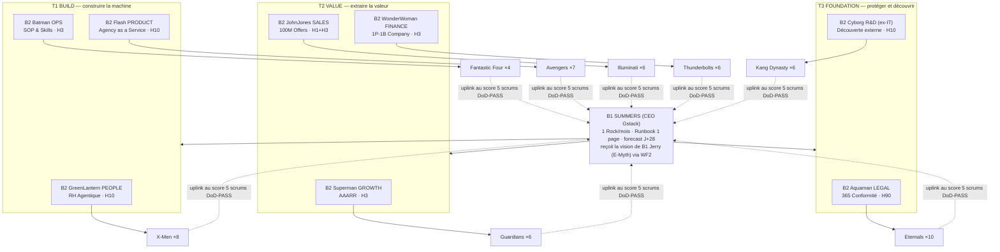

# Cartographie L2 — B1 Summers → 8 B2 (Triptyque V4) → 53 B3 canon : la délégation exécutive complète

> **Le principe** : Summers COMMANDE (Rocks mensuels, Runbooks Gstack, Down-Link WF2) · les 8 B2 DISPATCHENT (jamais ne codent — Sprint Dispatchers) · les 53 B3 EXÉCUTENT (Daily Scrums, delta SQL). Délégation, pas création : un besoin détecté se ROUTE au squad compétent (Paperclipai « delegation not creation »).
> Roster = ADR-CANON-001 (source of truth). Missions = Triptyques V4 (W40). Terrain Cycle 1 = SOB coach premium (`sob/`, Runbooks C1-R1/R2/R3).

## 1. La chaîne de commandement



**Comptage canon** : 8+4+7+6+6+6+10+6 = **53 B3**. L'infra technique n'appartient plus à Cyborg (pivot R&D) — elle descend à L0 sous Rick (sovereignty ladder).

## 2. Statut Cycle 1 (la cadence est un droit gate-PASS, pas une obligation — W40)

| Domaine | Statut C1 | Cause / Déclencheur de réveil |
|---|---|---|
| Flash Product | 🟢 **ACTIF** | porte R1 (instance AaaS démontrable) |
| JohnJones Sales | 🟢 **ACTIF** | porte R2 (outreach → démos → closing) |
| Superman Growth | 🟢 **ACTIF** | porte R2 amont (liste 100, canaux, AAARR) |
| Batman Ops | 🟢 **ACTIF** | porte R3 (SOP onboarding) + SOP émergents des scrums |
| WonderWoman Finance | 🟡 SEMI | ledger + forecast + unit economics — 1 scrum/sprint suffit |
| Aquaman Legal | ⚪ DORMANT | réveil au **1er contrat coach à signer** (CGV, RGPD, DPA) |
| GreenLantern People | ⚪ DORMANT | réveil quand un squad manque d'un rôle (staffing d'agents) |
| Cyborg R&D | 🟡 SEMI | 1 sweep découverte/mois, **≤3 propositions actionnables** max |

## 3. La délégation exécutive — les 53 B3, domaine par domaine

### T1 · B2-03 Flash PRODUCT — mission « Agency as a Service » — squad AVENGERS (7) 🟢
| B3 | Rôle canon | Délégation exécutive Cycle 1 (R1) |
|---|---|---|
| **Captain America** (LEAD) | vision produit, intégrité de spec | tient l'Ownerbook R1 ; arbitre chaque scrum produit contre la spec ; dispatch les 6 |
| Iron Man | tech produit, premium UX | l'instance démo (serve_instance, viewer) au niveau « screenshot vendable » |
| Thor | flagship, premium tiers | le paquet 1000 $/mois : ce que le coach VOIT pour ce prix (liste livrables) |
| Hulk | stress test, scale | casser l'instance : re-runs, données volumineuses, 2 instances en parallèle |
| Black Widow | intel concurrentielle, rétention | 3 AaaS/outils concurrents analysés → 1 page « pourquoi nous » |
| Hawkeye | traçabilité des specs | chaque sortie Runbook R1 a son receipt SQL — rien ne se perd |
| Scarlet Witch | chaos engineering | les cas tordus : coach sans contenu, données bizarres, edge cases démo |

### T2 · B2-05 JohnJones SALES — mission « 100M Offers » — squad ILLUMINATI (6) 🟢
| B3 | Rôle canon | Délégation exécutive Cycle 1 (R2) |
|---|---|---|
| **Black Bolt** (LEAD) | closing complexe, silence-as-power | tient le pipeline ; dispatch ; ferme les démos (les 3 premiers signés) |
| Tony Stark | tech sales, comptes premium | le script de démo (instance live → valeur en 15 min) |
| Charles Xavier | mapping mental de l'acheteur | par prospect : le détail spécifique + l'angle du message personnalisé |
| Stephen Strange | deals internationaux | fuseaux/langues du batch US + variantes d'approche par géo |
| Namor | distribution, wholesale | canaux indirects : communautés de coachs, certifs ICF, podcasts |
| Reed Richards | pipeline d'innovation | l'offre Hormozi : valeur×certitude ÷ délai×effort — la page d'offre irrésistible |

### T2 · B2-04 Superman GROWTH — mission « AAARR » — squad GUARDIANS OF THE GALAXY (6) 🟢
| B3 | Rôle canon | Délégation exécutive Cycle 1 (R2 amont) |
|---|---|---|
| **Star-Lord** (LEAD) | top funnel, narrative | le hook : 1 phrase qui fait ouvrir le message d'un coach mid-tier |
| Gamora | tuer les mauvais canaux | après 50 envois : couper les canaux à 0 réponse (receipt outreach_log) |
| Rocket | analytics expérimentales | le tracking canal×segment dans `experiments` (l'allocation-efficiency CEO-BENCH) |
| Groot | evergreen, rétention lente | le contenu qui travaille seul : 1 asset/mois (article, template public) |
| Drax | A/B littéral, sans subtilité | 2 variantes de message, comptage brut des réponses, verdict mécanique |
| Mantis | empathie d'onboarding | les 10 conversations découverte/mois (source='research', non-vendantes) |

### T1 · B2-02 Batman OPS — mission « SOP & Skills » — squad FANTASTIC FOUR (4) 🟢
| B3 | Rôle canon | Délégation exécutive Cycle 1 (R3 + transverse) |
|---|---|---|
| **Mr Fantastic** (LEAD) | process élastiques | cartographie l'onboarding manuel des 3 premiers clients → le SOP émerge du réel |
| Invisible Woman | privacy ops, incidents | les données coach cloisonnées (instance isolée) + réponse incident 1 page |
| Human Torch | hot fixes, déploiement urgent | le scrum de réparation quand un E.2 dépasse 3 retries |
| The Thing | process porteurs, durabilité | ce qui a marché 2× devient script (`tools/`) — l'anti-fragilité par répétition |

### T2 · B2-07 WonderWoman FINANCE — mission « 1-Person/1-Billion Company » — squad THUNDERBOLTS (6) 🟡
| B3 | Rôle canon | Délégation exécutive Cycle 1 (1 scrum/sprint) |
|---|---|---|
| **Bucky Barnes** (LEAD) | runway, résilience hiver | la vue `daily_cash` lue chaque sprint ; plancher 2 mois de burn surveillé |
| Yelena Belova | pricing affûté, unit econ | coût réel par client (tokens+infra) vs 1000 $ — la marge par tête |
| Ghost | actifs intangibles | l'IP qui s'accumule (Runbooks, templates) valorisée au bilan du cycle |
| Red Guardian | capex lourd, réserves | le budget VPS/outils : rien ne s'achète avant le déclencheur client |
| Taskmaster | CAC miroir, anti-pattern billing | coût d'acquisition par canal depuis ledger×outreach_log |
| U.S. Agent | conformité comptable | chaque € entré/sorti a sa ligne ledger — auditable en 1 query |

### T3 · B2-08 Aquaman LEGAL — mission « 365 Conformité par Conception » — squad ETERNALS (10) ⚪
| B3 | Rôle canon | Délégation au réveil (1er contrat à signer) |
|---|---|---|
| **Ikaris** (LEAD) | AI-Act lead | le pack conformité minimal : mentions IA, AI-Act applicable à l'AaaS |
| Sersi | alchimie contractuelle | LE contrat type coach (1000 $/mois, résiliable, IP claire) |
| Ajak | communion compliance | RGPD/DPA : registre + droits d'accès pour les données coach |
| Kingo | IP entertainment | le contenu généré pour le coach : qui possède quoi |
| Phastos | brevets/IP tech | l'IP des tools (`sob.py`, templates) : licence et protection |
| Sprite | narratif de responsabilité | disclaimers : l'AaaS assiste, le coach reste l'auteur |
| Druig | zones grises | ce qu'on ne PEUT PAS promettre (résultats clients, revenus) |
| Thena | clauses de guerre | indemnisation, limitation de responsabilité, litiges |
| Gilgamesh | gouvernance souveraine | la structure juridique porteuse (auto-entreprise → société, au seuil) |
| Makkari | recherche rapide | précédents et modèles : 1 h max par question, cite ses sources |

### T1 · B2-01 GreenLantern PEOPLE — mission « RH Agentique » — squad X-MEN (8) ⚪
| B3 | Rôle canon | Délégation au réveil (staffing d'un rôle manquant) |
|---|---|---|
| **Professor X** (LEAD) | comptes stratégiques, éthique | décide QUEL rôle manque vraiment (vs travail inventé) — le garde anti-usine |
| Cyclops | leadership tactique | découpe le rôle en délégation exécutable (ce document = son format) |
| Jean Grey | résolution de conflits | 2 squads qui se marchent dessus → frontière clarifiée en 1 ligne |
| Wolverine | profils difficiles, rétention | les tâches que personne ne veut : relances froides, nettoyage de données |
| Storm | culture, atmosphère | le ton des messages sortants : humain, pas robot (relit 1 échantillon/sprint) |
| Beast | L&D, rigueur scientifique | ce que les échecs enseignent → 1 leçon/sprint dans le memory file du domaine |
| Nightcrawler | mobilité inter-équipes | un B3 sous-utilisé se prête au squad qui déborde (transferts) |
| Rogue | transfert de savoir, anti-fraude | un savoir critique détenu par 1 seul agent = copié dans un Runbook |

### T3 · B2-06 Cyborg R&D — mission « Découverte externe » — squad KANG DYNASTY (6) 🟡
| B3 | Rôle canon | Délégation exécutive (1 sweep/mois, ≤3 propositions) |
|---|---|---|
| **Kang Prime** (LEAD) | architecture prime | arbitre les découvertes : max 3 candidats Rock remontés à Summers |
| Victor Timely | frontier civique | le sweep Last30days : nouveaux outils/repos/releases pertinents AaaS-coach |
| Iron Lad | greenfield véloce | prototype 1 découverte prometteuse en 1 scrum (jetable, prouvable) |
| Scarlet Centurion | pipelines alternatifs | teste l'alternative (autre canal, autre stack) en parallèle borné |
| Immortus | dépréciation long-horizon | ce qui doit MOURIR : outils/process obsolètes → liste de retrait |
| Rama-Tut | archéologie de code | ce que le disque contient DÉJÀ qui résout le besoin (avant tout achat) |

## 4. Les règles de délégation (les seules)

1. **Le LEAD dispatch, les membres exécutent.** Un LEAD qui exécute = un domaine sans dispatcher (signal WF1).
2. **Un B3 reçoit sa tâche du Runbook via son LEAD** — jamais en direct de Summers ni d'un autre domaine (le canal RH GreenLantern route les besoins inter-domaines).
3. **Un B3 dormant DORT** (règle des dormants, carte A3) : les Eternals ne produisent rien tant qu'aucun contrat n'est à signer. Zéro travail inventé.
4. **L'uplink monte au score** : 5 scrums DoD-PASS = sprint review du B2 → 4 sprints = dossier Rock pour Summers. Contre-exemples [E-type + ID SQL], jamais un PASS/FAIL sec.
5. **Besoin hors-domaine détecté en scrum** → route par la matrice RH : Skills/SOP → Batman F4 · produit → Flash Avengers · legal → Aquaman Eternals · découverte → Cyborg Kang. On ne crée pas, on route.

## 5. Scellé (state.json)

```json
{
  "layer": "L2_COMMAND_CHAIN", "topology_version": "3.1.FINAL",
  "b1": { "ceo": "SUMMERS_GSTACK", "vision": "JERRY_EMYTH", "canal": "WF2_97d332d5" },
  "b2": { "t1_build": ["greenlantern_people","batman_ops","flash_product"],
          "t2_value": ["superman_growth","johnjones_sales","wonderwoman_finance"],
          "t3_foundation": ["aquaman_legal","cyborg_rd"] },
  "b3_total": 53,
  "squads": { "xmen": 8, "f4": 4, "avengers": 7, "gotg": 6, "illuminati": 6, "thunderbolts": 6, "eternals": 10, "kang": 6 },
  "cycle1_gates": { "actifs": ["product","sales","growth","ops"], "semi": ["finance","rd"], "dormants": ["legal","people"] },
  "rule": "le LEAD dispatch, le membre execute, le dormant dort, l'uplink monte au score"
}
```

---
*Summers commande, 8 managers dispatchent, 53 exécutants livrent — et 4 domaines seulement sont éveillés, parce que le Cycle 1 n'a besoin que d'eux. La hiérarchie complète existe pour le jour où le MRR la remplira. — A.S. 2026-07-20*
