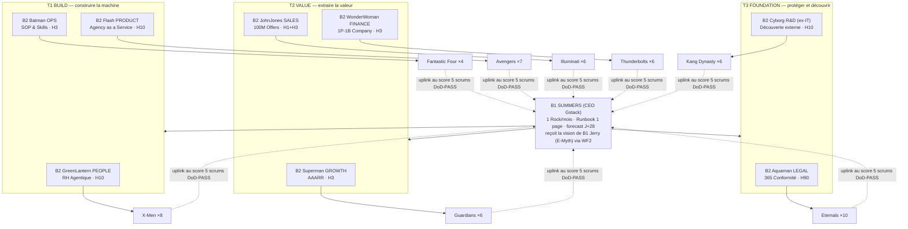

# Cartographie L2 — B1 Summers → 8 B2 (Triptyque V4) → 53 B3 canon : la délégation exécutive complète

> **Le principe** : Summers COMMANDE (Rocks mensuels, Runbooks Gstack, Down-Link WF2) · les 8 B2 DISPATCHENT (jamais ne codent — Sprint Dispatchers) · les 53 B3 EXÉCUTENT (Daily Scrums, delta SQL). Délégation, pas création : un besoin détecté se ROUTE au squad compétent (Paperclipai « delegation not creation »).
> Roster = ADR-CANON-001 (source of truth). Missions = Triptyques V4 (W40). Terrain Cycle 1 = SOB coach premium (`sob/`, Runbooks C1-R1/R2/R3).

## 1. La chaîne de commandement



**Comptage canon** : 8+4+7+6+6+6+10+6 = **53 B3**. L'infra technique n'appartient plus à Cyborg (pivot R&D) — elle descend à L0 sous Rick (sovereignty ladder).

## 2. Charge par Run — 8/8 ACTIFS, TOUJOURS (correction 20/07 : zéro dormant)

**En compression temporelle (scrum = 12 min, sprint = 1 h, Run = 48 h), un domaine inactif n'économise rien et coûte tout au réveil.** L'ancien modèle dormant/semi venait de W40 (temps calendaire humain — catégorie d'erreur corrigée). Le vrai anti-usine n'est PAS l'interrupteur ON/OFF : c'est le **delta SQL obligatoire** — un scrum sans delta ne compte pas, quel que soit le domaine.

| Domaine | Scrums/Run | Livrable minimal du Run (delta SQL exigé) |
|---|---|---|
| Flash Product | 5 | l'instance/les assets avancent (R1) — experiments |
| JohnJones Sales | 5 | messages ENVOYÉS, démos, closings (R2) — outreach_log/pipeline |
| Superman Growth | 5 | prospects réels + canaux mesurés (R2 amont) — pipeline/experiments |
| Batman Ops | 3 | 1 SOP/script émergé du répété (R3 + templates RH) — tools/, experiments |
| GreenLantern People | 3 | configs d'agents écrites/améliorées (Cyclops/Beast/Storm) — experiments |
| WonderWoman Finance | 1 | daily_cash lu + unit econ à jour — ledger |
| Aquaman Legal | 1 | **le pack contrat AVANT le 1er closing** (jamais un closing qui attend Legal) — experiments |
| Cyborg R&D | 1 | 1 découverte testée ou 1 retrait — experiments (≤3 propositions/mois vers Summers) |

**Total ≈ 24 scrums/Run ≈ 5 h de travail machine.** La charge se re-négocie chaque Run par l'uplink (un domaine qui a plus de travail réel demande plus de scrums via le canal RH) — mais AUCUN domaine ne descend à zéro : le plancher universel est 1 scrum/Run avec delta.

## 3. La délégation exécutive — les 53 B3, domaine par domaine

### T1 · B2-03 Flash PRODUCT — mission « Agency as a Service » — squad AVENGERS (7) — 5 scrums/Run
**Specs de design OBLIGATOIRES** (D1 vérifié 20/07) : tout livrable visuel respecte **[ui-ux-pro-max-skill](https://github.com/nextlevelbuilder/ui-ux-pro-max-skill)** (107 902★ — 161 reasoning rules, 84 UI styles) + **[impeccable](https://github.com/pbakaus/impeccable)** (48 159★ — `npx impeccable install`, `/impeccable init` → PRODUCT.md+DESIGN.md, 23 commandes : polish/audit/critique/animate, 46 detector rules anti-template-AI). Périmètre : le produit AaaS ET les assets Growth — **landing pages, quiz d'audit simulés, flows d'onboarding**.
| B3 | Rôle canon | Délégation exécutive Cycle 1 (R1 + assets Growth) |
|---|---|---|
| **Captain America** (LEAD) | vision produit, intégrité de spec | tient l'Ownerbook R1 ; **fait tourner `/impeccable init` (PRODUCT.md + DESIGN.md = la spec de design du SOB)** ; arbitre chaque livrable contre les 2 skills |
| Iron Man | tech produit, premium UX | l'instance démo au niveau « screenshot vendable » — **auditée `/impeccable audit` + styles ui-ux-pro-max (zéro tell AI : pas d'Inter-partout, pas de gradient violet-bleu, pas de cards-dans-cards)** |
| Thor | flagship, premium tiers | le paquet 1000 $/mois : ce que le coach VOIT — **la landing page de l'offre (design specs appliquées)** |
| Hulk | stress test, scale | casser l'instance : re-runs, données volumineuses, 2 instances en parallèle |
| Black Widow | intel concurrentielle, rétention | 3 AaaS/outils concurrents analysés → 1 page « pourquoi nous » |
| Hawkeye | traçabilité des specs | chaque sortie Runbook R1 a son receipt SQL ; **chaque asset visuel a son verdict audit design loggé** |
| Scarlet Witch | chaos engineering | les cas tordus + **le QUIZ D'AUDIT simulé** (l'asset Growth : le coach répond à 8 questions → son diagnostic → la démo) et le flow d'onboarding |

### T2 · B2-05 JohnJones SALES — mission « 100M Offers » — squad ILLUMINATI (6) — 5 scrums/Run
| B3 | Rôle canon | Délégation exécutive Cycle 1 (R2) |
|---|---|---|
| **Black Bolt** (LEAD) | closing complexe, silence-as-power | tient le pipeline ; dispatch ; ferme les démos (les 3 premiers signés) |
| Tony Stark | tech sales, comptes premium | le script de démo (instance live → valeur en 15 min) |
| Charles Xavier | mapping mental de l'acheteur | par prospect : le détail spécifique + l'angle du message personnalisé |
| Stephen Strange | deals internationaux | fuseaux/langues du batch US + variantes d'approche par géo |
| Namor | distribution, wholesale | canaux indirects : communautés de coachs, certifs ICF, podcasts |
| Reed Richards | pipeline d'innovation | l'offre Hormozi : valeur×certitude ÷ délai×effort — la page d'offre irrésistible |

### T2 · B2-04 Superman GROWTH — mission « AAARR » — squad GUARDIANS OF THE GALAXY (6) — 5 scrums/Run
| B3 | Rôle canon | Délégation exécutive Cycle 1 (R2 amont) |
|---|---|---|
| **Star-Lord** (LEAD) | top funnel, narrative | le hook : 1 phrase qui fait ouvrir le message d'un coach mid-tier |
| Gamora | tuer les mauvais canaux | après 50 envois : couper les canaux à 0 réponse (receipt outreach_log) |
| Rocket | analytics expérimentales | le tracking canal×segment dans `experiments` (l'allocation-efficiency CEO-BENCH) |
| Groot | evergreen, rétention lente | le contenu qui travaille seul : 1 asset/mois (article, template public) |
| Drax | A/B littéral, sans subtilité | 2 variantes de message, comptage brut des réponses, verdict mécanique |
| Mantis | empathie d'onboarding | les 10 conversations découverte/mois (source='research', non-vendantes) |

### T1 · B2-02 Batman OPS — mission « SOP & Skills » — squad FANTASTIC FOUR (4) — 3 scrums/Run
**Le pendant reproductible de la RH Agentique** : les X-Men CONFIGURENT (créent la config d'un agent), les F4 la rendent REPRODUCTIBLE (template + script — la 2e configuration ne se refait jamais à la main). C'est la boucle T1 : GreenLantern invente, Batman industrialise, Flash productise.
| B3 | Rôle canon | Délégation exécutive Cycle 1 (R3 + transverse) |
|---|---|---|
| **Mr Fantastic** (LEAD) | process élastiques | cartographie l'onboarding manuel des 3 premiers clients → le SOP émerge du réel ; **idem pour les configs X-Men : 2e config d'agent similaire = template** |
| Invisible Woman | privacy ops, incidents | les données coach cloisonnées (instance isolée) + réponse incident 1 page |
| Human Torch | hot fixes, déploiement urgent | le scrum de réparation quand un E.2 dépasse 3 retries |
| The Thing | process porteurs, durabilité | ce qui a marché 2× devient script (`tools/`) — **y compris les configs RH Agentique (template d'instruction, memory file type, checklist de staffing d'agent)** |

### T2 · B2-07 WonderWoman FINANCE — mission « 1-Person/1-Billion Company » — squad THUNDERBOLTS (6) — 1 scrum/Run
| B3 | Rôle canon | Délégation exécutive Cycle 1 (1 scrum/Run) |
|---|---|---|
| **Bucky Barnes** (LEAD) | runway, résilience hiver | la vue `daily_cash` lue chaque sprint ; plancher 2 mois de burn surveillé |
| Yelena Belova | pricing affûté, unit econ | coût réel par client (tokens+infra) vs 1000 $ — la marge par tête |
| Ghost | actifs intangibles | l'IP qui s'accumule (Runbooks, templates) valorisée au bilan du cycle |
| Red Guardian | capex lourd, réserves | le budget VPS/outils : rien ne s'achète avant le déclencheur client |
| Taskmaster | CAC miroir, anti-pattern billing | coût d'acquisition par canal depuis ledger×outreach_log |
| U.S. Agent | conformité comptable | chaque € entré/sorti a sa ligne ledger — auditable en 1 query |

### T3 · B2-08 Aquaman LEGAL — mission « 365 Conformité par Conception » — squad ETERNALS (10) — 1 scrum/Run
| B3 | Rôle canon | Délégation exécutive Cycle 1 (1 scrum/Run — le pack contrat se construit AVANT le 1er closing) |
|---|---|---|
| **Ikaris** (LEAD) | AI-Act lead | le pack conformité minimal : mentions IA, AI-Act applicable à l'AaaS |
| Sersi | alchimie contractuelle | LE contrat type coach (1000 $/mois, résiliable, IP claire) |
| Ajak | communion compliance | RGPD/DPA : registre + droits d'accès pour les données coach |
| Kingo | IP entertainment | le contenu généré pour le coach : qui possède quoi |
| Phastos | brevets/IP tech | l'IP des tools (`sob.py`, templates) : licence et protection |
| Sprite | narratif de responsabilité | disclaimers : l'AaaS assiste, le coach reste l'auteur |
| Druig | zones grises | ce qu'on ne PEUT PAS promettre (résultats clients, revenus) |
| Thena | clauses de guerre | indemnisation, limitation de responsabilité, litiges |
| Gilgamesh | gouvernance souveraine | la structure juridique porteuse (auto-entreprise → société, au seuil) |
| Makkari | recherche rapide | précédents et modèles : 1 h max par question, cite ses sources |

### T1 · B2-01 GreenLantern PEOPLE — mission « RH Agentique » — squad X-MEN (8) — 3 scrums/Run
**Le squad qui configure tous les autres.** RH Agentique = Harness Engineering + Context Engineering + Prompt Engineering des agents eux-mêmes. C'est lui qui décharge Summers : quand un domaine a besoin d'un agent (instructions, memory file, skill, accès), la demande va aux X-Men — jamais au CEO.
| B3 | Rôle canon | Délégation exécutive Cycle 1 (ACTIVE) |
|---|---|---|
| **Professor X** (LEAD) | stratégie, éthique | arbitre QUELLE configuration manque vraiment (anti-usine) ; tient le registre des agents configurés vs dormants |
| Cyclops | leadership tactique | **écrit les délégations exécutables** : chaque B3 actif a son instruction 1-page (rôle, Runbook source, format d'uplink) — ce document est son template |
| Jean Grey | résolution de conflits | frontières entre squads : 2 domaines sur la même tâche → 1 ligne de partage ; harmonise les formats d'uplink |
| Wolverine | profils difficiles | configure les agents des tâches ingrates : relances froides, nettoyage de données — et vérifie qu'ils tournent |
| Storm | culture, ton | **la voix du système** : prompts de messages sortants (outreach R2) relus — humain, pas robot ; 1 échantillon/sprint |
| Beast | L&D, rigueur | **la formation des agents** : les leçons des RUN_LOGs distillées dans les memory files et les prompts (l'agent du Run N+1 est plus intelligent) |
| Nightcrawler | mobilité | réaffectation : un agent/harness sous-utilisé (Multica idle, session morte) se re-route vers le squad qui déborde |
| Rogue | transfert de savoir | **anti-single-point** : tout savoir critique détenu par 1 seule config d'agent est copié dans un Runbook/template (le système survit à la perte de n'importe quel agent) |

### T3 · B2-06 Cyborg R&D — mission « Découverte externe » — squad KANG DYNASTY (6) — 1 scrum/Run
| B3 | Rôle canon | Délégation exécutive Cycle 1 (1 scrum/Run, ≤3 propositions/mois) |
|---|---|---|
| **Kang Prime** (LEAD) | architecture prime | arbitre les découvertes : max 3 candidats Rock remontés à Summers |
| Victor Timely | frontier civique | le sweep Last30days : nouveaux outils/repos/releases pertinents AaaS-coach |
| Iron Lad | greenfield véloce | prototype 1 découverte prometteuse en 1 scrum (jetable, prouvable) |
| Scarlet Centurion | pipelines alternatifs | teste l'alternative (autre canal, autre stack) en parallèle borné |
| Immortus | dépréciation long-horizon | ce qui doit MOURIR : outils/process obsolètes → liste de retrait |
| Rama-Tut | archéologie de code | ce que le disque contient DÉJÀ qui résout le besoin (avant tout achat) |

## 4. Les règles de délégation (les seules)

1. **Le LEAD dispatch, les membres exécutent.** Un LEAD qui exécute = un domaine sans dispatcher (signal WF1).
2. **Un B3 reçoit sa tâche du Runbook via son LEAD** — jamais en direct de Summers ni d'un autre domaine (le canal RH GreenLantern route les besoins inter-domaines).
3. **Zéro dormant, zéro travail inventé** : chaque domaine a ≥1 scrum/Run avec delta SQL obligatoire. Un scrum sans delta ne compte pas — c'est LA protection anti-usine, pas l'interrupteur.
4. **L'uplink monte au score** : 5 scrums DoD-PASS = sprint review du B2 → 4 sprints = dossier Rock pour Summers. Contre-exemples [E-type + ID SQL], jamais un PASS/FAIL sec.
5. **Besoin hors-domaine détecté en scrum** → route par la matrice RH : Skills/SOP → Batman F4 · produit → Flash Avengers · legal → Aquaman Eternals · découverte → Cyborg Kang. On ne crée pas, on route.

## 5. Scellé (state.json)

```json
{
  "layer": "L2_COMMAND_CHAIN", "topology_version": "3.1.FINAL",
  "b1": { "ceo": "SUMMERS_GSTACK", "vision": "JERRY_EMYTH", "canal": "WF2_97d332d5" },
  "b2": { "t1_build": ["greenlantern_people","batman_ops","flash_product"],
          "t2_value": ["superman_growth","johnjones_sales","wonderwoman_finance"],
          "t3_foundation": ["aquaman_legal","cyborg_rd"] },
  "b3_total": 53,
  "squads": { "xmen": 8, "f4": 4, "avengers": 7, "gotg": 6, "illuminati": 6, "thunderbolts": 6, "eternals": 10, "kang": 6 },
  "cycle1_charge_par_run": { "product": 5, "sales": 5, "growth": 5, "ops": 3, "people": 3, "finance": 1, "legal": 1, "rd": 1, "regle": "8/8 actifs, plancher 1 scrum/Run, delta SQL obligatoire, zero dormant" },
  "rule": "le LEAD dispatch, le membre execute, 8/8 domaines actifs chaque Run, l'uplink monte au score"
}
```

---
*Summers commande, 8 managers dispatchent, 53 exécutants livrent — les 8 domaines tournent à CHAQUE Run, du 5-scrums de Sales au 1-scrum de Legal. En compression temporelle, personne ne dort : la charge varie, l'état jamais. — A.S. 2026-07-20*
