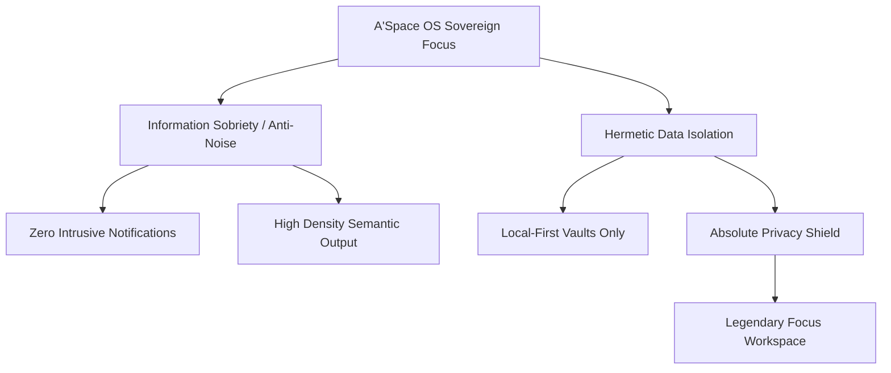

# Analyse Stratégique : Le Cas PNL – Le Marketing du Silence, Rareté Organisée et Hacking Culturel

## 1. Métadonnées Sémantiques & Alignement RAG
* **ID Unique** : YT-tuhSzxk9Rf0
* **Auteur** : Yann Leonardi
* **Thématique** : Growth Marketing / Scarcity & Communautary Hacking
* **Date d'Analyse** : 2026-05-28
* **Statut de Transition** : `CLARIFIED_PLANE`

---

## 2. Concepts Clés & Décryptage Technique (>30 lignes)

Le duo de rap PNL (Ademo et N.O.S) est analysé par Yann Leonardi comme l'un des cas d'étude marketing les plus fascinants et révolutionnaires de la décennie. En inversant toutes les règles traditionnelles de la promotion musicale et de la communication de masse, PNL a théorisé et appliqué ce que l'on appelle le **Marketing du Silence**. Les piliers techniques de cette stratégie de croissance disruptive sont multiples :

### A. La Rareté Organisée et la Rétention de l'Attention (Extreme Scarcity)
* **Zéro Interview, Zéro Passage Média** : PNL refuse systématiquement toute interview avec la presse, les radios ou les chaînes de télévision. En éliminant le "bruit" médiatique classique, ils créent un vide d'information. Ce vide génère naturellement une curiosité maladive, de la spéculation et un mystère immense que les fans cherchent désespérément à décoder.
* **Le produit comme seul vecteur de communication** : Le clip vidéo et le morceau de musique deviennent les uniques points de contact de la marque. Chaque seconde de vidéo est polie à l'extrême (budgets de production colossaux à l'autre bout du monde), forçant les spectateurs à analyser chaque plan à la recherche d'indices ou de messages cachés.

### B. Le Sentiment d'Appartenance Sacré (QLF : Que La Famille)
* **Le culte de la communauté fermée** : PNL a baptisé sa communauté originelle "QLF" (Que La Famille). Ce slogan d'appartenance exclusif crée une frontière étanche entre "ceux qui comprennent" (la famille) et le reste du monde. Cette segmentation radicale transforme l'audience en une armée d'ambassadeurs fanatisés, prêts à défendre la marque et à propager ses sorties avec une ferveur religieuse.

### C. Le Guerilla Marketing et l'Activation Expérientielle Sémantique
* PNL a transcendé la musique numérique en piratant le monde physique avec des coups d'éclat conceptuels :
    * **Le numéro de téléphone éphémère** : Pour teaser l'album *Dans la légende*, ils affichent un numéro de téléphone dans toute la France. Appeler ce numéro diffusait un extrait inédit en boucle, créant un buzz viral immédiat à coût d'acquisition (CAC) quasi nul.
    * **L'appropriation de symboles nationaux** : Privatiser le sommet de la Tour Eiffel pour y tourner le clip "Au DD" sans prévenir personne. Ce coup de force esthétique et politique envoie un signal fort de domination culturelle globale.

---

## 3. Entités, Outils & Mé methodologies

* **Le Marketing du Silence (Scarcity Marketing)** : Stratégie de positionnement haut de gamme reposant sur l'absence volontaire de communication pour démultiplier la désirabilité du produit.
* **Guerilla Marketing** : Actions de promotion non conventionnelles, à faible coût financier mais à fort impact conceptuel, menées sur le terrain physique pour surprendre l'audience.
* **QLF (Que La Famille) / Tribe-Led Growth** : Mécanisme d'acquisition fondé sur la création d'un sentiment d'appartenance tribal strict avec des codes de reconnaissance internes fortifiés.
* **D2C Radical (Direct-to-Consumer)** : Bypass complet des réseaux de distribution et des médias classiques pour s'adresser directement à l'audience cible via les réseaux de la marque.

---

## 4. Synthèse Pratique & Souveraineté A'Space OS (>35 lignes)

Les leçons tirées de la stratégie spectaculaire de PNL s'intègrent profondément dans le développement sémantique de **A'Space OS**.

### A. Le Principe de Sobriété Informationnelle (Anti-Bruit)
Le monde moderne sature notre attention de notifications, de flux continus d'informations et d'alertes inutiles. Inspiré par le marketing du silence de PNL, A'Space OS prône la **Sobriété Informationnelle**. Notre système d'exploitation n'agresse pas l'utilisateur avec des relances constantes. Il fonctionne en silence, de manière invisible en arrière-plan. Il concentre toute sa valeur sur la pertinence et la qualité du produit sémantique final (les réponses claires du RAG local, les synthèses de connaissances denses). Moins de bruit, plus de sens : c'est le luxe de la concentration retrouvée.

### B. La Tribalisation des Données (Hermetic Vault Isolation)
Pour garantir une sécurité et une souveraineté absolues, A'Space OS applique le concept de "Que La Famille" (QLF) à vos données personnelles. Vos fichiers, vos mots de passe et vos logs intimes font partie du cercle le plus restreint de la "famille" locale. Aucune donnée ne doit fuir vers les serveurs cloud de géants de la Tech sans un consentement explicite et chiffré. Cette étanchéité crée un sanctuaire numérique inviolable, une citadelle d'informations isolée des bruits du web.

### C. L'Action Guerilla de la Productivité (Guerilla Focus)
Au lieu de passer de longues heures à procrastiner sur des micro-tâches inefficaces, A'Space OS encourage le "Guerilla Focus" : des blocs de travail ultra-concentrés, isolés de toute distraction, pour réaliser des avancées majeures en un minimum de temps. Nous mettons en œuvre des raccourcis claviers ultra-rapides et des scripts d'automatisation pour abattre la complexité avec la même efficacité chirurgicale qu'un drop d'album de PNL.

---

## 5. Section D.E.A.L (Définir, Éliminer, Automatiser, Libérer)

* **Définir** : Vos zones de silence de travail. Bloquez des plages horaires quotidiennes dans votre calendrier où aucune communication externe n'est autorisée. Devenez injoignable pour créer votre chef-d'œuvre.
* **Éliminer** : Bannir les applications et les sources d'information qui polluent votre attention sans apporter de valeur réelle. Nettoyez votre environnement numérique pour faire renaître le mystère et la concentration.
* **Automatiser** : Configurer votre système de communication (emails, Slack, messages) pour qu'il réponde automatiquement à vos correspondants avec des messages polis mais fermes indiquant vos heures de disponibilité restreintes.
* **Libérer** : Atteindre le statut de souveraineté en faisant du produit de votre esprit (votre code, vos écrits, vos projets) la seule et unique preuve de votre valeur et de votre compétence. Laissez votre silence parler pour vous.
