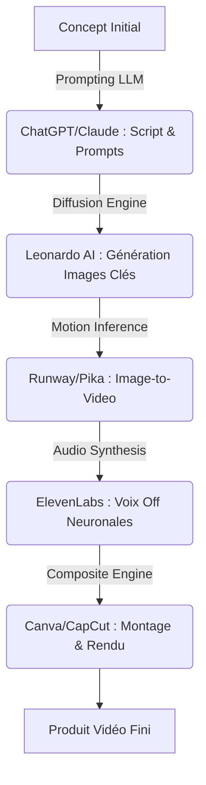

# 🧿 Geordi Resource Guide — 3D Animated Disney Cartoon Story
> **ID YouTube** : `YT-PcVQf3m_pxQ`  
> **Source Channel** : VAGPE Media  
> **Serendipity Score** : 7/10  
> **Date de Capture** : 2026-05-24  
> **Souveraineté Métier** : H1 - Horizon sémantique et génération de contenu par IA  

---

## 1. Concepts Clés (Deep-Dive Sémantique)

L'émergence des technologies d'IA générative applique un levier de productivité sans précédent sur le pipeline traditionnel de la création d'animations 3D. Le processus traditionnel de production de films d'animation (Disney, Pixar, Dreamworks), qui nécessitait auparavant des fermes de rendu massives, des équipes entières de modélisateurs 3D, de riggers, d'animateurs et d'ingénieurs du son, est désormais synthétisé en un micro-pipeline exécutable par un opérateur unique en quelques minutes.

### A. La Révolution de la Synthèse Multimodale
La synthèse multimodale désigne l'habileté à lier plusieurs types de modèles génératifs de manière séquentielle et automatisée :
- **Text-to-Story (LLM)** : Modèles de langage avancés (GPT-4, Claude) générant la structure narrative, le script dialogué et les invites d'images (prompts) à partir d'un concept initial simple.
- **Text-to-Image (Diffusion Models)** : Utilisation de modèles de diffusion (Midjourney, Stable Diffusion XL, Leonardo AI) pour générer des assets visuels 2D de haute fidélité simulant des styles artistiques spécifiques (le style Disney 3D Pixar par exemple).
- **Image-to-Video (T2V & I2V Generators)** : Traduction des images clés statiques en séquences vidéo fluides et dynamiques via des modèles de flux optique et d'attention spatio-temporelle (Runway Gen-2, Pika Labs, Luma Dream Machine).

### B. Contrôle de la Cohérence Temporelle et Personnages Consistants
L'un des défis majeurs du pipeline génératif réside dans la maintenance de la cohérence visuelle à travers les plans successifs :
- **Seed Matching & Reference Images** : Utilisation de paramètres de graines identiques et d'invites d'images de référence (Image Prompts) pour ancrer la géométrie et la palette chromatique du personnage.
- **Stylisation Disney 3D sémantique** : L'utilisation de descripteurs sémantiques fins (`3d disney style, detailed rendering, character concept sheet, octanerender`) permet d'influencer le biais d'entraînement des modèles pour maintenir le style Pixar en relief.

---

## 2. Entités & Outils (Souverains & Publics)

Pour orchestrer ce pipeline, les opérateurs combinent une suite logicielle sémantique et technique hautement intégrée :

| Outil | Rôle dans le Pipeline | Alternatives Souveraines / Open Source |
| :--- | :--- | :--- |
| **ChatGPT / Claude** | Scripting, Storytelling, Traduction de prompts d'images | Llama-3 (Local via Ollama) |
| **Leonardo AI / Midjourney** | Génération de personnages et décors style Disney Pixar 3D | SDXL / Pony Diffusion (Local WebUI) |
| **Runway Gen-2 / Pika** | Animation d'images statiques en mouvements fluides | Stable Video Diffusion / ComfyUI |
| **Canva / CapCut** | Montage, incrustation de voix, sous-titres et habillage | DaVinci Resolve (Souverain local) |
| **ElevenLabs** | Synthèse vocale neuronale multilingue ultra-réaliste | Bark / XTTS v2 (Local inference) |

### Algorithme conceptuel de la chaîne de traitement sémantique :


---

## 3. Synthèse Pratique (Procédure Standard de Production)

Pour livrer une vidéo de style Disney en moins de 15 minutes, l'opérateur applique le processus systématique en cinq phases. Cette méthode minimise la friction inter-outils en structurant les données dès le départ.

### Phase 1 : Rdaction de l'Arche Narrative et Génération de Prompts
L'opérateur soumet un prompt d'ancrage structurel à l'IA pour obtenir à la fois l'histoire, la voix off et le découpage technique :
> *Invite type : "Rédige une histoire pour enfants de 30 secondes sur un petit dragon bleu nommé Sparky perdu dans une forêt de cristal. Pour chaque phrase de voix off, propose un prompt d'image précis en anglais décrivant la scène dans un style Pixar 3D, avec une attention portée sur la lumière volumétrique et la cohérence visuelle."*

### Phase 2 : Production Graphique et Cohérence des Personnages
Sur Leonardo AI ou Midjourney :
1. Choisir un modèle affiné pour la 3D (ex : *Leonardo 3D Animation* ou *Midjourney v6 --style raw*).
2. Utiliser une invite typée : `/imagine a cute 3d disney pixar dragon named Sparky, glowing blue scales, big curious eyes, lost in a crystal forest, pastel colors, volumetric lighting, unreal engine 5 render, highly detailed --ar 16:9 --seed 202605`.
3. Générer les décors d'arrière-plan avec les mêmes paramètres esthétiques pour éliminer toute dissonance cognitive visuelle.

### Phase 3 : Animation par Flux Optique Temporel
Sur Runway Gen-2 ou Pika Labs :
1. Téléverser l'image clé générée à la phase 2.
2. Appliquer une description textuelle subtile de mouvement : `slow camera pan, gentle head movement, crystals glowing, dust particles floating`.
3. Ajuster le paramètre de mouvement (`Motion Brush` ou `Motion strength` à 3-4 maximum) pour éviter les distorsions grotesques ou les aberrations géométriques.

---

## 4. Actionnabilité (D.E.A.L)

### D - Definition (Intention Stratégique)
Créer une usine à contenu (Content Factory) souveraine pour alimenter les plateformes de diffusion de manière hautement automatisée. L'objectif est d'atteindre un coût marginal de production proche de zéro tout en maximisant la rétention de l'audience via un storytelling calibré sémantiquement.

### E - Elimination (Épuration des Frictions)
- Éliminer le montage vidéo manuel complexe en utilisant des templates Canva pré-configurés pour le ratio 16:9 ou 9:16 (Shorts/TikTok).
- Bannir l'utilisation de voix synthétiques robotiques standard au profit de modèles de clonage vocal à haute expressivité émotionnelle (ElevenLabs ou modèles locaux XTTS v2).
- Proscrire les temps de rendu locaux en déportant l'inférence sur le Cloud (ou via des clusters locaux sous Docker).

### A - Automation (Le Cœur Logique de la SOP)
```
[SOP-CAPTURE-3D-ANIME]
1. CONFIGURER l'environnement de génération : Leonardo AI (Preset 3D) et Runway Gen-2.
2. ENTRER le prompt maître narratif dans le LLM local (Ollama/Llama-3) pour générer l'arche en 5 scènes.
3. EXÉCUTER la génération d'images clés sur Leonardo AI en maintenant le seed strict.
4. SOUMETTRE les images clés à Runway avec un Motion Strength de 3.
5. CONVERTIR le texte de voix off en voix neuronale via ElevenLabs.
6. IMPORTER tous les éléments dans Canva, appliquer le filtre de transition douce "Fondu" et assembler.
7. EXPORTER au format MP4 1080p.
```

### L - Liberation (Objectif Souverain & Alignement)
* **Domaine Spock associé** : `[Spock's Area LD01 - Career/Business]` (Diversification de revenus passifs via chaînes automatisées sans intervention humaine constante).
* **Roue de la vie** : Impact social et divertissement créatif pour enfants.
* **Prochaine étape actionnable** : Déployer la SOP sur un lot de 3 scripts tests pour valider le taux d'aberration géométrique lors du passage Image-to-Video.

---
*Ce document de connaissances fait partie intégrante du système PARA de l'Enterprise d'A'Space OS V2.*
