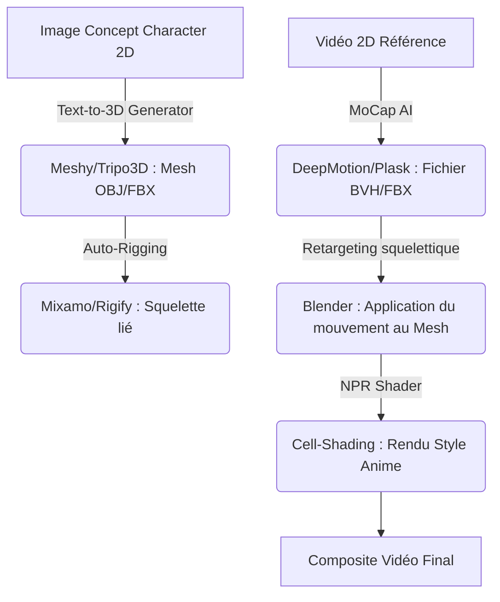

# 🧿 Geordi Resource Guide — AI Animation Generator & 3D Anime Maker
> **ID YouTube** : `YT-4XSb6eC_fSY`  
> **Source Channel** : Ai Lockup  
> **Serendipity Score** : 7/10  
> **Date de Capture** : 2026-05-24  
> **Souveraineté Métier** : H1 - Ingénierie de la capture de mouvement et rendu 3D par IA  

---

## 1. Concepts Clés (Deep-Dive Sémantique)

La transition entre les modèles de diffusion bidimensionnels (2D) et le rendu cinématique tridimensionnel (3D) constitue l'une des frontières technologiques les plus dynamiques du deep learning appliqué à l'animation. Ce guide détaille les méthodologies permettant de passer d'un simple croquis ou concept 2D à un modèle 3D animé en temps réel à l'aide d'outils d'IA souverains et grand public.

### A. Synthèse de Mouvement Tridimensionnel (AI Motion Capture)
L'animation 3D par IA repose sur la prédiction de coordonnées spatiales complexes sans nécessiter de combinaisons physiques coûteuses munies de capteurs infrarouges :
- **Vision par Ordinateur Monoculaire (Single-camera MoCap)** : Algorithmes capables d'extraire la pose squelettique humaine en 3D à partir d'une simple séquence vidéo 2D (ex: flux d'une webcam ou vidéo YouTube) grâce à des architectures de réseaux de neurones convolutionnels profonds ou de Transformers spatio-temporels.
- **Rigging Sémantique et Skinning Automatique** : Processus d'association automatique d'un squelette de déformation interne (bones) à un maillage tridimensionnel externe (mesh), permettant au modèle de se mouvoir de façon anatomiquement plausible.

### B. Le Style Cell-Shading et Anime 3D (NPR)
Le rendu non photoréaliste (NPR - Non-Photorealistic Rendering) est essentiel pour obtenir l'esthétique Anime japonais traditionnelle :
- **Génération de textures stylisées** : L'IA intervient pour générer des textures en cell-shading (ombrage plat à contours nets) appliquées sur des géométries 3D.
- **Modèles de conversion Style-to-Style** : Application de filtres d'attention (comme les architectures GAN de type AnimeGAN) sur les passes de rendu 3D pour simuler des dessins faits à la main, alliant la liberté de mouvement de la 3D à la chaleur visuelle de la 2D classique.

---

## 2. Entités & Outils (Souverains & Publics)

Pour orchestrer un pipeline complet de création d'Anime 3D par IA, l'opérateur s'appuie sur la suite logicielle suivante :

| Outil | Rôle dans le Pipeline | Alternatives Souveraines / Open Source |
| :--- | :--- | :--- |
| **DeepMotion / Plask** | Extraction du mouvement (MoCap) 3D à partir d'une vidéo 2D | MediaPipe (Google, local), OpenPose (C++ local) |
| **Mixamo (Adobe)** | Rigging automatique et bibliothèque d'animations squelettiques | Rigify (Blender Addon local) |
| **Kaiber / Runway / Luma** | Génération de décors dynamiques et d'effets visuels Anime | ComfyUI + AnimateDiff (Inférence locale Stable Diffusion) |
| **Blender** | Environnement central de composition 3D, shaders NPR et rendu | Unreal Engine (Shader sémantique) |
| **Tripo3D / Meshy** | Génération de modèles 3D texturés à partir d'images 2D | InstantMesh / LRM (Local Python models) |

### Graphe de dépendance des processus d'ingénierie 3D :


---

## 3. Synthèse Pratique (Procédure Standard de Production)

L'implémentation de cette procédure requiert de dissocier la création du personnage, la capture de l'animation et l'étape finale d'habillage graphique.

### Phase 1 : Génération du Personnage Anime 3D
1. Créer une image de référence orthogonale (face et profil si possible) sur Midjourney ou Leonardo AI.
   > *Invite type : "Anime character concept sheet, front view, full body, cute magical girl, colorful hair, black jacket, white background, detailed flat colors, t-pose --ar 1:1"*
2. Téléverser cette image de face dans un générateur Text-to-3D comme Meshy ou Tripo3D.
3. Extraire le modèle 3D généré au format `.obj` ou `.fbx`.

### Phase 2 : Rigging et Capture de Mouvement par IA
1. Importer le modèle `.obj` dans Mixamo. Placer les repères anatomiques (menton, poignets, coudes, genoux, entrejambe) pour générer le squelette.
2. Pour les mouvements complexes : filmer sa propre chorégraphie avec son smartphone, puis téléverser la vidéo sur DeepMotion.
3. Télécharger le fichier d'animation résultant au format `.fbx` (motion capture cleanée par l'IA).

### Phase 3 : Composition et Rendu sous Blender
1. Ouvrir Blender et importer le personnage riggé ainsi que l'animation FBX.
2. Appliquer un shader NPR (Non-Photorealistic Rendering) : connecter les entrées `Diffuse BSDF` à un nœud `Shader to RGB`, puis à une `ColorRamp` (rampe de couleur) configurée en mode `Constant` pour obtenir l'ombrage typique du dessin animé japonais.
3. Configurer la caméra de rendu et exporter la séquence d'images au format PNG pour conserver la transparence de l'arrière-plan.

---

## 4. Actionnabilité (D.E.A.L)

### D - Definition (Intention Stratégique)
Industrialiser la production de séries ou de courts-métrages Anime 3D en s'affranchissant des contraintes physiques de capture de mouvement et de modélisation manuelle. Permettre la mise en œuvre de récits complexes à un coût de production minimal.

### E - Elimination (Épuration des Frictions)
- Éliminer le rigging manuel fastidieux qui nécessite des heures d'ajustement de poids de sommets (vertex weight painting).
- Supprimer le besoin de capteurs de capture de mouvement onéreux en convertissant directement les vidéos de smartphone en données d'animation squelettique FBX tridimensionnelle.
- Écarter les artefacts de maillages grossiers générés par l'IA en appliquant des modificateurs Blender de lissage (`Smooth modifier`) et de décimation pour optimiser la géométrie.

### A - Automation (Le Cœur Logique de la SOP)
```
[SOP-3D-ANIME-PRODUCTION]
1. GENERER l'image conceptuelle du personnage en T-Pose sur Leonardo AI.
2. CONVERTIR l'image 2D en maillage 3D OBJ via le modèle local ou API Meshy.
3. RIGGER automatiquement le maillage sur Mixamo pour obtenir le squelette initial.
4. FILMER ou COLLECTER la vidéo de référence de mouvement (2D), et l'extraire en fichier FBX d'animation squelettique via DeepMotion.
5. RETARGETER l'animation FBX sur le squelette Mixamo dans Blender à l'aide de l'outil de re-ciblage natif.
6. CONFIGURER le Shader NPR Constant sur Blender pour l'effet Cell-Shading.
7. EXPORTER le rendu final en séquence d'images PNG pour post-traitement.
```

### L - Liberation (Objectif Souverain & Alignement)
* **Domaine Spock associé** : `[Spock's Area LD01 - Career/Business]` (Capacité de prototypage rapide d'IP - Intellectual Property - et création de démos de jeux/séries).
* **Roue de la vie** : Carrière et créativité technique avancée.
* **Prochaine étape actionnable** : Réaliser un prototype d'animation de marche et de course de 10 secondes pour valider la précision des pieds (foot sliding mitigation) de DeepMotion.

---
*Ce document de connaissances fait partie intégrante du système PARA de l'Enterprise d'A'Space OS V2.*
