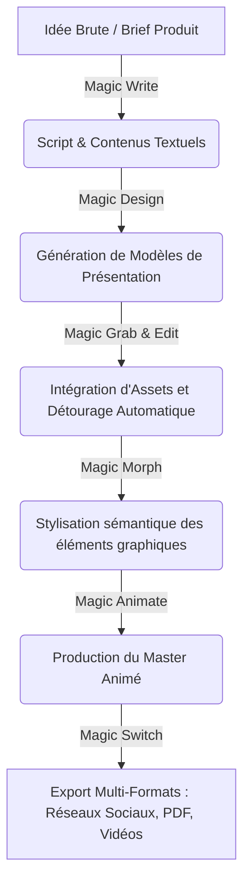

# 🧿 Geordi Resource Guide — Canva Magic Studio AI Update
> **ID YouTube** : `YT-SKBhJkZ0-Ww`  
> **Source Channel** : Ai Lockup  
> **Serendipity Score** : 7/10  
> **Date de Capture** : 2026-05-24  
> **Souveraineté Métier** : H1 - Suite bureautique visuelle et productivité marketing accélérée par l'IA  

---

## 1. Concepts Clés (Deep-Dive Sémantique)

L'intégration massive des outils d'IA générative dans les applications d'édition grand public redéfinit la conception de contenu d'entreprise. L'annonce et la mise à jour de Canva Magic Studio démontrent la transition d'outils d'édition spécialisés à une plateforme unifiée et cognitive. Ce guide explore les fonctionnalités de Magic Studio pour automatiser les tâches fastidieuses du marketing numérique et du design.

### A. La Consolidation des Modèles Génératifs de Bout en Bout
Canva Magic Studio ne se contente pas d'ajouter des fonctionnalités d'IA isolées, il structure un environnement où les données transitent sans couture d'un type d'IA à un autre :
- **Magic Switch (Traduction et Formatage Multimodal)** : Capacité de convertir un document texte (ex : un compte-rendu) en présentation visuelle, ou de traduire instantanément un design dans plus de 100 langues tout en ajustant automatiquement la mise en page.
- **Magic Grab & Magic Morph (Manipulation de Vecteurs et Objets)** : Utilisation de réseaux de segmentation sémantique pour détacher n'importe quel objet ou personne d'une photo statique (comme s'il s'agissait d'un calque individuel) et de lui appliquer des transformations sémantiques ou stylistiques via des invites de texte (ex : transformer un texte 2D en texture de ballon gonflable 3D).

### B. Démocratisation du Motion Design (Magic Animate)
L'animation d'interfaces et de présentations, traditionnellement réservée à des experts de logiciels comme After Effects, est simplifiée via des moteurs d'analyse de scènes :
- **Analyse Contextuelle des Calques** : Magic Animate analyse la hiérarchie visuelle (titres, images, boutons) et applique des courbes de transition coordonnées pour donner un aspect professionnel instantané sans réglage manuel de clés d'animation.

---

## 2. Entités & Outils (Souverains & Publics)

Pour maximiser l'usage de la suite Canva Magic Studio, l'opérateur orchestre les entités logiques de la plateforme :

| Entité / Outil | Fonction Clé dans Magic Studio | Alternative Souveraine / Open Source |
| :--- | :--- | :--- |
| **Magic Design** | Génération instantanée de templates marketing complets à partir d'un prompt | Adobe Firefly / Midjourney + Canva |
| **Magic Write** | Assistant de rédaction sémantique intégré pour adapter le ton de marque | Ollama + Llama-3 (Local text inference) |
| **Magic Media** | Génération d'images (Stable Diffusion) et de vidéos (Runway engine) | ComfyUI / Stable Video Diffusion local |
| **Magic Grab & Edit** | Détourage et modification inpainting d'objets sur des images statiques | Segment Anything (Meta, local) + SD Inpainting |
| **Magic Animate** | Transition et animation automatique de scènes et présentations | Blender (Animation de caméra 2D) |

### Graphe d'enchaînement des tâches marketing automatisées :


---

## 3. Synthèse Pratique (Procédure Standard de Production)

Voici la procédure standard de production pour créer un kit de campagne marketing multilingue complet en 15 minutes en exploitant le potentiel de Canva Magic Studio.

### Phase 1 : Curation des Contenus et Scripting
1. Activer l'outil **Magic Write** directement dans un document Canva.
2. Entrer l'invite de génération :
   > *Prompt de production : "Rédige 3 accroches publicitaires percutantes pour le lancement d'un tracker d'activité physique souverain nommé 'A-Track'. Inclus un slogan inspirant et un appel à l'action pour les réseaux sociaux."*
3. Sélectionner le texte généré et utiliser le filtre de ton pour l'ajuster en mode "Professionnel" ou "Amical".

### Phase 2 : Génération Visuelle et Édition Avancée
1. Ouvrir **Magic Design**, insérer les accroches rédigées et laisser l'IA générer des propositions de bannières.
2. Importer une photo de sport pour illustrer. Activer l'outil **Magic Grab**. Cliquer sur le sujet principal pour le détacher du fond instantanément.
3. Déplacer le sujet pour améliorer la composition. Utiliser **Magic Edit** sur une partie de l'image (ex : remplacer le t-shirt de l'athlète par un sweat-shirt jaune fluo) en saisissant simplement le mot : `neon yellow hoodie`.

### Phase 3 : Animation, Traduction et Export
1. Cliquer sur la présentation globale et sélectionner **Magic Animate**. Choisir le style de transition suggéré par l'IA (ex : "Élégant" ou "Dynamique") pour appliquer des mouvements fluides sur tous les calques de manière synchrone.
2. Utiliser **Magic Switch** pour traduire instantanément l'intégralité du design en espagnol et en allemand. Le moteur ajuste automatiquement la taille des polices pour éviter les débordements textuels.
3. Exporter au format MP4 pour les réseaux sociaux et PDF pour le print.

---

## 4. Actionnabilité (D.E.A.L)

### D - Definition (Intention Stratégique)
Optimiser et standardiser la production d'assets marketing à l'aide d'outils à base d'intelligence artificielle intégrée. L'objectif est de réduire de 80% le temps de conception graphique des équipes sans transiger sur la charte graphique et la qualité sémantique.

### E - Elimination (Épuration des Frictions)
- Éliminer le détourage manuel fastidieux à la plume ou au lasso dans des logiciels lourds comme Photoshop.
- Bannir le copier-coller manuel d'une taille de canevas à une autre en utilisant le redimensionnement sémantique automatique de Magic Switch.
- Éliminer la recherche d'images de stock génériques et saturées en générant des éléments uniques via Magic Media.

### A - Automation (Le Cœur Logique de la SOP)
```
[SOP-CANVA-MAGIC-STUDIO]
1. CONFIGURER le document maître avec le logo et les couleurs de la marque A'Space.
2. APPLIQUER Magic Write pour rédiger les accroches textuelles en adéquation avec la charte éditoriale.
3. LIKER et EXTRAIRE les assets visuels via Magic Media (Preset photo réaliste ou illustration 3D).
4. DÉTOURER instantanément les sujets principaux avec Magic Grab pour les détacher de l'arrière-plan.
5. METTRE EN FORME avec Magic Morph en appliquant des textures de verre ou métalliques sur les titres principaux.
6. APPLIQUER Magic Animate sur l'ensemble de la séquence pour harmoniser les transitions.
7. TRADUIRE et REDIMENSIONNER via Magic Switch en 3 formats clés : Story (9:16), Post (1:1), et Bannière (16:9).
```

### L - Liberation (Objectif Souverain & Alignement)
* **Domaine Spock associé** : `[Spock's Area LD01 - Career/Business]` (Capacité de réaction marketing agile, lancements de MVP ultra-rapides et génération d'actifs publicitaires en totale autonomie).
* **Roue de la vie** : Efficacité opérationnelle et gains de temps.
* **Prochaine étape actionnable** : Intégrer les templates Canva Magic Studio validés dans notre pipeline de lancements hebdomadaires sous Affine.

---
*Ce document de connaissances fait partie intégrante du système PARA de l'Enterprise d'A'Space OS V2.*
