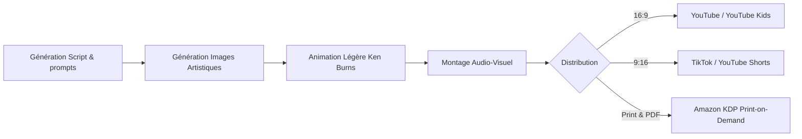

# 🧿 Geordi Resource Guide — Create AI-Animated Children Stories
> **ID YouTube** : `YT-JZukGBRjRwY`  
> **Source Channel** : The Future Of AI  
> **Serendipity Score** : 7/10  
> **Date de Capture** : 2026-05-24  
> **Souveraineté Métier** : H1 - Horizon monétisation automatisée et micro-édition par IA  

---

## 1. Concepts Clés (Deep-Dive Sémantique)

L'industrie de l'auto-édition et des livres pour enfants connaît une restructuration profonde causée par la démocratisation des outils de génération artistique par IA. Ce guide décrypte le modèle d'affaires de la création de livres d'images animés et d'histoires narratives destinées aux plateformes de streaming (YouTube Kids, Amazon KDP, TikTok) pour générer des revenus passifs récurrents.

### A. La Monétisation de Contenu Éducatif et Narratif
Le marché du divertissement pour enfants se caractérise par des taux de rétention très élevés et des volumes d'écoutes répétés. Les parents utilisent massivement des vidéos courtes et narratives comme outils d'apaisement ou d'apprentissage de la langue :
- **L'Économie de l'Attention Enfantine** : Contrairement aux adultes, les enfants consomment plusieurs dizaines de fois le même contenu audio-visuel s'il est stimulant sur le plan des couleurs et du rythme narratif.
- **Micro-Monétisation & Revenus Passifs** : L'accès à la monétisation YouTube (AdSense) ou aux redevances Amazon Kindle Direct Publishing (KDP) représente un levier financier stable dès lors qu'un catalogue de 50 à 100 vidéos est indexé par les algorithmes de recommandation.

### B. Moteurs de Rendu Artistique Spécifiques aux Enfants
La sélection stylistique est le facteur clé de succès pour capter et fidéliser l'attention d'une audience jeune :
- **Styles Watercolor & Claymation** : Les modèles de diffusion entraînés ou incités pour le style Aquarelle (watercolor) ou Pâte à modeler (claymation) suscitent un sentiment de confort et de sécurité cognitive chez l'enfant.
- **Contraste de Formes et Chromatisme Vibrant** : Utilisation d'une palette chromatique chaude et de formes douces, exemptes de contours agressifs, optimisées pour les terminaux mobiles et tablettes.

---

## 2. Entités & Outils (Souverains & Publics)

La chaîne d'outils sémantique combine la génération d'images avec des techniques d'animation ciblées et de la distribution automatisée :

| Outil | Rôle dans le Pipeline | Alternatives Souveraines / Open Source |
| :--- | :--- | :--- |
| **Midjourney (v6) / DALL-E 3** | Génération de visuels pour enfants hautement texturés et colorés | Stable Diffusion (Modèles affinés comme DreamShaper) |
| **ElevenLabs (Voice Cloning)** | Création d'une voix de conteur ou de grand-mère réconfortante | Piper TTS / Coqui TTS (Inférence locale ultra-rapide) |
| **CapCut / Canva / Premiere** | Assemblage de la timeline, zooms dynamiques (Ken Burns effect) | Kdenlive (Souverain local libre) |
| **ChatGPT / Claude 3** | Génération de contes moraux avec structure de Joseph Campbell | Local LLM (Hermes-2 / Llama-3) |
| **MusicGen (Meta)** | Génération de comptines ou musiques de fond douces et libres | Audiocraft (Inférence Python locale) |

### Flux opérationnel de distribution multi-plateforme :


---

## 3. Synthèse Pratique (Procédure Standard de Production)

Pour déployer une usine à histoires de manière itérative, l'opérateur suit un protocole strict. Cela permet de produire des contes d'une qualité professionnelle constante.

### Phase 1 : Ingénierie Narrative
L'opérateur lance le modèle de langage pour structurer l'arche dramatique. Le conte doit comporter une morale explicite :
> *Invite type : "Écris un conte pour enfants en 6 scènes intitulé 'Le Petit Nuage qui ne voulait pas pleuvoir'. L'histoire doit inculquer l'importance du partage et du cycle de la nature. Pour chaque scène, donne-moi le texte du narrateur et un prompt Midjourney ultra-détaillé de style aquarelle enfantine, aux tons pastels doux."*

### Phase 2 : Standardisation du Style Graphique
Pour assurer une cohérence absolue entre les pages du livre animé :
1. Définir un invite Midjourney maître avec un suffixe stylistique constant : `, children's book illustration, watercolor style, soft pastel colors, cute design, hand-drawn texture, cozy lighting --ar 16:9 --style raw`.
2. Utiliser le paramètre de référence de style de Midjourney (`--sref`) avec l'URL de l'image de la première scène réussie pour verrouiller l'univers esthétique.
3. Conserver un seed global pour toutes les variations de personnages.

### Phase 3 : Animation de Caméra Interactive (Effet Ken Burns)
Plutôt que d'animer l'image de manière complexe (ce qui peut déformer les visages des animaux), privilégier l'animation de caméra :
1. Dans le logiciel de montage (CapCut/Canva), importer l'image en pleine résolution.
2. Appliquer une trajectoire linéaire lente (zoom avant de 100% à 108%, ou panoramique léger gauche-droite) étalée sur toute la durée de la voix off de la scène.
3. Ce mouvement subtil maintient la tension dramatique sans introduire de distorsions visuelles désagréables pour l'œil de l'enfant.

---

## 4. Actionnabilité (D.E.A.L)

### D - Definition (Intention Stratégique)
Industrialiser un réseau de micro-chaînes thématiques éducatives et narratives pour les enfants. L'objectif est d'atteindre une récurrence financière par la capitalisation sur les catalogues longs d'AdSense et de royalties imprimés (Amazon KDP).

### E - Elimination (Épuration des Frictions)
- Éliminer le flou artistique en bannissant les invites trop génériques. Chaque prompt d'image doit spécifier la composition, le style (watercolor), et la palette.
- Éviter les droits d'auteur bloquants en générant des bandes-son uniques via MusicGen de Meta en local plutôt qu'en téléchargeant des musiques libres de droits surexploitées sur le web.
- Réduire le temps de rendu final en créant des macros d'édition pour le positionnement des textes et des sous-titres animés.

### A - Automation (Le Cœur Logique de la SOP)
```
[SOP-KIDS-STORY-FACTORY]
1. GENERER le script en 6 scènes avec morale et invites d'images correspondants via le LLM.
2. EXÉCUTER les requêtes d'images sur Midjourney en utilisant le paramètre '--sref' pour la cohérence stylistique.
3. CONVERTIR le texte du script en audio chaleureux sur ElevenLabs (Voix type 'Storyteller').
4. GÉNÉRER une mélodie douce de 60 secondes avec MusicGen (Meta) : "lullaby acoustic guitar, soft piano, peaceful atmosphere, children video background music".
5. ASSEMBLER dans CapCut en appliquant l'effet Ken Burns (panoramique/zoom lent) sur chaque scène.
6. INJECTER les sous-titres en police lisible (ex: Inter ou Poppins, couleur blanche avec ombre portée noire).
7. EXPORTER le rendu final en 1080p et PLANIFIER la mise en ligne via le planificateur YouTube Studio.
```

### L - Liberation (Objectif Souverain & Alignement)
* **Domaine Spock associé** : `[Spock's Area LD01 - Career/Business]` (Génération d'actifs numériques pérennes et résilients).
* **Roue de la vie** : Finances et créativité artistique.
* **Prochaine étape actionnable** : Produire une première maquette de 3 minutes et la soumettre au test d'attention d'un panel utilisateur restreint.

---
*Ce document de connaissances fait partie intégrante du système PARA de l'Enterprise d'A'Space OS V2.*
