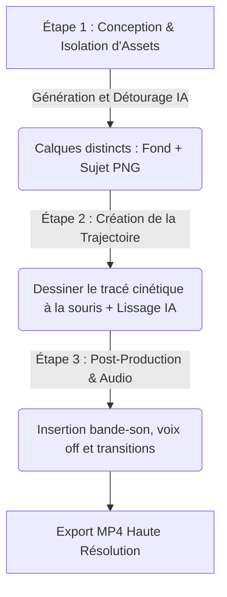

# 🧿 Geordi Resource Guide — Create Canva Animation in 3 Steps
> **ID YouTube** : `YT-coHxoxg98iw`  
> **Source Channel** : VAGPE Media  
> **Serendipity Score** : 7/10  
> **Date de Capture** : 2026-05-24  
> **Souveraineté Métier** : H1 - Micro-animation rapide et prototypage visuel par IA  

---

## 1. Concepts Clés (Deep-Dive Sémantique)

L'animation traditionnelle par images clés (keyframing) ou par squelette (rigging) exige un investissement temporel important et la maîtrise d'outils complexes comme Adobe After Effects ou Animate. Le développement d'outils d'animation assistés par IA dans des interfaces Web intuitives simplifie ce processus. Canva permet de réaliser des animations de niveau professionnel en trois étapes clés combinant la génération sémantique d'assets et les trajectoires dynamiques.

### A. La Génération sémantique d'assets isolés
Le premier pilier consiste à préparer les éléments visuels de manière à ce qu'ils soient animables individuellement :
- **Séparation sémantique Sujet/Fond** : Pour animer un personnage sur un fond, ces deux éléments doivent être des calques distincts. Canva exploite ses modèles d'IA générative pour créer des arrière-plans d'une part, et des personnages détourés d'autre part (au format PNG transparent), éliminant l'étape manuelle de détourage.
- **Régularité du Style Artistique** : Assurer que le style visuel des différents calques concorde (ex : personnages et objets dans le même style d'illustration) pour garantir la crédibilité de l'univers visuel créé.

### B. Le Tracé de trajectoire cinétique personnalisé (Custom Motion Paths)
L'innovation majeure réside dans la méthode de définition du mouvement :
- **Cinématique assistée par le tracé** : Au lieu de positionner manuellement des coordonnées X/Y à différents instants clés de la timeline, l'opérateur dessine simplement la trajectoire voulue à la souris ou au stylet.
- **Lissage algorithmique de trajectoire** : L'IA applique un filtre de lissage sur le tracé de la souris pour éliminer les tremblements involontaires, et permet d'ajuster des paramètres cinétiques complexes comme l'amorti de départ et d'arrivée (ease-in / ease-out) ou la vitesse variable de déplacement.

---

## 2. Entités & Outils (Souverains & Publics)

Pour mener à bien ce workflow d'animation rapide en 3 étapes, les entités logicielles suivantes sont assemblées :

| Composant / Outil | Rôle Spécifique dans le Workflow | Alternative Souveraine / Open Source |
| :--- | :--- | :--- |
| **Canva AI Image Generator** | Génération de l'image de fond et des objets à animer | Stable Diffusion local (Fooocus / WebUI) |
| **Canva BG Remover** | Détourage instantané des personnages pour les rendre mobiles | Remove.bg / Segment Anything Model (SAM) |
| **Custom Animation Tool** | Définition de la trajectoire personnalisée par glissé de souris | Synfig Studio (Logiciel d'animation vectorielle local) |
| **Canva Timeline** | Ajustement de la durée de la scène, des fondus et du rythme global | DaVinci Resolve Cut Page (Local) |

### Algorithme du workflow d'animation en 3 étapes :


---

## 3. Synthèse Pratique (Procédure Standard de Production)

Pour concevoir une animation dynamique de 15 secondes en moins de 15 minutes, l'opérateur exécute le protocole standardisé suivant.

### Étape 1 : Création et Isolation des Calques Visuels
1. Générer l'arrière-plan de la scène sur Canva à l'aide de l'outil de génération d'images IA.
   > *Prompt type : "Magical forest background, dreamy atmosphere, glowing mushrooms, fairy lights, fantasy style, 4k, digital art --ar 16:9"*
2. Générer ou importer le personnage ou l'objet à animer (ex : une petite fée ou une capsule spatiale).
3. Placer l'objet sur l'arrière-plan, cliquer sur "Éditer l'image", puis sélectionner l'outil **Effaceur d'arrière-plan (BG Remover)**. L'objet se retrouve isolé sous forme de calque mobile transparent.

### Étape 2 : Définition de la Trajectoire Cinétique Personnalisée
1. Sélectionner le calque de l'objet à animer. Cliquer sur l'onglet **Animer** dans la barre d'outils supérieure, puis sélectionner **Créer une animation** (l'icône représentant une abeille laissant une traînée).
2. Cliquer sur l'objet avec la souris, maintenir le clic et dessiner le mouvement souhaité à travers l'écran (ex : une trajectoire en zigzag ou en boucle pour simuler le vol d'une fée).
3. Dans le panneau de configuration de l'animation :
   - Sélectionner le mode **Douce** ou **Stable** pour laisser l'algorithme lisser les imperfections du tracé de la souris.
   - Activer l'option **Orienter selon la trajectoire** pour que l'objet pivote automatiquement dans le sens de son déplacement.
   - Ajuster la vitesse globale à l'aide du curseur temporel.

### Étape 3 : Rythme, Effets Sonores et Exportation
1. Dupliquer la scène si nécessaire pour créer des plans alternatifs (zoom de caméra ou angles différents).
2. Ajouter une piste musicale de fond et des effets sonores synchronisés avec le mouvement de l'objet (ex : un son de scintillement au moment où la fée effectue une courbe serrée).
3. Exporter l'animation finale au format MP4 1080p ou au format GIF pour les besoins du web.

---

## 4. Actionnabilité (D.E.A.L)

### D - Definition (Intention Stratégique)
Standardiser et accélérer la production de micro-animations à vocation commerciale (bannières publicitaires animées, intros YouTube, visuels de réseaux sociaux) en éliminant les barrières techniques liées aux outils d'animation traditionnels.

### E - Elimination (Épuration des Frictions)
- Éliminer le keyframing manuel fastidieux qui nécessite de gérer des dizaines de points d'ancrage temporels pour chaque objet.
- Supprimer les imports/exports d'images entre Photoshop et After Effects en maintenant tout le pipeline au sein du même espace de travail collaboratif en ligne.
- Proscrire l'animation saccadée en appliquant systématiquement les filtres de lissage algorithmique de Canva.

### A - Automation (Le Cœur Logique de la SOP)
```
[SOP-CANVA-3STEPS-ANIM]
1. GENERER le fond de la scène et l'objet mobile de manière distincte grâce à l'IA générative visuelle.
2. DÉTOURER l'objet à l'aide de l'outil d'isolation automatique pour créer un calque PNG transparent.
3. INVOQUER l'outil d'animation personnalisée de Canva sur l'objet.
4. TRACER la trajectoire cinétique à la souris pour définir le mouvement global.
5. CONFIGURER l'animation en mode 'Stable' avec orientation automatique activée pour assurer la fluidité.
6. SYNCHRONISER un effet sonore thématique au moment d'impact ou de changement de trajectoire majeur.
7. COMPOSER et EXPORTER la séquence en format vidéo MP4 60FPS.
```

### L - Liberation (Objectif Souverain & Alignement)
* **Domaine Spock associé** : `[Spock's Area LD01 - Career/Business]` (Production autonome d'identités visuelles animées pour les lancements de produits et les réseaux sociaux).
* **Roue de la vie** : Rentabilité, efficacité opérationnelle et expression créative.
* **Prochaine étape actionnable** : Créer un pack de 5 gabarits de bannières animées standards (Stories, Reels) basés sur ce workflow pour accélérer la communication de la marque A'Space.

---
*Ce document de connaissances fait partie intégrante du système PARA de l'Enterprise d'A'Space OS V2.*
