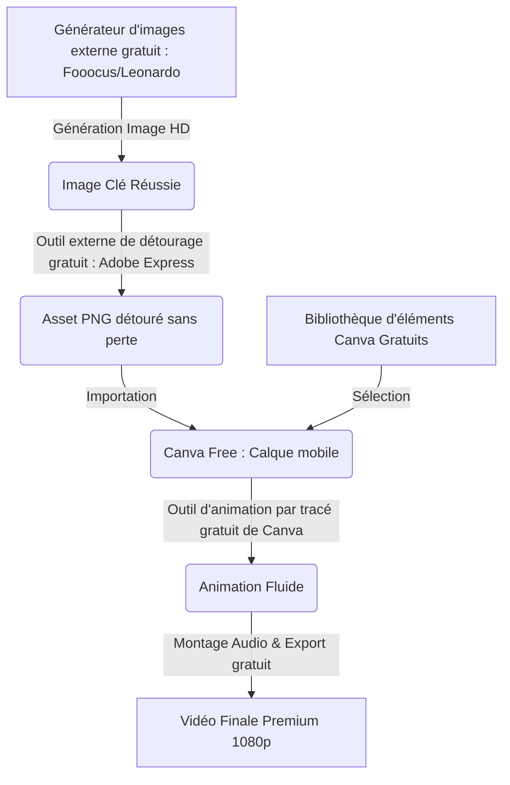

# 🧿 Geordi Resource Guide — Create FREE Animation with Canva AI Tools
> **ID YouTube** : `YT-Wd1UW9wqP1k`  
> **Source Channel** : Learn with Zar  
> **Serendipity Score** : 7/10  
> **Date de Capture** : 2026-05-24  
> **Souveraineté Métier** : H1 - Optimisation des coûts logiciels et ingénierie d'actifs visuels gratuits  

---

## 1. Concepts Clés (Deep-Dive Sémantique)

L'accès démocratisé aux outils de création numérique implique de savoir naviguer entre les fonctionnalités gratuites et payantes des plateformes pour optimiser son retour sur investissement (ROI). Ce guide explore les techniques permettant de réaliser des animations de niveau professionnel sur Canva sans surcoût logiciel, en mariant les outils d'IA gratuits intégrés avec des ressources et plateformes externes d'excellence.

### A. La Synergie Logicielles à Coût Nul (Zero-Cost Software Stacking)
La création visuelle souveraine ne doit pas nécessairement dépendre de coûteux abonnements mensuels récurrents. En assemblant intelligemment des briques technologiques gratuites ou open source, l'opérateur contourne les paywalls :
- **Hybridation Local/Cloud** : Générer des images de très haute qualité sur des instances locales gratuites (ex : Stable Diffusion sous Fooocus ou ComfyUI) pour s'affranchir des limites d'utilisation de jetons (credits) des générateurs Cloud payants, puis importer ces images dans la version gratuite de Canva pour l'animation.
- **Micro-Générateurs Spécialisés** : Utiliser des outils d'IA externes spécialisés pour chaque tâche (ex : suppression de fond, génération de voix off, musique) qui proposent des formules gratuites généreuses, plutôt que de payer une suite tout-en-un.

### B. L'Animation Cinématique sous Contrainte Budgétaire
L'animation sur la version gratuite de Canva repose sur l'exploitation fine de fonctionnalités souvent sous-estimées :
- **Optimisation des Calques Gratuits** : Utilisation d'éléments vectoriels libres de droits de la bibliothèque Canva combinés à l'outil d'animation de tracé personnalisé.
- **La Technique du Découpage Externe** : Si l'outil d'effacement d'arrière-plan de Canva (BG Remover) est verrouillé sous la version Pro, l'opérateur utilise des alternatives d'IA gratuites et immédiates pour préparer ses calques PNG transparents avant importation.

---

## 2. Entités & Outils (Souverains & Publics)

Pour orchestrer cette chaîne de production à coût marginal nul, l'opérateur combine les ressources logicielles suivantes :

| Outil / Ressource | Rôle Spécifique (Workflow Gratuit) | Alternative Souveraine / Open Source |
| :--- | :--- | :--- |
| **Canva (Free Version)** | Outil central d'assemblage, timeline et dessin de trajectoire d'animation | Blender (Solution locale 100% libre et gratuite) |
| **Fooocus / Leonardo.ai** | Génération gratuite d'images HD de styles variés (illustrations, photo) | Stable Diffusion WebUI (Local & gratuit) |
| **Adobe Express / Remove.bg** | Suppression d'arrière-plan gratuite par IA pour isoler les personnages | SAM (Segment Anything Model en local via Python) |
| **CapCut (Desktop Free)** | Ajout d'effets sonores, mixage audio et exportation 4K sans filigrane | DaVinci Resolve (Version gratuite ultra-puissante) |
| **Suno / MusicGen** | Génération de pistes audio et musiques de fond gratuites par IA | Audiocraft (Inférence de musique en local) |

### Comparatif d'intégration visuel :


---

## 3. Synthèse Pratique (Procédure Standard de Production)

Pour contourner les restrictions financières et techniques tout en maintenant un standard de livraison premium, l'opérateur applique scrupuleusement la procédure d'ingénierie visuelle suivante.

### Phase 1 : Préparation des Actifs Visuels en Local
1. Lancer **Fooocus** sur sa machine locale (ou utiliser **Leonardo AI** avec son allocation quotidienne de 150 jetons gratuits).
2. Générer le personnage principal et le fond de manière isolée pour conserver une résolution maximale.
   > *Prompt de personnage : "Chibi knight character, cute anime style, medieval armor, full body portrait, front view, flat clean background, high resolution --ar 1:1"*
   > *Prompt de décor : "Enchanted medieval castle courtyard, digital painting, fantasy art style, colorful, sun rays, cinematic lighting --ar 16:9"*
3. Téléverser l'image du personnage sur **Adobe Express Background Remover** (gratuit et sans perte de résolution) pour extraire l'arrière-plan. Enregistrer le fichier résultant au format PNG transparent.

### Phase 2 : Assemblage et Animation dans Canva Gratuit
1. Ouvrir un projet vidéo vierge 16:9 dans la version gratuite de **Canva**.
2. Importer l'image de fond générée et l'étirer pour combler le canevas. Verrouiller le calque de fond pour éviter les mouvements accidentels lors de l'édition.
3. Importer le personnage au format PNG transparent. Placer le personnage sur le calque de fond.
4. Sélectionner le personnage, cliquer sur l'onglet **Animer** dans le menu supérieur. Sélectionner l'outil **Créer une animation**.
5. Dessiner la trajectoire cinétique (ex : le chevalier marchant joyeusement vers le château). Configurer le style de mouvement en mode **Stable** et ajuster la vitesse globale.
6. Utiliser des éléments gratuits natifs de Canva (ex : des étoiles scintillantes ou des feuilles qui tombent) pour ajouter une couche de profondeur visuelle (Layering) en les superposant à différents niveaux de la composition.

### Phase 3 : Finalisation Audio et Exportation
1. Générer une musique d'ambiance à l'aide de **MusicGen** de Meta (ou utiliser des pistes gratuites et libres de droits d'une bibliothèque open source comme Freesound).
2. Importer la piste audio dans Canva, l'aligner avec l'animation visuelle.
3. Effectuer le rendu final au format MP4 1080p. Si Canva gratuit limite le nombre d'exports en haute définition, exporter la vidéo brute sans son, puis faire l'assemblage et le mixage audio-visuel final sous **CapCut** ou **DaVinci Resolve** en local.

---

## 4. Actionnabilité (D.E.A.L)

### D - Definition (Intention Stratégique)
Optimiser l'infrastructure logicielle créative pour minimiser les coûts d'exploitation fixes (OpEx) de la marque A'Space. Démontrer qu'une exécution de qualité professionnelle est possible en s'appuyant uniquement sur des outils gratuits ou open source locaux.

### E - Elimination (Épuration des Frictions)
- Éliminer la dépendance aux abonnements mensuels récurrents (SaaS fatigue) en remplaçant chaque outil payant par une alternative locale ou open source gratuite de qualité équivalente.
- Supprimer les filigranes restrictifs des outils d'IA en choisissant exclusivement des API gratuites sans watermark ou en effectuant l'inférence en local sur sa propre carte graphique (GPU).
- Éviter la perte de résolution d'image lors des détourages gratuits en utilisant des modèles de segmentation neuronaux précis (ex: Adobe Express ou SAM local).

### A - Automation (Le Cœur Logique de la SOP)
```
[SOP-FREE-ANIM-FACTORY]
1. GENERER l'asset de fond et le personnage sur l'instance locale de Fooocus (Stable Diffusion).
2. APPLIQUER la segmentation d'arrière-plan sur le personnage via l'outil gratuit d'Adobe Express.
3. IMPORTER le fond et l'asset PNG transparent dans Canva Free.
4. CONFIGURER la trajectoire cinétique à l'aide de la souris et appliquer le lissage algorithmique stable.
5. SURIMPOSER des éléments d'habillage gratuits de la bibliothèque Canva pour enrichir la composition.
6. IMPORTER et SYNCHRONISER la musique de fond générée localement avec MusicGen.
7. COMPOSER et EXPORTER la vidéo finale au format MP4 1080p sans filigrane.
```

### L - Liberation (Objectif Souverain & Alignement)
* **Domaine Spock associé** : `[Spock's Area LD01 - Career/Business]` (Souveraineté technologique et financière complète par l'affranchissement des dépendances logicielles payantes).
* **Roue de la vie** : Gestion financière optimisée et ingéniosité technique.
* **Prochaine étape actionnable** : Documenter et packager cette chaîne d'outils gratuits sous forme de kit de formation pour nos collaborateurs et notre écosystème.

---
*Ce document de connaissances fait partie intégrante du système PARA de l'Enterprise d'A'Space OS V2.*
