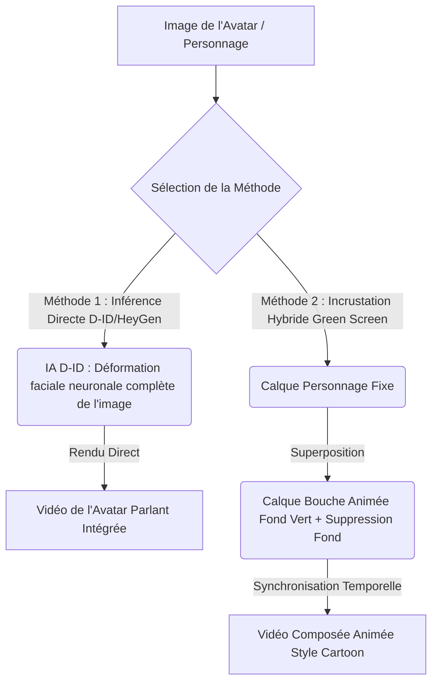

# 🧿 Geordi Resource Guide — Creating Lip-Sync with Canva Animation
> **ID YouTube** : `YT-882AOkAen04`  
> **Source Channel** : Learn with Zar  
> **Serendipity Score** : 7/10  
> **Date de Capture** : 2026-05-24  
> **Souveraineté Métier** : H1 - Création d'avatars animés et synthèse vocale avec synchronisation labiale  

---

## 1. Concepts Clés (Deep-Dive Sémantique)

La création d'avatars parlants et la synchronisation labiale (Lip-Sync) constituent un jalon technologique important pour la production de vidéos marketing, de formations en ligne et de présentations interactives. Traditionnellement, ce processus nécessitait des logiciels de modélisation 3D avancés ou des techniques complexes de morphing sous After Effects. Grâce à l'intégration d'applications d'IA spécialisées dans l'écosystème de Canva, les créateurs de contenu peuvent désormais générer des personnages parlants à partir d'une simple image fixe et d'une piste audio ou textuelle. Ce guide détaille les deux méthodes principales pour orchestrer ce flux de production.

### A. La Synchronisation Labiale Neuronale (Méthode 1 : Intégrations d'Avatars IA)
La première méthode repose sur des modèles génératifs d'apprentissage profond spécialisés dans l'animation faciale (ex : HeyGen, D-ID, ou NeROIC) :
- **Synthèse de Mouvement Pilotée par l'Audio (Audio-Driven Face Animation)** : L'algorithme prend en entrée une photo fixe (avatar portrait) et un fichier vocal. Il analyse les fréquences sonores, les phonèmes et les intonations pour déformer géométriquement la bouche, les lèvres, et appliquer des micro-mouvements oculaires et de tête réalistes.
- **Rendu Unifié et Sans Couture** : L'IA se charge de fondre les déformations de la bouche dans l'image d'origine pour éviter tout effet de "masque" artificiel, générant ainsi un rendu vidéo fluide et naturel en quelques secondes.

### B. Le Lip-Sync par Calques et Incrustation Chroma Key (Méthode 2 : Assemblage Hybride Canva)
La seconde méthode est plus flexible et idéale pour les personnages de dessins animés ou d'illustrations 2D :
- **Superposition de Bouche Animée (Chroma Key Green Screen)** : Cette technique consiste à utiliser une image de personnage fixe au corps complet et d'y superposer une animation de bouche en mouvement (générée sur fond vert).
- **Incrustation et Masquage de Précision** : L'opérateur utilise les capacités de suppression d'arrière-plan de Canva pour éliminer le fond vert de la bouche animée et la positionner précisément sur le visage du personnage statique, simulant ainsi la parole de manière stylisée.

---

## 2. Entités & Outils (Souverains & Publics)

Pour mettre en application ces deux méthodes de synchronisation labiale, l'opérateur orchestre les entités logicielles suivantes :

| Outil / Application | Rôle dans le Pipeline (Méthode 1 & 2) | Alternatives Souveraines / Open Source |
| :--- | :--- | :--- |
| **D-ID / HeyGen Canva App** | Génération directe d'avatars parlants réalistes depuis l'éditeur | SadTalker / Wav2Lip (Inférence Python locale) |
| **Canva Photo / Video Editor** | Support de composition, gestion des calques et des masques | DaVinci Resolve (Incrustation locale) |
| **Green Screen Lips Elements** | Assets de bouches animées sur fond vert pour la méthode 2 | Adobe Character Animator (Génération locale) |
| **ElevenLabs / Murf AI** | Synthèse vocale neuronale pour la piste de voix off | XTTS v2 / Coqui TTS (Modèles vocaux locaux) |

### Comparatif architectural des deux méthodes de Lip-Sync :


---

## 3. Synthèse Pratique (Procédure Standard de Production)

L'opérateur doit maîtriser les deux protocoles pour s'adapter à la fois aux projets hyperréalistes et aux projets d'animation stylisés.

### Méthode 1 : Avatars IA Neuronaux Intégrés (HeyGen/D-ID dans Canva)
1. Dans l'interface d'édition Canva, ouvrir le menu **Applications** dans le volet de gauche.
2. Rechercher et connecter l'application **D-ID AI Presenters** ou **HeyGen**.
3. Configurer l'avatar :
   - Sélectionner un présentateur prédéfini ou téléverser sa propre image générée (ex : un portrait photoréaliste généré sur Midjourney).
4. Configurer la voix :
   - Saisir le script textuel dans la boîte de dialogue et choisir la langue, la voix et le ton émotionnel, OU téléverser directement un fichier audio personnalisé (préalablement généré sur ElevenLabs pour une fidélité vocale maximale).
5. Cliquer sur **Générer le présentateur**. La vidéo de l'avatar parlant s'ajoute automatiquement sur le canevas de travail. Utiliser l'outil de détourage vidéo de Canva si nécessaire pour l'intégrer dans un décor personnalisé.

### Méthode 2 : Incrustation Hybride de Bouche Animée (Chroma Key)
1. Importer l'image d'un personnage de style dessin animé (statique) sur le canevas de travail.
2. Aller dans l'onglet **Éléments** de Canva, rechercher `talking mouth green screen` ou `bouche parlante fond vert` dans la section Vidéos. Choisir l'animation de bouche qui correspond au style visuel du personnage.
3. Positionner l'élément vidéo de la bouche sur le visage du personnage, à l'emplacement exact de sa bouche d'origine.
4. Cliquer sur "Modifier la vidéo", puis sélectionner l'outil **Suppression d'arrière-plan vidéo (Background Remover)** pour éliminer le fond vert de manière sémantique.
5. Ajuster le timing de l'apparition de la bouche animée sur la timeline pour qu'elle corresponde exactement à la diffusion de la voix off.

---

## 4. Actionnabilité (D.E.A.L)

### D - Definition (Intention Stratégique)
Industrialiser la création de vidéos de formation et d'annonces publicitaires incarnées par des avatars IA. L'objectif est d'éliminer le besoin de caméras, d'acteurs réels et de studios d'enregistrement physiques pour réduire drastiquement les coûts de production de contenu vidéo d'entreprise.

### E - Elimination (Épuration des Frictions)
- Éliminer le temps de tournage physique et les contraintes d'éclairage ou de captation sonore.
- Supprimer les erreurs de prononciation ou les bafouillages en modifiant simplement le texte du script ou en régénérant le fichier audio associé.
- Écarter les effets d'Uncanny Valley (vallée de l'étrange) trop marqués en optant pour des personnages 2D stylisés avec la méthode 2 plutôt que des avatars réalistes mal animés.

### A - Automation (Le Cœur Logique de la SOP)
```
[SOP-CANVA-LIP-SYNC]
1. GENERER le portrait haute définition de l'avatar sur Midjourney (Style Corporate ou Cartoon selon la cible).
2. CONCEVOIR la voix off neuronale sur ElevenLabs à partir du script validé sous Affine.
3. INVOQUER l'application 'D-ID AI Presenters' au sein du panneau Canva.
4. TÉLÉVERSER le portrait et la piste audio de la voix off.
5. EXÉCUTER la génération de l'avatar animé et l'intégrer au centre de l'image.
6. COMPOSER le décor d'arrière-plan en appliquant l'effet Magic Grab pour placer le présentateur derrière un bureau virtuel.
7. EXPORTER la vidéo finale au format MP4 1080p pour diffusion immédiate.
```

### L - Liberation (Objectif Souverain & Alignement)
* **Domaine Spock associé** : `[Spock's Area LD01 - Career/Business]` (Production en série de modules de e-learning, de formations clients et d'annonces commerciales en totale autonomie).
* **Roue de la vie** : Productivité, carrière et efficacité de communication.
* **Prochaine étape actionnable** : Créer un guide de style répertoriant 3 avatars types (1 réaliste, 2 illustrés) et tester leur niveau d'acceptabilité et d'engagement auprès d'un panel de 50 utilisateurs.

---
*Ce document de connaissances fait partie intégrante du système PARA de l'Enterprise d'A'Space OS V2.*
