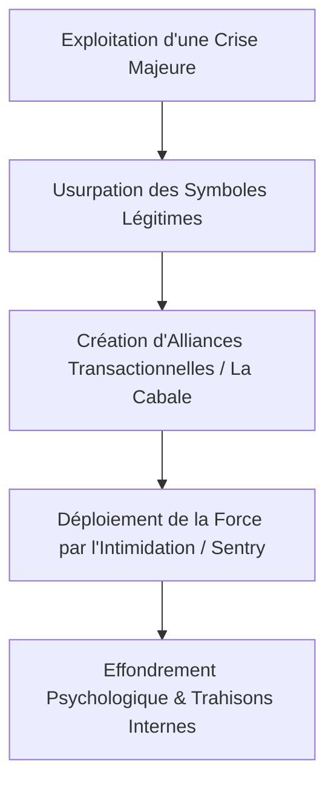

# Guide PARA Geordi : Structures Narratives, Usurpation d'Identité & Psychologie du Pouvoir (Dark Avengers)

> **Statut** : CLARIFIED_PLANE
> **Source** : LE BLACKBIRD COMICS (YT-rwv3NQvOeYA)
> **Axe** : Pop Culture / Ingénierie Narrative / Modèles Mentaux

---

## 1. Concepts Clés

### A. L'Inversion Narrative et l'Usurpation d'Identité Sémantique
Le concept central de l'ère des *Dark Avengers* (scénarisée par Brian Michael Bendis) est l'usurpation sémantique des symboles héroïques. Norman Osborn, ancien super-vilain (le Bouffon Vert) devenu héros national après l'invasion Skrull (*Secret Invasion*), prend le contrôle de la sécurité mondiale (le H.A.M.M.E.R. remplaçant le S.H.I.E.L.D.). Pour asseoir sa légitimité, il ne crée pas une nouvelle équipe de vilains, mais maquille des criminels sociopathes sous l'identité des Avengers originaux (Bullseye devient Hawkeye, Moonstone devient Captain Marvel, Daken devient Wolverine). C'est un cas d'étude majeur en relations publiques et manipulation de la perception de masse.

### B. Le Paradoxe de la Sentry (Instabilité et Puissance Absolue)
Robert Reynolds (Sentry) incarne le concept de la dualité psychologique destructrice. Possédant la puissance de "mille soleils explosant", sa force est intrinsèquement liée à son antithèse sombre : le Void (le Néant). Ce concept illustre la loi de l'équilibre des forces sémantiques : une puissance technique ou opérationnelle infinie non canalisée par un cadre moral ou un ancrage stable génère inévitablement sa propre force d'annihilation.

### C. La Fragilité de la Coalition Opportuniste (La Cabale)
Pour stabiliser son régime, Osborn s'allie avec les leaders des différentes factions de l'univers Marvel (Namor, Emma Frost, Dr. Doom, The Hood, Loki). Ce concept de "Cabale" démontre l'instabilité structurelle des systèmes basés exclusivement sur l'intérêt personnel et l'opportunisme transactionnel. Sans vision partagée ni éthique commune, le système s'effondre sous le poids de ses propres trahisons internes.

---

## 2. Entités & Outils

### A. Norman Osborn (Iron Patriot)
L'archétype du manipulateur machiavélique qui utilise une crise systémique pour s'approprier le monopole de la force légitime. En fusionnant l'armure d'Iron Man aux couleurs patriotiques de Captain America, il crée un artefact visuel de propagande absolue.

### B. H.A.M.M.E.R.
L'organisation de sécurité globale militarisée d'Osborn, illustrant la transition d'un modèle de surveillance républicain (S.H.I.E.L.D.) vers une autocratie policière privée et opaque.

### C. The Sentry & Void
Le pivot d'intimidation militaire d'Osborn. Reynolds est l'outil ultime de dissuasion, mais aussi la bombe à retardement psychologique qui causera la destruction d'Asgard (*Siege*).

---

## 3. Synthèse Pratique

L'ascension et la chute du régime de Norman Osborn offrent un modèle d'analyse stratégique transposable aux organisations réelles :

*   **Phase 1 : Opportunisme** (Secret Invasion). Osborn capitalisera sur la défaillance des héros traditionnels pour abattre la reine Skrull devant les caméras du monde entier, s'appropriant le crédit de la victoire.
*   **Phase 2 : Maquillage sémantique**. Redéfinir l'identité des Avengers pour aligner l'opinion publique sur un faux sentiment de continuité.
*   **Phase 3 : Destruction par l'hubris**. L'incapacité d'Osborn à contrôler ses propres psychoses (la résurgence du Bouffon Vert) et son arme absolue (Sentry) conduit à une sur-extension militaire (l'invasion injustifiée d'Asgard) et à sa destitution.

---

## 4. Actionnabilité (D.E.A.L)

### Definition (Définition)
*   **Objectif** : Identifier et cartographier les risques d'usurpation de réputation ou de dérive autoritaire au sein de systèmes d'alliances ou d'architectures de projets.
*   **Livrables** : Une matrice de vigilance analysant l'alignement éthique des partenaires d'un écosystème.

### Elimination (Élimination)
*   Éliminer les dépendances technologiques ou partenariales envers des entités ultra-puissantes mais instables psychologiquement ou techniquement (type "Sentry").
*   Bannir les alliances purement transactionnelles privées de charte de valeurs communes.

### Automation (Automatisation)
*   Implémenter des protocoles de monitoring de réputation et de sécurité sur les composants critiques pour empêcher toute modification s'appropriant frauduleusement une identité validée.

### Liberation (Libération)
*   **SOP de gestion d'alliances stratégiques** :
    1.  Avant d'intégrer un partenaire majeur dans un projet A'Space OS, évaluer sa stabilité structurelle sur 3 axes : Compétence technique, Alignement des valeurs, Historique de loyauté.
    2.  Refuser tout partenariat basé sur l'opportunisme court-terme si les valeurs fondamentales divergent.
    3.  Mettre en place des mécanismes d'isolation (sandboxing technique et contractuel) pour éviter qu'une défaillance d'un membre instable n'entraîne l'effondrement de l'infrastructure globale.
