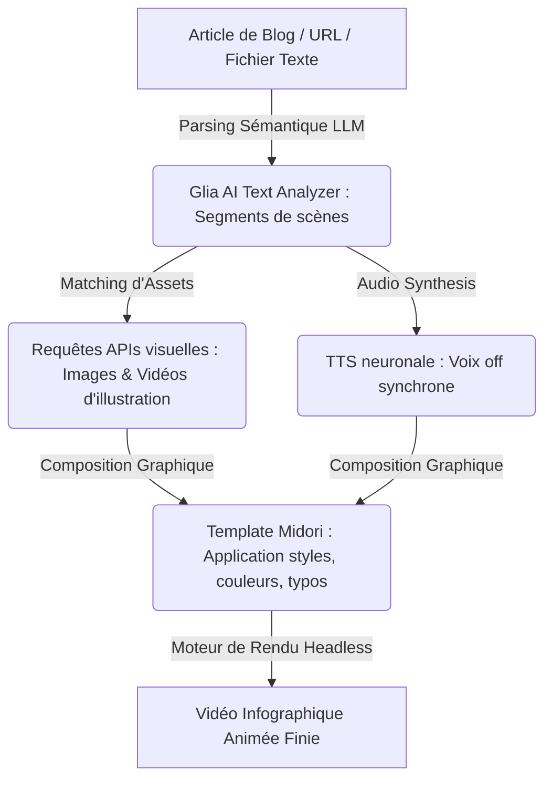

# 🧿 Geordi Resource Guide — Glia AI Video Demo (Midori)
> **ID YouTube** : `YT--Lvi-qiUhOs`  
> **Source Channel** : GliaStudio  
> **Serendipity Score** : 7/10  
> **Date de Capture** : 2026-05-24  
> **Souveraineté Métier** : H1 - Automatisation de la conversion Text-to-Video et curation sémantique de contenu  

---

## 1. Concepts Clés (Deep-Dive Sémantique)

La conversion automatisée de textes en vidéos (Text-to-Video / Article-to-Video) représente un changement majeur pour la presse en ligne, les blogueurs et les éditeurs de contenu éducatif. La plateforme GliaStudio illustre cette transition en automatisant l'extraction sémantique d'un texte écrit pour le transcrire en une infographie vidéo animée. La démo "Midori" met en lumière l'utilisation de gabarits (templates) esthétiques et d'avatars de présentation sémantiquement intégrés pour fluidifier la consommation de l'information.

### A. L'Extraction Sémantique et la Summarization Visuelle
Le processus repose sur la capacité d'une IA à analyser la structure logique d'un texte écrit :
- **Identification des Entités Clés et Mots-valises** : L'IA de GliaStudio scanne l'article de blog ou le script fourni pour en extraire les idées forces, les statistiques clés et les mots-clés essentiels. Elle segmente le texte en scènes logiques adaptées à une timeline de lecture vidéo confortable.
- **Appariement sémantique d'assets d'illustration (Semantic Asset Matching)** : Pour chaque scène segmentée, l'IA interroge une base de données de clips vidéo de stock et d'illustrations pour sélectionner automatiquement l'élément visuel le plus pertinent s'accordant avec le sens de la phrase prononcée ou affichée.

### B. Le Rendu Hybride : Texte, Audio et Mouvement (Dynamic Kinetic Typography)
- **Typographie Cinétique Automatisée** : Affichage dynamique des mots importants surlignés en temps réel pour capter l'attention sans nécessiter de travail manuel de mise en page.
- **Synthèse Vocale Synchrone (TTS Synced)** : Intégration d'une voix off neuronale parfaitement cadencée avec les transitions visuelles et les sous-titres, éliminant les temps morts et les décalages de rythme (auditory-visual synchronization).

---

## 2. Entités & Outils (Souverains & Publics)

Pour mettre en œuvre un pipeline industriel de conversion de textes en vidéos par IA, l'opérateur assemble les technologies suivantes :

| Outil / Entité | Rôle Central dans GliaStudio & Altern. | Alternatives Souveraines / Open Source |
| :--- | :--- | :--- |
| **GliaStudio Platform** | Moteur de traitement automatique de texte vers vidéo et d'assemblage d'assets | Local Python automation tools using FFmpeg |
| **Glia AI Text Analyzer** | Parseur sémantique d'articles pour la segmentation en scènes | LangChain / Claude LLM (Local parsing pipelines) |
| **Midori Template** | Gabarit de design graphique (couleurs, polices, transitions douces) | HTML/CSS Custom Templates via headless browser rendering |
| **ElevenLabs API** | Génération de voix neuronales de haute fidélité synchronisées | XTTS v2 / Bark (Modèles locaux sous Docker) |
| **Stock Video Libraries** | Fourniture de briques visuelles pour illustrer le texte | Pexels API / Pixabay API (Curation automatisée) |

### Flux architectural de traitement de texte vers vidéo automatisé :


---

## 3. Synthèse Pratique (Procédure Standard de Production)

Pour déployer un flux de travail de production de vidéos à partir d'un flux de publication d'articles de blog de manière 100% autonome, l'opérateur applique la procédure suivante.

### Phase 1 : Collecte et Ingestion des Contenus Écrits
1. Configurer un connecteur d'ingestion sémantique (via Make ou un script Python local) branché sur le flux RSS de votre blog ou sur vos bases de connaissances Obsidian.
2. Soumettre l'article sélectionné au module d'analyse sémantique.
   > *Prompt de segmentation sémantique : "Analyse l'article suivant. Divise-le en 5 segments de 15 mots maximum chacun. Pour chaque segment, spécifie l'idée clé et propose une recherche de mot-clé d'illustration visuelle en anglais (ex: 'business meeting', 'server room')."*

### Phase 2 : Configuration du Template Visuel et des Assets (Style Midori)
1. Ouvrir le tableau de bord de **GliaStudio** (ou charger votre pipeline d'assemblage local basé sur des modèles HTML animés).
2. Sélectionner le gabarit **Midori** : ce style privilégie des tons pastel apaisants, une typographie sans-serif moderne (ex : Outfit ou Roboto), et des transitions douces par glissement (slide transitions).
3. Examiner les propositions d'illustrations sélectionnées par l'IA pour chaque scène. Remplacer manuellement les clips d'illustration non pertinents par des assets uniques générés par IA (via Leonardo AI ou Midjourney) pour élever le niveau d'exclusivité visuelle du montage.

### Phase 3 : Synchronisation Vocale et Rendu Headless
1. Activer le moteur de synthèse vocale intégré. Choisir une voix de type "Journaliste" ou "Narrateur de confiance".
2. Lancer la génération des sous-titres cinétiques automatiques. Veiller à ce que les mots-clés d'impact soient mis en surbrillance avec une couleur contrastante (ex : texte blanc avec accents jaune d'or).
3. Lancer le rendu dans le Cloud (ou sur serveur local). Télécharger la vidéo MP4 finale 1080p.

---

## 4. Actionnabilité (D.E.A.L)

### D - Definition (Intention Stratégique)
Multiplier par dix le rendement éditorial d'un média ou d'un blog en convertissant automatiquement chaque nouvel article publié en vidéo dynamique prête à être diffusée sur YouTube, LinkedIn et Twitter. Maximiser le trafic organique entrant (SEO & Video SEO) à coût de production constant.

### E - Elimination (Épuration des Frictions)
- Éliminer le montage vidéo manuel répétitif consistant à caler des briques d'illustration et des textes sur une piste audio.
- Supprimer les séances d'enregistrement de voix off chronophages en s'appuyant sur des modèles de synthèse vocale neuronale haut de gamme.
- Proscrire les designs inconsistants d'une vidéo à l'autre en verrouillant scrupuleusement le gabarit graphique Midori.

### A - Automation (Le Cœur Logique de la SOP)
```
[SOP-GLIA-TEXT-TO-VIDEO]
1. DETECTER la publication d'un nouvel article via notre webhook sémantique Obsidian/RSS.
2. SEGMENTER l'article en 5 scènes logiques dotées de mots-clés d'impact grâce au LLM local.
3. REQUÊTER automatiquement la bibliothèque d'assets visuels et générer les illustrations manquantes via SDXL.
4. SOUMETTRE le texte au moteur de synthèse vocale ElevenLabs pour obtenir le fichier audio synchronisé.
5. APPLIQUER le template graphique de marque Midori (couleurs, polices et transitions).
6. ASSEMBLER l'audio, les sous-titres typographiques animés et les clips d'illustration.
7. EXÉCUTER le rendu final au format MP4 et PLANIFIER la publication sur les canaux sociaux via Buffer ou API.
```

### L - Liberation (Objectif Souverain & Alignement)
* **Domaine Spock associé** : `[Spock's Area LD01 - Career/Business]` (Création d'une usine de recyclage de contenu écrit en contenu vidéo à haute vélocité et à très forte scalabilité).
* **Roue de la vie** : Impact sur l'audience, carrière et efficacité de diffusion.
* **Prochaine étape actionnable** : Automatiser la publication de 5 vidéos pilotes issues d'articles existants et analyser l'impact sur le taux de clic (CTR) et le trafic référent sur notre site web.

---
*Ce document de connaissances fait partie intégrante du système PARA de l'Enterprise d'A'Space OS V2.*
