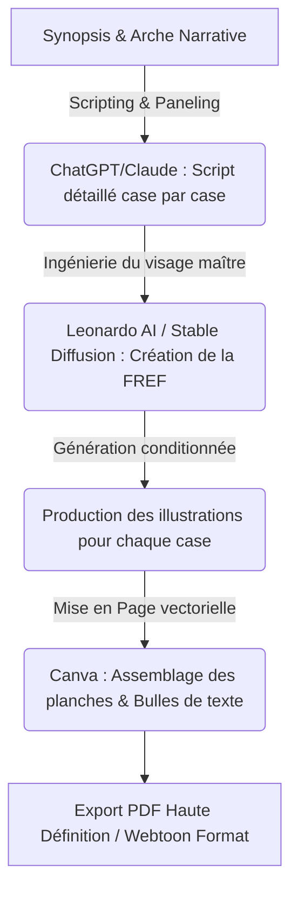

# 🧿 Geordi Resource Guide — How to Create a Comic Book with AI
> **ID YouTube** : `YT-yM14V5rc4Fw`  
> **Source Channel** : Ai Lockup  
> **Serendipity Score** : 7/10  
> **Date de Capture** : 2026-05-24  
> **Souveraineté Métier** : H1 - Micro-édition de bandes dessinées et ingénierie de la cohérence visuelle par IA  

---

## 1. Concepts Clés (Deep-Dive Sémantique)

La création d'une bande dessinée, d'un manga ou d'un webtoon a toujours représenté un défi artistique et logistique majeur, nécessitant des compétences poussées en dessin d'anatomie, en perspective, en encrage et en narration visuelle. L'avènement des modèles d'IA générative (Text-to-Image) bouleverse cette discipline en automatisant le rendu visuel. La réussite de ce pipeline d'édition par IA dépend de deux piliers fondamentaux : la cohérence des personnages à travers les cases et la maîtrise de la composition des planches (storyboarding).

### A. La Cohérence Multiclonal des Personnages (Consistent Character Generation)
Le principal écueil de la bande dessinée par IA réside dans les variations involontaires du visage, des vêtements ou de la morphologie d'un personnage d'une case à l'autre :
- **Ingénierie du Prompt d'Ancrage Face-Reference (FREF)** : Utilisation des dernières technologies d'ancrage sémantique pour forcer l'IA à reproduire le même visage sous différents angles (profil, face, trois-quarts) et expressions émotionnelles.
- **La Technique de la Feuille de Personnage (Character Sheet)** : Générer en amont une grille unique contenant le personnage sous toutes ses coutures, puis découper individuellement les postures pour conserver une cohérence géométrique et vestimentaire absolue.

### B. La Mise en Page Narrative (Paneling and Storyboarding)
- **Le Découpage Séquentiel (Sequential Paneling)** : La bande dessinée repose sur la tension dramatique créée par la transition d'une case à la suivante. L'opérateur doit concevoir une alternance dynamique de plans (plans larges pour situer le décor, plans serrés pour les émotions, plans moyens pour l'action) pour maintenir l'intérêt du lecteur.
- **L'Intégration Typographique des Bulles de Dialogue (Speech Bubbles)** : La mise en place de bulles de texte ne doit pas obstruer les détails clés des illustrations. L'utilisation de gabarits vectoriels fins permet d'assurer une lisibilité professionnelle de la typographie.

---

## 2. Entités & Outils (Souverains & Publics)

Pour structurer une usine de création de BD ou de Mangas par IA, l'opérateur assemble la suite logicielle suivante :

| Outil / Entité | Rôle Spécifique dans le Pipeline de la BD | Alternatives Souveraines / Open Source |
| :--- | :--- | :--- |
| **Leonardo.ai / Bing Image Creator** | Génération gratuite d'illustrations de style BD, cartoon ou manga | Stable Diffusion XL (Local avec modèles comme Comic Diffusion) |
| **ChatGPT / Claude** | Scripting, écriture des dialogues et découpage technique par case | Llama-3-70B (Local text generation) |
| **Canva / Comic Life** | Mise en page des planches, bulles de dialogue et lettrage | Krita / GIMP (Solution de dessin et mise en page locale libre) |
| **IP-Adapter / FaceID (SD)** | Technologie open source locale pour figer le visage d'un personnage | InstantID (Inférence locale via ComfyUI) |

### Flux opérationnel de production d'un Comic Book :


---

## 3. Synthèse Pratique (Procédure Standard de Production)

Pour concevoir et publier une bande dessinée complète de 10 pages en totale autonomie, l'opérateur applique scrupuleusement la procédure suivante.

### Phase 1 : Scripting et Découpage Séquentiel
L'opérateur utilise le modèle de langage pour structurer le script scénaristique case par case, en définissant précisément la composition visuelle de chaque image :
> *Invite de découpage : "Rédige le script de la planche numéro 1 d'une bande dessinée de science-fiction intitulée 'A-Space Odyssey'. Divise la planche en 4 cases. Pour chaque case, fournis : le type de plan, la description visuelle détaillée pour un prompt d'image (style comic book dessiné à la main, encrage sombre, couleurs saturées) et les dialogues des bulles de texte."*

### Phase 2 : Génération des Cases avec Cohérence de Personnage
1. Générer le visage de référence du héros (ex : un astronaute nommé Leo) sur Leonardo AI ou Bing Image Creator.
   > *Prompt de référence : "Concept art sheet, hand-drawn comic style, a brave astronaut named Leo, short dark hair, blue eyes, determined look, white space suit, flat clean background, highly detailed --ar 1:1"*
2. Pour générer les cases successives en conservant le même personnage :
   - Sur Leonardo AI, utiliser l'outil **Image Guidance** en téléversant le visage de référence généré à l'étape 1 comme guide d'identité (ou utiliser le paramètre `--cref` sur Midjourney).
   - Utiliser des descriptions de postures et d'actions précises dans le prompt, tout en maintenant les constantes du personnage (cheveux courts sombres, yeux bleus, combinaison spatiale blanche).

### Phase 3 : Assemblage des Planches et Lettrage dans Canva
1. Dans Canva, créer un document vierge au format A4 (ou au format vertical de type Webtoon).
2. Utiliser l'outil **Grilles de conception** pour créer les fenêtres (cases/panels) sur la page (ex : une grille asymétrique à 3 ou 4 cases).
3. Glisser-déposer les illustrations générées dans les cases correspondantes.
4. Aller dans l'onglet **Éléments**, rechercher `speech bubble` ou `bulle de texte`. Sélectionner des bulles vectorielles simples (blanches à contour noir).
5. Placer les bulles de dialogue de manière équilibrée sur les illustrations. Saisir les textes avec une police de caractères typique de la bande dessinée (ex : *Comic Sans* - bien que souvent décriée, il existe des alternatives professionnelles gratuites comme *Comic Neue*, *Bangers*, ou *Architects Daughter*).
6. Exporter l'œuvre au format PDF Impression pour l'auto-édition ou en images PNG haute résolution pour la publication en ligne.

---

## 4. Actionnabilité (D.E.A.L)

### D - Definition (Intention Stratégique)
Démocratiser la création littéraire et visuelle de bandes dessinées et de mangas en exploitant des outils d'IA générative gratuits ou open source. Permettre à des auteurs indépendants de donner vie à leurs univers graphiques à un coût marginal nul et avec une rapidité d'exécution sans précédent.

### E - Elimination (Épuration des Frictions)
- Éliminer le besoin de maîtriser le dessin anatomique et les perspectives géométriques complexes en délégant le rendu visuel aux modèles d'IA.
- Supprimer les inconsistances de personnages en appliquant de manière rigoureuse des technologies d'ancrage d'identité (FREF, IP-Adapter, cref).
- Éviter le lettrage manuel désordonné en utilisant des gabarits typographiques vectoriels standardisés dans Canva.

### A - Automation (Le Cœur Logique de la SOP)
```
[SOP-AI-COMIC-FACTORY]
1. GENERER le script scénaristique case par case avec le découpage technique via le LLM.
2. CRÉER l'identité graphique maître du personnage (visage, costume, style).
3. CONFIGURER l'outil de génération d'images (Leonardo/SD) en activant le guidage d'image de référence pour verrouiller l'identité faciale.
4. GÉNÉRER les illustrations de chaque case selon le découpage technique établi.
5. CONSTRUIRE la grille de mise en page (cases) sur Canva.
6. INSÉRER les illustrations générées et superposer les bulles de dialogue vectorielles.
7. APPLIQUER la police de caractères 'Comic Neue' pour le lettrage final et EXPORTER au format PDF HD.
```

### L - Liberation (Objectif Souverain & Alignement)
* **Domaine Spock associé** : `[Spock's Area LD01 - Career/Business]` (Capacité d'auto-édition et création d'actifs intellectuels et artistiques monétisables).
* **Roue de la vie** : Expression créative, finances et épanouissement personnel.
* **Prochaine étape actionnable** : Produire une planche complète de 4 cases pour valider le niveau d'expression émotionnelle du personnage principal sous guidage d'image.

---
*Ce document de connaissances fait partie intégrante du système PARA de l'Enterprise d'A'Space OS V2.*
