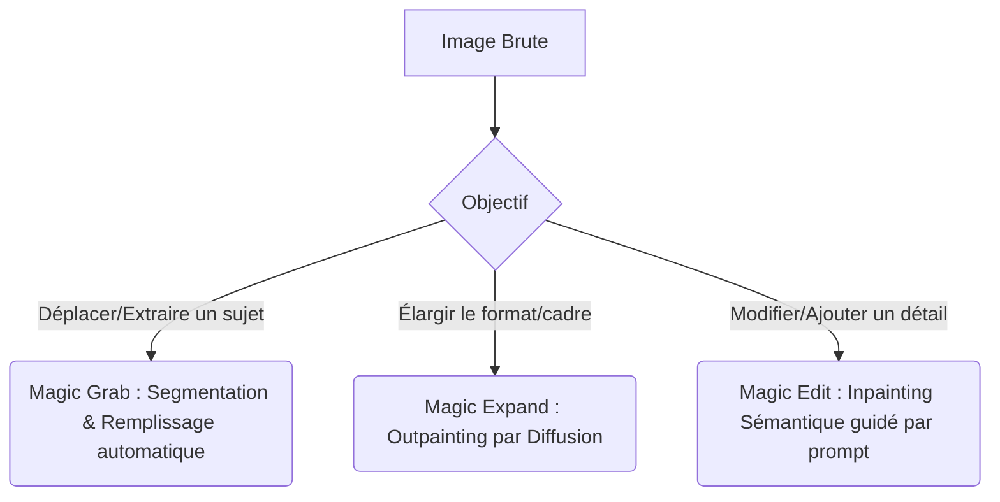

# 🧿 Geordi Resource Guide — NEW Canva Magic Photo Tools
> **ID YouTube** : `YT-EfFGFAFnqrs`  
> **Source Channel** : EdTech Hustle  
> **Serendipity Score** : 7/10  
> **Date de Capture** : 2026-05-24  
> **Souveraineté Métier** : H1 - Retouche photo assistée par IA et ingénierie de la composition visuelle  

---

## 1. Concepts Clés (Deep-Dive Sémantique)

L'intégration d'algorithmes avancés d'inpainting et d'outpainting basés sur les modèles de diffusion au sein des plateformes de design en ligne transforme radicalement le travail d'édition photographique. Canva a introduit trois outils photographiques majeurs qui redéfinissent la manipulation d'images sans nécessiter d'expertise technique sur des suites logicielles lourdes. Ce guide analyse les concepts scientifiques et les applications pratiques de ces innovations.

### A. Algorithmes d'Inpainting sémantique (Magic Edit)
L'inpainting consiste à reconstruire des parties manquantes ou modifiées d'une image de manière cohérente avec le contexte global :
- **Génération Conditionnée par le Contexte** : Contrairement au simple tampon de duplication qui copie des pixels adjacents, l'inpainting par IA (comme Magic Edit) comprend la structure de l'image (lumière, texture, perspective) et génère de nouveaux pixels sémantiquement cohérents à partir d'un prompt textuel.
- **Masquage de Précision** : L'utilisateur définit une zone de masquage élémentaire, et le modèle remplace le contenu sous le masque tout en assurant une transition harmonieuse des bords (blending) pour éviter les démarcations visibles.

### B. Outpainting et Extension d'Image (Magic Expand)
L'outpainting (ou Magic Expand) permet d'étendre les limites physiques d'une image au-delà de son cadre d'origine :
- **Prédiction de Structure Extrapolée** : Le modèle analyse les lignes de fuite, le flou d'arrière-plan et la colorimétrie de l'image source pour imaginer et dessiner le paysage ou les objets qui se trouveraient naturellement en dehors du cadre. Cela s'avère particulièrement utile pour adapter une photo verticale au format horizontal (16:9) sans la recadrer ni la déformer.

### C. Découpage sémantique d'objets (Magic Grab)
- **Segmentation d'instance en un clic** : Magic Grab utilise des réseaux neuronaux de segmentation d'objets (semblables à SAM - Segment Anything Model de Meta) pour identifier les contours exacts d'un sujet (humain, objet, animal) et le transformer instantanément en élément indépendant mobile, tout en reconstituant de manière intelligente le fond situé derrière lui.

---

## 2. Entités & Outils (Souverains & Publics)

Pour orchestrer ce micro-pipeline de retouche d'image, les opérateurs manipulent les outils technologiques suivants :

| Outil / Entité | Fonction dans Canva Magic Photo | Alternative Souveraine / Open Source |
| :--- | :--- | :--- |
| **Magic Grab** | Détourer et déplacer un sujet en un clic en complétant l'arrière-plan | Segment Anything Model (SAM) local |
| **Magic Expand** | Étendre les limites d'une image (Outpainting) | Stable Diffusion Outpainting (ComfyUI) |
| **Magic Edit** | Remplacer ou ajouter des éléments par saisie textuelle (Inpainting) | Stable Diffusion Inpainting (WebUI / Fooocus) |
| **Canva Photo Editor** | Interface de composition, réglages de filtres et colorimétrie | GIMP / Krita (Souverain local libre) |

### Comparaison conceptuelle des 3 technologies :


---

## 3. Synthèse Pratique (Procédure Standard de Production)

Pour exploiter ces trois outils de manière synergique et professionnelle, l'opérateur applique la procédure suivante sur ses visuels bruts.

### Phase 1 : Cadrage et Extension de l'Espace de Travail (Magic Expand)
1. Importer une photo de portrait verticale dans un canevas horizontal de format 16:9.
2. Cliquer sur l'image, sélectionner l'outil **Magic Expand** dans la barre d'édition de photo.
3. Choisir l'option de redimensionnement "Page entière" ou étendre manuellement les poignées latérales du cadre.
4. Lancer l'extension. L'IA génère le prolongement réaliste du décor (ex : prolonger une plage ou un bureau de travail) et propose quatre variantes visuelles. Sélectionner la plus cohérente.

### Phase 2 : Détourage et Repositionnement du Sujet (Magic Grab)
1. Sur l'image étendue, sélectionner l'outil **Magic Grab**.
2. L'algorithme isole instantanément le sujet (le personnage principal) de son nouvel arrière-plan.
3. Glisser-déposer le sujet sur le côté gauche ou droit de la composition pour respecter la règle des tiers. L'emplacement d'origine du sujet est automatiquement comblé par l'IA de manière imperceptible.

### Phase 3 : Modification Sémantique de Détails (Magic Edit)
1. Pour ajouter un élément de marque ou ajuster un vêtement, sélectionner **Magic Edit**.
2. Peindre avec le pinceau de masquage sur la zone cible (ex : la main du personnage).
3. Saisir l'instruction dans la boîte de dialogue : `holding a professional minimalist smartphone`.
4. Cliquer sur "Générer" et choisir parmi les quatre options réalistes proposées celle qui s'intègre le mieux avec l'éclairage de la scène d'origine.

---

## 4. Actionnabilité (D.E.A.L)

### D - Definition (Intention Stratégique)
Industrialiser la chaîne de retouche et de re-cadrage de visuels promotionnels. L'objectif est de s'affranchir des limitations de format des photos sources fournies par les clients ou les banques d'images en les rendant malléables sémantiquement à volonté.

### E - Elimination (Épuration des Frictions)
- Éliminer l'étape fastidieuse du détourage manuel au tracé vectoriel sous Photoshop ou Illustrator.
- Écarter les photos rejetées à cause d'un cadrage inadapté (vertical au lieu d'horizontal) en reconstituant l'espace manquant de façon automatique.
- Supprimer les séances photo de rattrapage en modifiant les accessoires ou tenues démodées directement en post-production par Inpainting.

### A - Automation (Le Cœur Logique de la SOP)
```
[SOP-CANVA-PHOTO-AI]
1. IMPORTATION du visuel brut dans le format cible de destination de la campagne.
2. EXÉCUTION de 'Magic Expand' pour combler les zones de vide périphériques.
3. ISOLEMENT et RE-POSITIONNEMENT du sujet avec 'Magic Grab' selon les règles de composition graphique.
4. SÉLECTION de la zone accessoire avec le pinceau 'Magic Edit' pour l'adapter au produit promu.
5. APPLIQUER les filtres de cohérence lumineuse pour harmoniser le rendu global.
6. EXPORTER le fichier PNG HD pour intégration finale.
```

### L - Liberation (Objectif Souverain & Alignement)
* **Domaine Spock associé** : `[Spock's Area LD01 - Career/Business]` (Agilité et rapidité de design publicitaire en interne sans dépendre de graphistes externes).
* **Roue de la vie** : Rentabilité, productivité et créativité visuelle.
* **Prochaine étape actionnable** : Réaliser un benchmark d'outpainting sur 10 visuels complexes (décors urbains, forêts, motifs abstraits) pour mesurer le taux de fidélité et la cohérence de Magic Expand.

---
*Ce document de connaissances fait partie intégrante du système PARA de l'Enterprise d'A'Space OS V2.*
