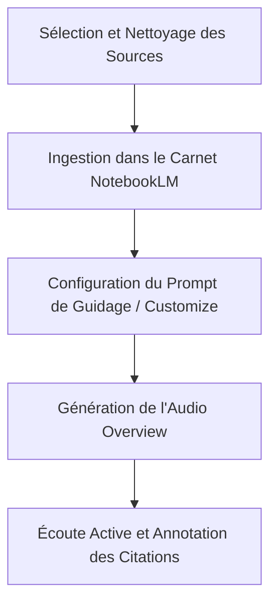

# Guide PARA Geordi : RAG Sémantique & Génération de Podcasts avec NotebookLM

> **Statut** : CLARIFIED_PLANE
> **Source** : AI Tuto (YT-t_WTZhm8UDY)
> **Axe** : Intelligence Artificielle / RAG / Synthèse Vocale Sémantique

---

## 1. Concepts Clés

### A. RAG (Retrieval-Augmented Generation) Documentaire
Le cœur fonctionnel de NotebookLM repose sur l'ancrage strict du modèle de langage sur un corpus de documents fourni par l'utilisateur (PDF, Google Docs, URL, Markdown). Contrairement aux modèles de chat généralistes qui s'appuient sur leurs poids pré-entraînés, NotebookLM applique une recherche sémantique locale pour extraire le contexte pertinent avant de formuler ses réponses ou de générer des synthèses. Cet ancrage élimine quasi totalement les hallucinations en forçant le LLM à citer ses sources directement dans les documents injectés.

### B. Audio Overview (Synthèse Dialoguée)
L'innovation majeure réside dans la conceptualisation de la synthèse d'informations sous la forme d'un dialogue dynamique entre deux hôtes IA (un homme et une femme). Ce concept transforme des textes techniques, arides ou fragmentés en une conversation fluide, ponctuée d'intonations naturelles, de souffles, de rires et de relances sémantiques. L'IA n'effectue pas une simple lecture de texte (Text-to-Speech classique), mais une véritable réécriture scénarisée, simulant un podcast de haut niveau.

### C. Traduction et Alignement Linguistique Multi-langues
Initialement restreint à l'anglais, le moteur de NotebookLM prend désormais en compte des sources multi-langues et permet la génération de podcasts structurés en français. Le concept clé réside dans l'alignement conceptuel : le modèle traduit la structure argumentative d'un texte d'origine tout en conservant le ton journalistique et dynamique propre aux formats audio américains.

---

## 2. Entités & Outils

### A. Google NotebookLM
L'environnement de travail souverain pour la recherche sémantique. Il permet d'agréger jusqu'à 50 sources par carnet de notes, avec une limite de 500 000 mots par source. L'outil agit comme un second cerveau collaboratif.

### B. Sources Structurées
*   **Documents Textuels** : Fichiers PDF, ePub, Textes bruts, Markdown.
*   **Intégrations Natives** : Google Drive (Docs et Slides), permettant une mise à jour dynamique des données sources.
*   **Entrées Web** : Liens d'articles ou de documentations techniques pour nourrir le contexte en temps réel.

### C. Paramètres d'Audio Overview
*   **Customize** : Option de guidage de l'audio (Prompting de l'hôte) pour orienter la discussion vers des sujets spécifiques, simplifier le jargon ou adopter un ton particulier.
*   **Génération Mono/Multi-langue** : Capacité de traiter des sources en français pour générer une discussion fluide en français.

---

## 3. Synthèse Pratique

Le flux de travail pour transformer un ensemble de ressources documentaires brutes en un outil d'apprentissage audio premium se déroule en trois étapes majeures :

1.  **Ingestion Contextuelle** : Charger des notes de recherche, des spécifications d'architecture ou des articles de blog. NotebookLM génère automatiquement un résumé de chaque source et suggère des questions clés.
2.  **Scénarisation Automatique** : L'algorithme analyse les recoupements sémantiques entre les sources pour dresser un conducteur de podcast équilibré (introduction, développement des thèses, exemples concrets, conclusion).
3.  **Export & RAG** : Le podcast généré sert de média d'assimilation rapide (idéal pour l'apprentissage nomade) tout en restant lié aux notes écrites cliquables dans l'interface de NotebookLM.

---

## 4. Actionnabilité (D.E.A.L)

### Definition (Définition)
*   **Objectif** : Produire un podcast de synthèse sémantique en français à partir de n'importe quel lot de documents PDF/Markdown d'A'Space OS en moins de 10 minutes.
*   **Livrables** : Un fichier audio MP3 contenant le dialogue explicatif clair et une note structurée liant les concepts clés aux documents sources.

### Elimination (Élimination)
*   Éliminer les lectures linéaires de longs documents techniques (perte de temps cognitive).
*   Bannir l'utilisation d'outils de Text-To-Speech (TTS) rigides sans ton conversationnel pour l'assimilation sémantique.

### Automation (Automatisation)
*   Créer un carnet NotebookLM standardisé pour chaque projet de recherche A'Space OS.
*   Automatiser le regroupement des documents de recherche dans un dossier Google Drive synchronisé avec NotebookLM pour une ingestion immédiate.

### Liberation (Libération)
*   **SOP sémantique d'ingestion et génération audio** :
    1.  Rassembler les sources documentaires (par ex. les spécifications d'architecture d'un nouveau module).
    2.  Créer un nouveau notebook dans NotebookLM.
    3.  Uploader les sources et attendre la génération de l'index sémantique.
    4.  Cliquer sur "Generate" dans la section "Audio Overview".
    5.  Utiliser la fonction "Customize" pour forcer le ton en français avec le prompt : `Générez une discussion approfondie et dynamique en français, en vous concentrant exclusivement sur les implications d'architecture technique et les cas d'usage pratiques.`
    6.  Télécharger le fichier audio résultant et le stocker dans les ressources PARA correspondantes pour écoute en mobilité.
