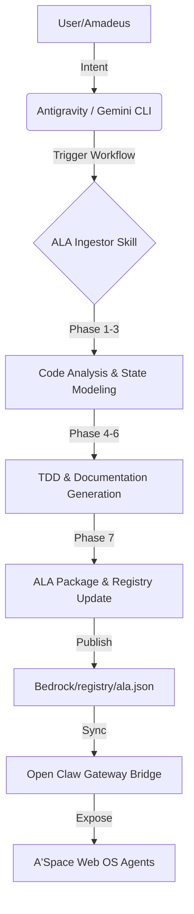

# ALA Ingestion: Architecture Design

## High-Level Diagram

## Key Decisions

### Fork Strategy
The `CLI-Anything` logic will be decoupled from `Claude Code`'s private APIs and refactored as a standalone Node.js module that can be natively invoked by `gemini` commands or Antigravity's terminal.

### Communication Protocol
ALAs will communicate via standard `stdin/stdout` using JSON-RPC strings to ensure compatibility with all agent languages (JS, Python, Go) while keeping the host system clean.

### The Ingestion Workflow
We will use a dedicated `.agent/workflows/software-ingestion.md` to guide the A3 agent through the 7 phases, ensuring that if it crashes or reaches a quota limit, it can resume exactly where it left off (Checkpoint persistence).

## Security & Isolation
- All ingestion tests run in a `tmp/ala-sandbox/` directory.
- The registry is read-only for sub-agents; only A0/A1 can authorize a new tool insertion.
