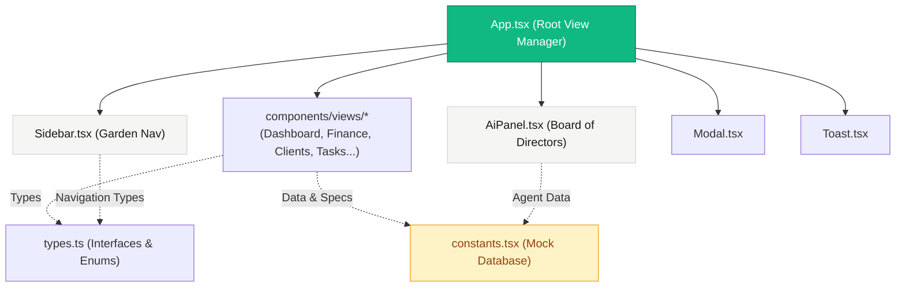
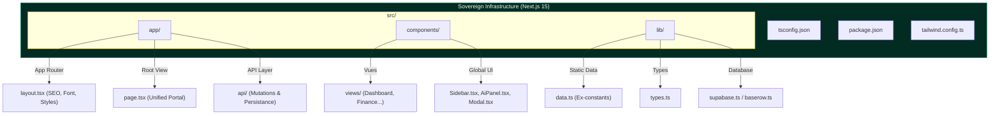

# 🔆 A'Space AaaS (Digital Garden) — Audit Technique & Correction de Dettes (Project Picard)

> **Date** : 2026-05-25  
> **Projet** : `A'Space AaaS` (Digital Garden) — OS de gestion d'Agency-as-a-Service pour fondateurs non-techniques  
> **Source** : `C:\Users\amado\ASpace_OS_V2\30_Business_OS\00_Summers_QuickAccess\00_Agency_aaS\B2_Business_Domains\03_Product_Flash_Avengers\00_Interface_Prototypes\aaas os`  
> **Objectif** : Alignement **Deployment Ready** & Migration souveraine vers une architecture Next.js 15 production-grade.

---

## 1. Cartographie de l'Existant

### 📁 Inventaire des Fichiers du Prototype

| Composant / Fichier | Taille | Rôle / Description |
| :--- | :--- | :--- |
| `App.tsx` | 7.9 KB | Point d'entrée de l'application React. Gère la navigation, les modales, les notifications (toasts) et le rendu des vues. |
| `types.ts` | 3.1 KB | Fichier central des définitions TypeScript (types de navigation, KPI, tâches, SOP, clients, transactions, etc.). |
| `constants.tsx` | 9.7 KB | Base de données mocked complète de l'application (KPIs, alertes, SOPs, tâches, leads, transactions, membres de l'équipe, etc.). |
| `metadata.json` | 160 B | Métadonnées de l'application (Nom, description, permissions requises). |
| `components/Sidebar.tsx` | 6.2 KB | Barre de navigation gauche collante avec thématique "Digital Garden" ("Cultivate", "Nurture", "Bloom", "Roots"). |
| `components/AiPanel.tsx` | 9.3 KB | Panneau d'intelligence artificielle interactif représentant le "Board of Directors" (Jerry, Batman, Superman, Flash, etc.). |
| `components/Modal.tsx` | 1.9 KB | Wrapper modal réutilisable avec animations fluides. |
| `components/Toast.tsx` | 1.8 KB | Système de feedback visuel temporaire. |
| `components/views/...` (12 fichiers) | ~90 KB | Vues métier modélisant chaque sous-système de l'OS (Dashboard, Finance, Clients, People, Tasks, SOP Library, Legal, Growth, Marketplace, Sales, System Roots, Settings). |

**Total** : 16 fichiers TSX/TS · ~130 KB · **Zéro configuration d'infrastructure de build** (pas de `package.json`, `tsconfig.json`, `tailwind.config.js` ni de point d'entrée HTML/Vite).

### 🏗️ Architecture Actuelle



---

## 2. Diagnostic des Dettes Techniques

### 🔴 CRITICAL — Bloquants Déploiement & Pipeline

| ID | Dette | Impact | Description & Détail |
|---|---|---|---|
| **D01** | **Absence de package.json** | 🚫 Compilation | Il s'agit d'un répertoire de fichiers bruts. Impossible d'installer des dépendances (`npm install`), d'exécuter un build (`npm run build`), ni de gérer un pipeline CI/CD standard. |
| **D02** | **Absence de tsconfig.json local** | 🚫 Typage / IDE | Bien que les fichiers soient typés en TypeScript, il n'y a pas de configuration de compilation locale, ce qui peut causer des incohérences de compilation et des alertes de l'éditeur lors de l'intégration globale. |
| **D03** | **Pas de fichier de styles global (CSS/Tailwind)** | 🚫 Design System | L'application utilise des classes Tailwind (`bg-stone-50`, `glass-panel`, `shadow-soft`, etc.) mais le fichier de configuration Tailwind (`tailwind.config.js`) et le CSS d'entrée (`globals.css`) sont manquants dans ce répertoire. L'application dépend d'un héritage de styles extérieur non explicite. |
| **D04** | **Absence de configuration de build / bundler** | 🚫 Serveur | Il n'y a aucun outil comme Vite, Webpack ou Next.js pour servir l'application localement ou générer un bundle statique optimisé pour la production. |

### 🟠 HIGH — Dettes Architecturales

| ID | Dette | Impact | Description & Détail |
|---|---|---|---|
| **D05** | **État Applicatif 100% Volatile** | ⚠️ Persistance | Toutes les données modifiées (ex: création de tâches, signature de contrats, gestion de clients) sont gérées localement par des `useState` et des simulations dans les composants. Aucun stockage persistant (Base de données, LocalStorage, API) n'est implémenté. |
| **D06** | **Ressources / Assets CDN Externes** | ⚠️ Fiabilité / Offline | L'application dépend de services externes (Dicebear pour les avatars `api.dicebear.com` et Vercel pour le SVG de bruit de fond `grainy-gradients.vercel.app/noise.svg`). Si ces services tombent ou si la machine est hors ligne, les graphismes cassent. |
| **D07** | **Actions Vues / Formulaires Simulés** | ⚠️ Business | Les boutons d'action et formulaires (e.g. signature de documents dans `Legal.tsx`, activation d'agents, ou transferts financiers) déclenchent uniquement des Toasts simulés sans effet réel. |
| **D08** | **Espace dans le nom du dossier** | ⚠️ CI/CD | Le dossier s'appelle `aaas os`. L'espace dans le nom du dossier est une mauvaise pratique majeure pour les pipelines de build automatisés et les shells CLI (peut faire échouer les scripts Node/Bash). |

### 🟡 MEDIUM — Dettes Qualité & SEO

| ID | Dette | Impact | Description & Détail |
|---|---|---|---|
| **D09** | **Aucun Routage Vrai** | 🔧 SEO & UX | La navigation se fait via un `useState` React basique (`currentView`). Impossible de recharger directement sur `/finance` ou de partager un lien vers la vue `/clients`. Bloque le référencement et l'indexation. |
| **D10** | **Absence de balises Meta & SEO** | 🔧 SEO / OG | Pas de balises Open Graph, pas de favicon de marque, pas de `robots.txt` ni de configuration `sitemap`. |
| **D11** | **Aucune Couverture de Tests** | 🔧 Robustesse | Zéro test unitaire, d'intégration ou E2E (Playwright/Cypress). La validation repose entièrement sur la revue manuelle. |

---

## 3. Score de Maturité Déploiement

```
 CATÉGORIE                    SCORE    CIBLE (Next.js 15)
 ─────────────────────────── ──────── ────────────────────
 Build Pipeline               0 / 10           10
 Versionning (Git/GitHub)     2 / 10           10  (Intégré au mono-repo parent)
 SEO / SSR                    2 / 10            9
 Performance (Lighthouse)     4 / 10            9
 Backend / API / Persistence  0 / 10            7
 Tests                        0 / 10            6
 Sécurité                     3 / 10            8
 Design System / CSS          8 / 10           10  (Structure magnifique)
 Qualité du Contenu           9 / 10           10  (Contenu hyper-réaliste et soigné)
 ─────────────────────────── ──────── ────────────────────
 TOTAL                       28 / 100          89 / 100
```

> [!CAUTION]
> **Verdict Flash (Maturité : 28%)** : Le design et l'UX simulés sont d'une **qualité visuelle exceptionnelle (9/10)**, fidèles aux standards souverains A'Space OS. Cependant, **l'infrastructure technique est inexistante (1/10)**. L'application est actuellement un prototype inerte qui ne peut être ni déployé ni testé en isolation.

---

## 4. Plan de Correction en 4 Phases (Solaris Pattern)

### 🎯 Architecture Cible (Next.js 15 App Router + Tailwind CSS + TS)

La structure ciblée intègre l'ensemble de l'application dans une infrastructure Next.js moderne, modulaire, autonome et performante.



---

### Phase 1 : Initialisation & Fondation (Dettes D01–D04, D08)
*Objectif : Mettre en place la structure Next.js, configurer TypeScript/Tailwind et assembler les modules en ESM.*

1. **Renommage du Dossier cible** : Renommer `aaas os` → `aaas-os` pour supprimer l'espace et éviter les crashs de script.
2. **Bootstrap Next.js** : Initialiser une application Next.js 15 standardisée dans un dossier compagnon temporaire ou directement au propre :
   ```bash
   npx -y create-next-app@latest ./ --typescript --tailwind --eslint --app --src-dir --import-alias "@/*"
   ```
3. **Migration des Styles Globaux** : Récupérer et intégrer le design system A'Space dans le fichier `src/app/globals.css` (incluant les variables HSL et la classe `.glass-panel`).
4. **Migration des Fichiers Source** :
   - Placer `types.ts` dans `src/lib/types.ts`.
   - Placer `constants.tsx` dans `src/lib/constants.ts` (en renommant proprement les constantes).
   - Déplacer `components/` vers `src/components/`.
   - Déplacer les 12 vues de `components/views/` vers `src/components/views/`.
5. **Ajustement des Imports** : Remplacer tous les chemins relatifs par des alias propres (`@/components/...`, `@/lib/...`).
6. **Suppression des erreurs TypeScript** : Configurer le `tsconfig.json` local pour garantir un typage strict et une compilation sans erreur.

### Phase 2 : Rapatriement des Assets & SEO (Dettes D06, D10)
*Objectif : Rendre le projet 100% autonome vis-à-vis des CDNs et injecter les metadata SEO/OG.*

1. **Localisation des Images** : Télécharger et héberger les fichiers SVG Dicebear et les bruits de textures complexes localement dans le dossier `public/assets/`.
2. **Metadata Engine** : Configurer `src/app/layout.tsx` avec des metadata complètes pour l'Agency-as-a-Service OS (titre dynamique, description, mots-clés, open-graph).
3. **Polices Système et Local Fonts** : Configurer la police d'écriture `Inter` ou `Outfit` via `next/font/google` pour éliminer tout chargement de fonts bloquant côté client.

### Phase 3 : Couche de Persistance & Vrais Formulaires (Dettes D05, D07)
*Objectif : Remplacer l'état en mémoire par une base de données ou un backend persistant.*

1. **Intégration DB (Supabase / Baserow / LocalStorage)** :
   - Choix A (Léger & Autonome) : Utilisation du `localStorage` côté client pour les mutations des Tâches, Clients et Documents, permettant une persistence immédiate 0-infra.
   - Choix B (Souverain & Cloud) : Intégration de Supabase avec création de tables dédiées (`tasks`, `clients`, `transactions`, `leads`) et routes d'API Next.js dans `src/app/api/`.
2. **Raccordement des formulaires** :
   - Rendre le formulaire de création de tâches opérationnel.
   - Rendre le panneau de modification système fonctionnel.
   - Permettre la signature réelle des contrats (génération d'un flag `Signed` persistant).

### Phase 4 : Déploiement & Pipeline CI/CD (Dette D11)
*Objectif : Livrer l'application en production sur les serveurs souverains.*

1. **GitHub Pipeline** : Push initial du code propre et isolé vers GitHub.
2. **Configuration Docker (Track B - Recommandée pour A'Space OS)** :
   - Création d'un `Dockerfile` multi-stage optimisé pour Next.js (taille d'image minimale, build de production).
   - Fichier `docker-compose.yml` pour déploiement souverain immédiat via **Dokploy / CapRover** sur le VPS Hostinger ou en local.
3. **Configuration Vercel (Track A - Alternative rapide)** :
   - Fichier de déploiement instantané et configuration des variables d'environnement.

---

## 5. Décision Requise & Questions pour le Commanditaire

> [!IMPORTANT]
> ### 🚨 Questions de validation pour A0 (Amadeus / Commanditaire) :
> 
> 1. **Stratégie de déploiement (Track A ou Track B) ?**
>    - **Track A (Vercel)** : Déploiement ultra-rapide (5 min), idéal pour du test de prototype.
>    - **Track B (Dokploy/Self-Hosted VPS)** : Totalement souverain, hébergé sur vos propres serveurs, aligné avec la doctrine A'Space OS.
> 
> 2. **Type de Persistance souhaité pour la Phase 3 ?**
>    - **Locale (LocalStorage / Zustand-persist)** : Pas d'infrastructure de base de données requise, sauvegarde automatique dans le navigateur de l'utilisateur (très simple et souverain).
>    - **Backend (Supabase / Postgres local)** : Une vraie base de données collaborative prête pour le multi-utilisateur.
> 
> 3. **Choix du Framework de Fondation ?**
>    - **Next.js 15 (Recommandé)** : Idéal pour l'intégration des routes d'API, du SEO, du rendu hybride et pour s'aligner sur l'architecture de `solaris-aaas`.
>    - **Vite.js + React (SPA)** : Plus léger et rapide au build si aucune route d'API backend complexe n'est requise dans l'immédiat.
> 
> 4. **Domaine Cible ou Configuration de routage ?**
>    - A-t-on un domaine de test spécifique (ex: `aaas.kalybana.com` ou sous-domaine de `solaris.factory`) ?

---

*Ce document d'audit constitue le diagnostic de Project Picard. En attente de validation A0 pour le lancement de la Phase 1.*
