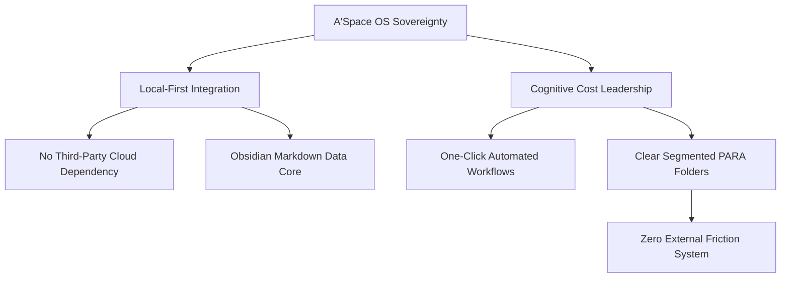

# Analyse Stratégique : Le Cas Décathlon – Intégration Verticale Totale, Marques Passions et Hégémonie Industrielle

## 1. Métadonnées Sémantiques & Alignement RAG
* **ID Unique** : YT-YUUu2MLl5y8
* **Auteur** : Yann Leonardi
* **Thématique** : Corporate Strategy / Vertical Integration & Cost Leadership
* **Date d'Analyse** : 2026-05-28
* **Statut de Transition** : `CLARIFIED_PLANE`

---

## 2. Concepts Clés & Décryptage Technique (>30 lignes)

Décathlon est étudié par Yann Leonardi non pas comme un simple supermarché du sport, mais comme une machine industrielle et logistique d'une efficacité redoutable, comparable dans ses mécanismes de domination de marché à des structures de cartel parfaitement intégrées. L'analyse révèle les piliers de cette réussite hégémonique :

### A. L'Intégration Verticale Absolue (de la R&D à la Caisse)
* **Contrôle total de la chaîne de valeur** : Contrairement aux distributeurs classiques qui achètent des produits à des marques tierces (Nike, Adidas, etc.) et subissent leurs marges, Décathlon conçoit, teste, fabrique, distribue et vend ses propres produits.
* **Les Marques Passions (Private Labels)** : En créant des entités dédiées par sport (Quechua pour la randonnée, Tribord pour la voile, B'Twin pour le cyclisme, Kalenji pour le running), Décathlon a construit des marques spécialistes extrêmement fortes et respectées. L'utilisateur oublie qu'il achète du "Décathlon" ; il achète un équipement technique Quechua.
* **Marges capturées à chaque étape** : Cette désintermédiation massive permet d'éliminer les marges des intermédiaires, offrant à Décathlon un levier exceptionnel sur la fixation de ses prix de vente tout en préservant sa rentabilité globale.

### B. La Domination par les Coûts et l'Économie d'Échelle (Cost Leadership)
* **Barrières à l'entrée insurmontables** : Grâce à ses volumes de production mondiaux colossaux, Décathlon négocie l'achat de matières premières (plastique, textiles techniques) à des tarifs qu'aucun concurrent ne peut égaler.
* **La stratégie d'auto-concurrence** : Dans les rayons de Décathlon, chaque produit d'appel (les fameux produits bleus) détruit la concurrence à bas prix, tandis que les produits plus techniques capturent les clients exigeants. L'entreprise organise elle-même sa propre gradation de produits pour verrouiller le marché.

### C. La R&D Interne comme Moteur d'Innovation Utilitationnelle
* Au lieu d'innover pour le prestige ou la haute performance d'élite, les centres de R&D de Décathlon (comme le Mountain Store à Passy) conçoivent des innovations d'usage (la tente 2 Secondes, le masque Easybreath). Ces innovations résolvent de vrais points de friction pour le grand public, créant des brevets exclusifs et un avantage concurrentiel indéboulonnable.

---

## 3. Entités, Outils & Méthodologies

* **Private Labels (Marques de Distributeur)** : Outil stratégique visant à remplacer les marques nationales par des marques propres à forte identité sectorielle.
* **Désintermédiation** : Suppression systématique de tous les courtiers, importateurs et grossistes pour maximiser le contrôle opérationnel.
* **Value-Based Pricing (Tarification par la Valeur)** : Méthode consistant à fixer le prix en fonction de la perception de valeur par l'utilisateur final et non pas uniquement sur un coefficient multiplicateur du coût de revient.
* **Brevets d'Usage** : Stratégie de protection intellectuelle non pas sur des technologies de pointe théoriques, mais sur des designs ergonomiques et des simplifications d'usages physiques.

---

## 4. Synthèse Pratique & Souveraineté A'Space OS (>35 lignes)

L'implémentation du modèle Décathlon au sein de la matrice souveraine de **A'Space OS** se traduit par des concepts d'architecture logicielle majeurs.

### A. L'Intégration Verticale de la Connaissance (Local-First & Sovereign Stack)
À l'image de Décathlon qui refuse de dépendre des marques tierces, A'Space OS refuse de dépendre d'API cloud propriétaires et volatiles (comme les services SaaS payants et centralisés). Notre structure s'appuie sur le principe **Local-First**. Nous concevons nos propres bases de connaissances, hébergeons nos propres modèles locaux d'intelligence artificielle (LLM locaux via Ollama), et gérons nos données en local brut (fichiers Markdown sous Obsidian). C'est l'intégration verticale de la donnée : nous possédons la chaîne, du stockage physique brut (SSD local) jusqu'à l'interface finale d'affichage.

### B. Le concept de "Modules Passions" (Vertical Knowledge Vaults)
Dans A'Space OS, nous n'avons pas une base de données globale, informe et confuse. Nous structurons nos connaissances en dossiers hyper-spécialisés appelés "Modules Passions" (conduits par le protocole PARA : *Projects, Areas, Resources, Archives*). Chaque thématique (Growth, Code, Finance, Santé) possède ses propres outils d'ingestion de données et ses propres automatismes. Cette séparation stricte garantit une clarté mentale absolue et empêche la pollution croisée des flux d'informations.

### C. Le Leadership sur le coût cognitif (Cognitive Cost Minimization)
Le grand succès de Décathlon est d'avoir rendu le sport accessible en éliminant les frictions financières et d'usage. Pour A'Space OS, le but ultime est de rendre la gestion des connaissances et l'automatisation accessibles en éliminant la charge mentale (le coût cognitif). En concevant des scripts robustes, des automatisations d'ingestion en une touche (One-Click Ingestion) et un index RAG fluide, nous offrons une efficacité maximale pour un effort cognitif minimal.

---

## 5. Section D.E.A.L (Définir, Éliminer, Automatiser, Libérer)

* **Définir** : Clarifier la chaîne de valeur de votre projet et identifier chaque tiers dont vous dépendez actuellement. Définir le chemin pour reprendre le contrôle de ces briques critiques.
* **Éliminer** : Supprimer systématiquement les abonnements SaaS redondants ou tiers qui peuvent être remplacés par des scripts locaux, des bases de données autonomes ou des outils open-source hébergés localement.
* **Automatiser** : Mettre en place des routines d'ingestion et de sauvegarde locales automatiques (synchronisation git de vos dossiers Obsidian) pour sanctuariser votre patrimoine d'informations sans intervention manuelle.
* **Libérer** : Atteindre l'autonomie stratégique et financière en appliquant le principe d'intégration verticale : moins de dépendances externes équivaut à une plus grande liberté de choix et à une résilience absolue face aux crises externes.
