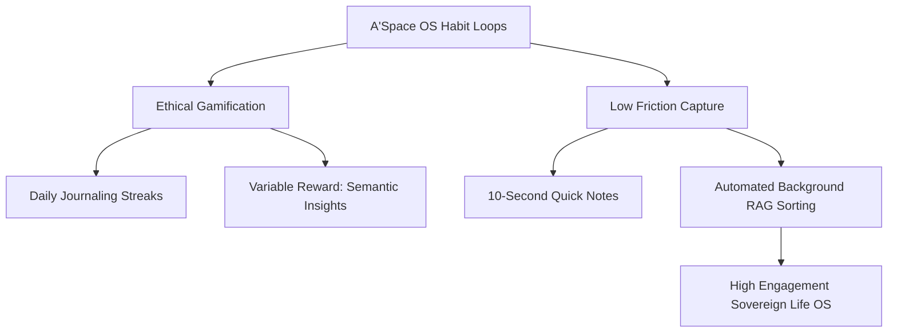

# Analyse Stratégique : Le Cas Duolingo – Hook Model, Hyper-Gamification et Mécaniques de Rétention Neurologique

## 1. Métadonnées Sémantiques & Alignement RAG
* **ID Unique** : YT-LZsyJpKAu1M
* **Auteur** : Yann Leonardi
* **Thématique** : Product Growth / Gamification & Engagement Loops
* **Date d'Analyse** : 2026-05-28
* **Statut de Transition** : `CLARIFIED_PLANE`

---

## 2. Concepts Clés & Décryptage Technique (>30 lignes)

Dans cette analyse incisive, Yann Leonardi démontre que l'objectif principal de Duolingo n'est pas la maîtrise rapide d'une langue étrangère par ses utilisateurs, mais la création d'une dépendance comportementale à l'application. Duolingo s'est transformé en un véritable casino cognitif dont le produit réel n'est pas l'éducation, mais les métriques d'engagement (DAU, MAU, Rétention). Les piliers de cette stratégie d'hyper-gamification reposent sur plusieurs leviers d'ingénierie produit :

### A. La boucle d'engagement infinie (The Streak Loop)
* **L'Aversion à la perte (Loss Aversion)** : La mécanique de la "Streak" (série de jours consécutifs d'utilisation) est le moteur de rétention le plus puissant du produit. Perdre une série de 300 jours crée une douleur psychologique réelle. Duolingo utilise ce biais cognitif pour forcer l'utilisateur à ouvrir l'application chaque jour, même pour faire une leçon de 30 secondes sans intérêt pédagogique réel.
* **Le Streak Freeze** : Un coup de génie de monétisation et d'engagement. Permettre à l'utilisateur d'acheter ou de gagner un joker pour préserver sa série en cas d'oubli introduit une mécanique d'assurance psychologique hautement addictive.

### B. La gamification neurologique (Leagues, XP, Hearts)
* **Les Ligues compétitives** : En regroupant les utilisateurs dans des ligues hebdomadaires (Bronze, Rubis, Diamant) basées sur les points d'expérience (XP) accumulés, Duolingo exploite le besoin de statut et la compétitivité sociale. Les utilisateurs n'apprennent plus pour parler espagnol, ils optimisent leurs sessions de jeu pour ne pas être rétrogradés.
* **Le système d'énergie (Hearts)** : Limiter les erreurs possibles sous peine d'interruption de session crée une tension psychologique artificielle qui incite soit à la frustration (et au départ), soit à l'achat d'abonnements premiums pour obtenir des vies infinies.

### C. La déconstruction pédagogique pour maximiser la rétention
* Pour s'assurer que l'utilisateur ne quitte jamais l'application par sentiment d'échec, le niveau de difficulté est maintenu artificiellement bas. Les leçons reposent sur des QCM ultra-simples, de la reconnaissance de formes et de la répétition mécanique. Cette méthode donne l'illusion de l'apprentissage (sentiment de compétence) tout en maintenant un taux de réussite très élevé, ce qui déclenche des décharges régulières de dopamine.

---

## 3. Entités, Outils & Méthodologies

* **Hook Model (Nir Eyal)** : Modèle d'ingénierie comportementale basé sur le cycle *Trigger -> Action -> Variable Reward -> Investment*. Duolingo l'applique à la perfection.
* **Loss Aversion (Biais d'Aversion à la Perte)** : Concept d'économie comportementale démontrant que la douleur de perdre quelque chose est psychologiquement deux fois plus puissante que le plaisir de gagner son équivalent.
* **Variable Reward (Récompense Variable)** : Mécanisme de casino où les récompenses (coffres, badges, animations de Duo la chouette) sont distribuées de façon imprévisible pour maximiser l'addiction.
* **Dark Patterns d'Engagement** : Choix de design d'interface qui forcent ou manipulent l'utilisateur pour qu'il prenne des décisions favorables aux métriques de la plateforme (notifications agressives culpabilisantes).

---

## 4. Synthèse Pratique & Souveraineté A'Space OS (>35 lignes)

L'étude des mécaniques de Duolingo par Yann Leonardi nous enseigne comment concevoir des boucles d'engagement saines mais puissantes pour **A'Space OS**, sans tomber dans la manipulation addictive et toxique.

### A. La Gamification Positive au service de la Souveraineté (Habit-Building)
A'Space OS a pour mission d'aider son utilisateur à structurer sa vie (Life OS). Or, maintenir un système d'organisation (comme remplir son Memory Core, documenter ses projets ou réviser ses notes Obsidian) demande de la discipline. Nous pouvons appliquer les concepts de Duolingo pour rendre la rigueur séduisante :
* **Gamification éthique** : Mettre en place un système de "Streak" interne pour la mise à jour quotidienne du log de vie (`wiki/log.md`). L'objectif n'est pas de retenir l'attention de l'utilisateur pour lui vendre de la publicité, mais de l'encourager à préserver son hygiène mentale et sa mémoire numérique.

### B. Conception de micro-tâches à faible coût cognitif
Pour vaincre la procrastination de la gestion de données, A'Space OS doit proposer des interfaces de capture ultra-rapides. Inspiré des sessions courtes de Duolingo, l'ingestion d'une note ou d'une tâche dans le système PARA doit prendre moins de 10 secondes. Le système doit s'occuper de classer, trier et structurer la donnée en arrière-plan (grâce aux agents RAG A3), offrant à l'utilisateur une gratification immédiate d'ordre et de clarté mentale sans l'épuiser.

### C. La Récompense Variable Utile (Semantic Synthesis)
Au lieu de distribuer des badges en chocolat, A'Space OS génère des synthèses de connaissances inattendues et hautement précieuses. Par exemple, après une série de 7 jours de capture d'idées, le système RAG local formule automatiquement une note de synthèse croisée, révélant des connexions sémantiques invisibles entre différents projets de l'utilisateur. C'est la récompense suprême : la découverte d'idées neuves générées par son propre cerveau augmenté.

---

## 5. Section D.E.A.L (Définir, Éliminer, Automatiser, Libérer)

* **Définir** : Identifier les habitudes clés que vous souhaitez ancrer dans votre vie (ex : 15 min de veille technique par jour). Définir des déclencheurs clairs et un système de suivi visuel minimaliste.
* **Éliminer** : Couper les notifications manipulatrices des applications mobiles addictives. Remplacer les boucles de dopamine passives (scroll infini) par des actions actives de création de connaissances dans votre OS.
* **Automatiser** : Configurer A'Space OS pour qu'il vous envoie une notification unique de synthèse quotidienne à heure fixe, éliminant les interruptions constantes tout en maintenant le contact avec vos priorités.
* **Libérer** : Reprendre le contrôle de votre attention. Ne laissez aucun algorithme externe dicter vos actions quotidiennes. Mettez la puissance du design comportemental au service de votre propre émancipation intellectuelle.
