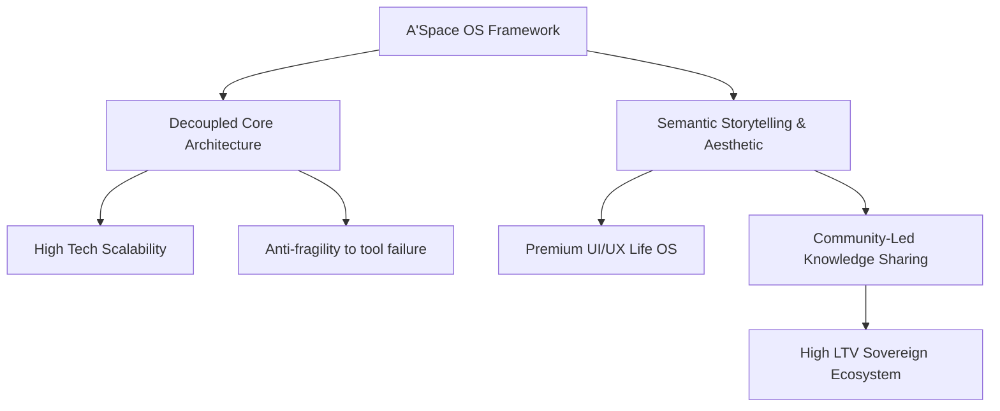

# Analyse Stratégique : Le Cas FC Versailles – Lifestyle, Branding et Disruptive Sports Marketing

## 1. Métadonnées Sémantiques & Alignement RAG
* **ID Unique** : YT-lLXT_RvQ-K8
* **Auteur** : Yann Leonardi
* **Thématique** : Growth Marketing / Brand Equity & Community-Led Growth
* **Date d'Analyse** : 2026-05-28
* **Statut de Transition** : `CLARIFIED_PLANE`

---

## 2. Concepts Clés & Décryptage Technique (>30 lignes)

Le FC Versailles ne doit pas être analysé comme un simple club de football évoluant dans les divisions inférieures (National), mais comme une **DNVB (Digitally Native Vertical Brand)** ou une marque de *lifestyle* haut de gamme déguisée en institution sportive. Yann Leonardi déconstruit ce phénomène à travers plusieurs piliers d'ingénierie marketing :

### A. Découplage de la performance sportive et de la Brand Equity
* **Modèle traditionnel** : Dans le sport classique, la valeur d'une marque (Brand Equity) dépend directement de ses résultats sur le terrain (victoires, montées, titres). Si l'équipe perd, l'audience s'effondre et les revenus de sponsoring diminuent.
* **Modèle FC Versailles (Disruptif)** : Le club a opéré un découplage sémantique complet. La valeur de la marque est indexée sur son positionnement culturel, son esthétique royale et son prestige géographique (le mythe de Versailles, le Roi Soleil). L'attention est captée non pas par le score du samedi soir, mais par l'audace de ses campagnes de communication, ses collaborations artistiques et sa direction artistique.

### B. Le Premium Lifestyle Hub & Collaborations Culturelles
* **Infiltration de la mode** : En s'associant avec des marques de mode contemporaines (comme Sandro ou d'autres créateurs parisiens), le FC Versailles transforme le maillot de foot en un accessoire de mode urbain (tendance *Blokecore*).
* **Le storytelling de l'anachronisme** : Associer l'univers populaire et brut du football amateur/semi-professionnel à la noblesse, au faste et au raffinement historique de Versailles crée un contraste cognitif saisissant. Ce décalage produit un taux d'engagement organique massif sur les réseaux sociaux.

### C. La boucle virale d'acquisition d'audience (Audience-First Product)
* Le club ne cherche pas à concurrencer le PSG sur le plan du jeu, mais sur le plan de l'attention digitale. La stratégie d'acquisition repose sur des micro-contenus à forte valeur esthétique (Reels, TikTok, shootings léchés) qui ciblent les amateurs de culture urbaine, de mode et d'art de vivre, bien au-delà des supporters de football traditionnels.
* Cette approche permet de maximiser le **LTV (Lifetime Value)** par supporter grâce à des paniers d'achat moyens plus élevés sur le merchandising (maillots premiums, collections capsules en édition limitée) et une monétisation dématérialisée (abonnements digitaux, contenus exclusifs).

---

## 3. Entités, Outils & Méthodologies

* **Blokecore / Sportswear Chic** : Tendance de mode consistant à porter des maillots de football dans la vie quotidienne. Le FC Versailles en fait un levier d'acquisition d'audience qualifiée *lifestyle*.
* **DNVB (Digitally Native Vertical Brand)** : Modèle d'organisation appliqué au club pour bypasser les distributeurs physiques et vendre directement en D2C (Direct-to-Consumer) via Shopify et le e-commerce exclusif.
* **Contrastes Cognitifs (Biais Psychologique)** : Technique de positionnement consistant à croiser deux univers théoriquement opposés (Noblesse historique vs Football populaire) pour forcer la mémorisation de la marque.
* **Co-Branding Premium** : Partenariats stratégiques avec des marques établies de la mode et de la culture (créateurs, photographes de mode) pour capter la crédibilité de tiers sans en supporter le coût initial de notoriété.

---

## 4. Synthèse Pratique & Souveraineté A'Space OS (>35 lignes)

L'analyse de Yann Leonardi sur le FC Versailles offre des leçons fondamentales pour l'architecture sémantique et la souveraineté opérationnelle de **A'Space OS**.

### A. Modularité et Découplage Systémique
Dans A'Space OS, le principe clé est l'indépendance de la couche technique par rapport à la couche d'usage et de sens. Tout comme le FC Versailles découple ses résultats sportifs de sa valeur de marque, A'Space OS doit découpler sa performance de calcul (les scripts, les microservices, les API) de son interface utilisateur et de son noyau sémantique. Si un service tiers tombe en panne (comme un match perdu), l'expérience globale et la souveraineté de l'OS doivent rester intactes. La valeur perçue réside dans l'écosystème global de connaissances et non dans l'outil brut temporaire.

### B. Le Storytelling Sémantique comme Moteur d'Adoption
Pour imposer A'Space OS comme le système d'exploitation ultime de la vie personnelle et professionnelle (Life OS), nous devons utiliser le contraste cognitif identifié chez Versailles. Nous marions la rigueur mathématique des bases de données RAG (les graphs de connaissances complexes, le Markdown brut) avec une esthétique de gestion minimaliste, fluide et hautement désirable. L'utilisateur n'adopte pas un outil technique aride, il intègre un style de vie souverain et structuré.

### C. La création de valeur par le Merchandising d'idées (Knowledge Assets)
A'Space OS capitalise sur la création de modèles de connaissances (Templates de productivité, prompts optimisés, scripts d'automatisation). Ces artefacts s'apparentent aux maillots premiums du FC Versailles. Ils ont une valeur intrinsèque élevée, sont reproductibles à coût marginal nul, et fédèrent une communauté d'utilisateurs passionnés par la souveraineté technologique.

---

## 5. Section D.E.A.L (Définir, Éliminer, Automatiser, Libérer)

* **Définir** : La proposition de valeur unique d'un projet doit reposer sur un positionnement culturel fort et un contraste marquant. Ne vendez pas de la technique pure, vendez une philosophie de vie et une esthétique.
* **Éliminer** : Supprimer la dépendance exclusive aux indicateurs de performance bruts (KPI techniques, scores temporaires) pour se concentrer sur la rétention émotionnelle et l'attachement à la marque.
* **Automatiser** : Mettre en place des flux de contenus automatisés basés sur des templates esthétiques stricts afin de maintenir une présence de marque haut de gamme sans effort de design quotidien lourd.
* **Libérer** : S'affranchir des canaux de distribution tiers et des plateformes intermédiaires centralisées en développant des canaux de communication directs (D2C, Newsletters privées, instances Obsidian souveraines).
