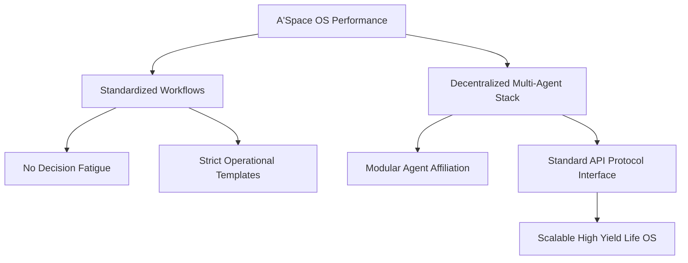

# Analyse Stratégique : Le Cas Hyrox – Franchisage Standardisé, Gamification du Fitness et Réseau d'Affiliation Global

## 1. Métadonnées Sémantiques & Alignement RAG
* **ID Unique** : YT-5Wd7Wvgg_7o
* **Auteur** : Yann Leonardi
* **Thématique** : Business Model Innovation / Standardization & Affiliate Growth Loops
* **Date d'Analyse** : 2026-05-28
* **Statut de Transition** : `CLARIFIED_PLANE`

---

## 2. Concepts Clés & Décryptage Technique (>30 lignes)

La thèse provocatrice de Yann Leonardi est d'une clarté limpide : HYROX n'est pas un sport au sens athlétique traditionnel, mais un chef-d'œuvre de modèle d'affaires, une franchise mondiale standardisée de fitness hybride conçue pour maximiser la réplicabilité, l'acquisition d'utilisateurs et le statut social. Hyrox a hacké l'industrie du fitness en s'appuyant sur des leviers stratégiques majeurs :

### A. La Standardisation Absolue (Le Code de la Compétition)
* **L'Unité de mesure universelle** : Contrairement au CrossFit où les entraînements (WOD) changent constamment, rendant la comparaison historique difficile, HYROX propose exactement la même course partout dans le monde : 8 fois 1 kilomètre de course à pied, entrecoupés de 8 ateliers d'exercices fonctionnels spécifiques (SkiErg, Sled Push, Sled Pull, Burpee Broad Jumps, Rowing, Farmers Carry, Sandbag Lunges, Wall Balls).
* **Le Leaderboard Mondial** : Cette standardisation absolue permet de créer un classement mondial unifié. Un athlète à Munich peut comparer sa performance à la seconde près avec un athlète à Chicago. Cela transforme l'activité physique en un jeu vidéo géant (Gamification du Fitness) axé sur l'optimisation des performances individuelles et le statut social.

### B. Le Modèle d'Affiliation B2B2C Triangulaire
* **Les Salles Partenaires (HYROX Affiliated Gyms)** : Hyrox ne possède aucune salle de sport physique. L'entreprise fait payer un abonnement annuel aux salles existantes pour qu'elles obtiennent le label "salle officielle Hyrox", forment leurs coachs à la méthodologie et attirent une clientèle ultra-fidèle et prête à payer un premium.
* **La double source de monétisation** : Hyrox encaisse d'un côté les frais d'affiliation récurrents des salles (B2B), et de l'autre, les frais d'inscription élevés des compétiteurs individuels pour les événements de masse (B2C), tout en vendant des espaces publicitaires massifs à des sponsors comme Puma.

### C. La Démocratisation de l'Effort (Mass-Market vs CrossFit)
* HYROX s'adresse au marché de masse. Les mouvements techniques complexes d'haltérophilie ou de gymnastique (propres au CrossFit) sont bannis au profit de mouvements fonctionnels simples, réalisables par n'importe quel pratiquant de fitness régulier. Le taux d'abandon est infime, garantissant un taux de satisfaction et de ré-inscription exceptionnellement élevé (Net Promoter Score maximal).

---

## 3. Entités, Outils & Méthodologies

* **Standardisation Processuelle** : Méthode industrielle consistant à figer chaque étape d'une prestation pour garantir une qualité constante et un coût de déploiement minimal à l'échelle mondiale.
* **Statut de Compétition (Social Status Games)** : Concept de sociologie appliquée au marketing où le produit acheté sert de marqueur de statut et de communauté (partager son temps Hyrox sur Instagram).
* **Modèle d'Affiliation Décentralisé** : Modèle de croissance rapide sans investissement en capital physique (Asset-Light Business Model) en exploitant l'infrastructure de tiers sous licence.
* **Leaderboard RAG (Global Index)** : Système d'indexation mondial de données permettant de classer et de comparer en temps réel des profils d'utilisateurs dispersés géographiquement.

---

## 4. Synthèse Pratique & Souveraineté A'Space OS (>35 lignes)

L'analogie de la standardisation et de l'affiliation de Hyrox se transpose directement dans la philosophie opérationnelle de **A'Space OS**.

### A. La Standardisation des Processus Cognitifs (Workflow Templates)
Pour être performant, A'Space OS ne doit pas réinventer sa structure chaque matin. À l'image de la course standardisée de Hyrox, nous mettons en place des **Workflows Cognitifs Standardisés**. La façon dont nous traitons une nouvelle ressource, dont nous démarrons un projet, ou dont nous archivons une tâche doit suivre un protocole strict et reproductible (le protocole BMad & PARA). Cette standardisation permet d'éliminer complètement la fatigue décisionnelle : l'esprit est libéré de la gestion de la structure pour se concentrer uniquement sur l'exécution pure de la tâche.

### B. L'Affiliation Décentralisée d'Agents (Multi-Agent Swarm)
Dans A'Space OS, nous appliquons le modèle B2B2C décentralisé de Hyrox à nos sous-agents IA (les rôles A1, A2, A3). L'OS central n'a pas besoin de tout coder en interne. Il orchestre un essaim d'agents spécialisés (Yaz pour la surveillance, Clara pour les flux de données, Batman pour les opérations). Chaque agent s'affilie à notre noyau d'instructions Obsidian en respectant des protocoles d'interface standardisés (les règles ECC et DDD). Cela nous permet de faire croître la puissance de calcul du système de manière exponentielle et modulaire sans surcharger le noyau.

### C. Le Leaderboard de Productivité Personnel (Self-Measurement)
Nous mettons en place un outil de mesure de nos propres flux : le suivi de nos métriques de production (Lignes de code produites, résumés de lectures assimilés, projets menés à terme). Ce suivi est un index sémantique personnel qui nous pousse à nous améliorer face à notre plus grand concurrent : nous-mêmes.

---

## 5. Section D.E.A.L (Définir, Éliminer, Automatiser, Libérer)

* **Définir** : Vos routines clés. Figez-en la structure exacte (temps, étapes, outils). Ne déviez pas de cette recette standardisée pendant au moins 30 jours pour en mesurer l'efficacité.
* **Éliminer** : Supprimer la complexité inutile dans l'organisation de vos journées. Dites non aux méthodes d'organisation trop alambiquées qui génèrent de la friction et privilégiez la simplicité d'exécution.
* **Automatiser** : Rédiger des scripts de démarrage de projets en une ligne de commande pour instancier instantanément l'architecture de fichiers standardisée (les sous-dossiers PARA).
* **Libérer** : En standardisant le fonctionnel et l'opérationnel, libérez un espace mental colossal pour vos activités créatives de haut niveau (Horizons H3 et H30, vision stratégique globale).
