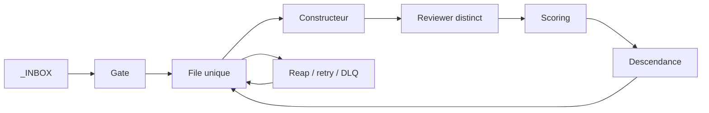

# Suite donnée le 2026-08-30 par Claude Opus 5

**Cet audit est confirmé, point par point, par une seconde mesure indépendante.**
Dernier événement de `uc.db` : `2026-08-03 17:18` — 27 jours de silence. 6 work
sur 11 en `failed`, 2 en `claimed` depuis 27 jours. Aucune tâche planifiée ne
pilotait le kernel : mon premier filtre en annonçait 4, c'était un faux positif
(`*uc*` attrape « Touchpad »). Et `worker_example.py` fait bien `time.sleep(0.2)`
au lieu de construire.

**Ce qui manquait est écrit : [`kernel/controleur.py`](../../10_Tech_OS/kernel/controleur.py).**
Les organes existaient — gate, claim atomique, reap, prediction, review, DLQ —
mais rien ne les appelait. Un cœur complet sans systole.

| | Avant | Après le premier battement |
|---|---|---|
| Dernier événement | 2026-08-03 (**647 h**) | 2026-08-30, **0 h** |
| `vivant` | **NON** | **oui** |
| Travail disponible | 1 `pending` | **9 `pending`** |
| Baux morts | 2 depuis 27 j | 0 |

Le battement a été **testé sur une copie jetable avant la production**, et la
base sauvegardée. `controleur.py --auto-test` refait cette vérification.

**Ce que le contrôleur ne fait pas, et ne doit pas faire :** construire. Il
ordonnance. Le constructeur est un harness, et confondre les deux est
exactement ce que cet audit reproche au worker de référence. Les capacités 3
et 5 de la définition falsifiable — *construire un artefact réel*, *scorer une
prédiction* — restent ouvertes.

**Le battement est détaché.** Tâche planifiée `ASpace_V3_Battement`, toutes les
15 minutes, `StartWhenAvailable` — donc elle rattrape après une extinction.
C'est la capacité 8, *recommencer après redémarrage*, et elle est fermée.

Premier enregistrement : `rc=2147942667` (`0x8007010B`, répertoire de travail
invalide — le planificateur Windows refuse les chemins en barres obliques).
Corrigé, relancé, `rc=0` vérifié. Un `exit 0` non regardé n'aurait rien prouvé ;
une tâche qui échoue en silence est pire que pas de tâche.

```bash
python C:/Users/amado/ASpace_OS_V3/10_Tech_OS/kernel/controleur.py --etat
```

**Ce qui reste ouvert, et que ce contrôleur ne fermera pas :** les capacités 3
et 5 — *construire un artefact réel* et *scorer une prédiction*. Elles
demandent un constructeur, pas un ordonnanceur. Tant que `worker_example.py`
simule le travail par un `sleep`, le métabolisme tourne à vide : il fait
circuler du travail sans en produire.

---

# Verdict

A'Space V3 n'est pas mort faute de sophistication. Il est **incomplet au niveau
causal** : les organes sont nommés, plusieurs sont prototypés, mais ils ne sont
pas reliés dans une boucle persistante qui transforme une demande en résultat
utile puis engendre la demande suivante.

L'image la plus exacte est celle-ci :

> V3 possède un génome, une anatomie décrite et plusieurs systèmes nerveux
> expérimentaux. Il ne possède pas encore de métabolisme fermé.

L'infrastructure donne des signes de pouls : AgentGateway écoute, le corpus
répond, Multica connaît 57 agents et 220 issues, SQLite contient une file. Mais
un port ouvert, une base peuplée ou un roster d'agents ne constituent pas de
l'agence. Au moment de l'audit, aucun processus ne faisait tourner
`uc.py reap`, `gate.py run`, un constructeur, `review.py run`, le scoring puis
la descendance. Les 57 agents Multica étaient tous `idle`. Le dernier événement
de `uc.db` datait du 3 août.

# Définition falsifiable de « vivant »

Un runtime V3 est vivant seulement si, sans nouvelle impulsion humaine, il
peut :

1. recevoir une demande complète ;
2. la convertir en travail réclamable ;
3. construire un artefact réel ;
4. vérifier le résultat par une autorité distincte ;
5. apprendre du résultat en scorant une prédiction préalable ;
6. survivre à la mort d'un worker ;
7. créer et détacher la prochaine unité de travail ;
8. recommencer après redémarrage de la machine.

V3 réussit aujourd'hui des fragments manuels de 2, 4 et 6. Il ne réussit pas la
chaîne entière sans opérateur. Le score ci-dessous est une grille diagnostique,
pas une métrique scientifique :

| Capacité | Score / 5 | Constat |
|---|---:|---|
| Entrée et ruban | 2 | Le gate sait reconnaître une spec minimale, mais le ruban est facultatif dans la file. |
| File et bail | 3 | Le claim atomique et le reap existent, mais aucun contrôleur permanent ne les invoque. |
| Constructeur | 0 | Le worker fourni dort 0,2 seconde ; il ne bâtit rien. |
| Vérification | 2 | Le reviewer sait exécuter certains critères, mais il est contournable. |
| Lois machine | 1 | Deux transitions sont protégées ; la temporalité, la preuve et la propriété ne le sont pas. |
| Reprise après échec | 1 | Le bail fonctionne sur invocation ; la relance automatique des `failed` est cassée. |
| Apprentissage | 1 | La table de prédiction existe, mais cinq prédictions sur neuf ne sont pas scorées. |
| Réplication | 0 | `spawn.py` copie des squelettes à la demande ; il n'amorce pas une descendance autonome. |
| **Total** | **10 / 40** | **Organes latents, boucle absente.** |

# Ce que l'audit a effectivement observé

## Le noyau fonctionne comme protocole manuel

Un cycle isolé sur une base de test a réussi :

`init → submit → claim → predict → attest → review → review.py → done`.

Cela prouve que le petit protocole est intelligible et que la loi de
détachement `review → done` fonctionne. Ce n'est pas une preuve de vivance :
l'auditeur a joué successivement l'émetteur, le contrôleur, le constructeur et
le reviewer.

La base de production racontait autre chose :

- 11 items : 2 `done`, 6 `failed`, 2 `claimed`, 1 `pending` ;
- les deux claims avaient expiré le 3 août ;
- le dernier événement datait du 3 août à 17:18:54 ;
- 9 prédictions seulement, dont 5 non scorées ;
- fichier `uc.db` sans écriture depuis 26,8 jours.

Le bail n'est donc pas un mécanisme autonome. C'est une primitive qui exige un
appel périodique à `reap`, et cet appel n'a pas lieu.

## Le ruban n'est pas la source de vérité obligatoire

`00_Amadeus/60_Tape_Specs/` contenait 16 fichiers, mais 15 étaient des
`.gitkeep`. Une seule spec non vide existait.

Plus grave : `work.tape_id` est nullable et `uc.py submit` accepte un item sans
ruban. `gate.py` valide correctement une note lorsqu'on l'appelle, mais la CLI
publique permet de contourner entièrement le gate. La loi :

> Si un constructeur doit poser une question, le ruban est incomplet.

n'est donc pas tenue par la machine. La machine accepte un travail sans ruban.

## La loi de prédiction ne garantit pas « avant l'exécution »

Le trigger SQL vérifie uniquement qu'une ligne `prediction` existe au moment
de passer en `review` ou `done`. Il n'existe ni `started_at` ni événement
d'exécution auquel comparer `predicted_at`.

Le test de contournement a enregistré une `evidence`, puis une prédiction, puis
`review`, puis `done`. La base a accepté la séquence. Elle interdit donc
« verdict sans prédiction », pas « prédiction postérieure à l'acte ».

## La preuve et la séparation des rôles sont conventionnelles

`uc.py attest` écrit une affirmation libre dans le journal. N'importe quel
appelant peut l'émettre pour n'importe quel item et critère. Le passage direct
`uc.py done` depuis `review` ne vérifie ni :

- la présence d'un ruban ;
- la couverture des critères ;
- l'identité du propriétaire du bail ;
- l'identité d'un reviewer distinct ;
- l'existence d'un artefact ;
- le scoring de la prédiction.

`review.py` apporte une meilleure procédure, mais le schéma ne force pas son
usage. Dans V3, les lois annoncées comme SQL sont encore en partie des règles
de bonne conduite placées dans les clients.

## La DLQ est presque inatteignable automatiquement

Le claim ciblé accepte `pending` et `failed`. Le claim normal, celui d'un
worker autonome, ne sélectionne que `pending`. Après un premier `fail`, un item
n'est donc jamais réclamé spontanément une deuxième fois.

Or la DLQ n'escalade qu'à partir de trois `attempts`. Un test a produit un item
`failed` à une tentative ; le claim normal suivant n'a rien trouvé et la DLQ
n'a rien escaladé. Le bridge Paperclip évite en plus de signaler deux fois le
même run. Sans acteur externe qui cible manuellement le même item, le seuil
n'est jamais atteint.

La récupération décrite est présente en vocabulaire, absente dans la dynamique.

## Le constructeur universel n'est pas un constructeur

`worker_example.py` dit explicitement que le travail est un stub. Il prédit,
dort 0,2 seconde et choisit aléatoirement `review` ou `failed`. `harness.py`
encapsule proprement le protocole, mais ne sait pas invoquer Codex, Claude,
Hermes, un script déterministe ou une sandbox à partir du ruban.

Les outils de construction existent sur le poste, mais aucun adaptateur actif
ne relie :

`capacité du worker + ruban immuable + espace de travail + artefact attendu`.

Le système sait distribuer un identifiant. Il ne sait pas encore transformer
cet identifiant en travail matériel.

## Six plans de contrôle coexistent sans autorité unique

L'audit a trouvé au moins six vérités opérationnelles :

1. `kernel/uc.db` et ses états ;
2. Multica avec 57 agents et 220 issues ;
3. Paperclip et son historique de runs ;
4. Buzz via AgentGateway ;
5. A0 et ses sept cadences dans `~/.claude/skills/ordonnanceur/` ;
6. le « mission-control » WSL décrit par une tâche planifiée.

Ils ne convergent pas vers une même machine d'états.

- Les 220 issues Multica étaient toutes assignées, mais leur dernière mise à
  jour datait du 12 août : 113 `todo`, 77 `done`, 14 `in_review`,
  4 `in_progress`, 3 `blocked`, 9 `cancelled`.
- 67 titres `[Rick dispatch]` et 67 titres `[Donna DLQ]` montrent que la
  supervision a surtout créé des copies de signal.
- `bridge_paperclip.py etat` rendait `paperclip_joignable: false`.
- AgentGateway tournait réellement, mais sans variable d'authentification Buzz
  dans le contexte audité.
- aucun processus `ordonnanceur`, A0, `uc.py`, gate, reviewer ou bridge
  Paperclip n'était actif.

Chaque sous-système peut paraître cohérent localement. Globalement, un item
peut être `done` dans Multica, absent de `uc.db`, invisible dans Buzz et non
scoré. C'est un split-brain architectural.

## L'amorçage automatique est cassé

La tâche `WSL-Kernel-WakeUp` était prête, mais son dernier résultat valait 1.
Elle cible la distribution `Ubuntu`, qui n'existe pas. La distribution réelle
est `Ubuntu-24.04`.

Dans cette distribution, aucun service systemd `gateway`, `bridge`,
`mission-control`, `aspace` ou agent n'était installé. Seul
`casaos-gateway.service` correspondait au filtre. La cascade annoncée dans le
commentaire de la tâche ne peut donc pas se produire.

`WSL-Gardien` fonctionne mieux : il maintient `Ubuntu-24.04` éveillée. Mais il
garde un substrat, pas le runtime V3. Garder une VM vivante ne démarre aucun
organe V3 à l'intérieur.

A0 présente trois autres ruptures :

- il vit hors du dépôt, donc hors du ruban reproductible ;
- il cible un dépôt `ASpace_OS_V2/.../coach-os`, pas la file V3 ;
- son « immortalité » dure explicitement 4 ou 12 heures, puis le script
  s'arrête.

A0 ne référence ni `uc.db`, ni `uc.py`, ni `60_Tape_Specs`, ni Multica, ni
Paperclip. Le canon et l'ordonnanceur sont deux systèmes différents.

## La réplication copie une anatomie, pas un organisme

`replicator/spawn.py` génère des fichiers de squelette quand un humain exécute
la commande. Il ne :

- copie pas automatiquement un ruban éprouvé ;
- soumet pas de descendance dans la file ;
- installe pas le contrôleur ;
- démarre pas de service ;
- provisionne pas les adaptateurs ;
- transmet pas une configuration sans secret ;
- exécute pas un canari sur une machine propre.

Le copieur B doit dupliquer aveuglément une description complète. Ici, la
description complète n'existe pas encore, et B doit être invoqué par
l'opérateur. C'est un générateur de dossiers, pas un mécanisme de reproduction.

# Pourquoi la sophistication ralentit actuellement la vivance

La conception est sophistiquée surtout sur trois axes :

- la sémantique : personnages, couches, organes, doctrines ;
- la représentation : Markdown, ontologies, OKF, index, cartographies ;
- la multiplicité : plusieurs runtimes, bus, bases et rosters.

La vivance dépend d'autres axes :

- fermeture de boucle ;
- continuité temporelle ;
- action matérielle ;
- autorité unique sur l'état ;
- mesure de valeur extérieure ;
- reproduction testée à froid.

La sophistication descriptive augmente le nombre d'interfaces à câbler. Tant
que le contrôleur n'est pas fermé, chaque nouvelle couche ajoute une nouvelle
façon pour l'état de diverger.

La mesure du dépôt confirme ce biais :

- 1 034 fichiers suivis contre 7 415 non suivis, soit 87,8 % du visible Git
  hors contrôle de version ;
- la cartographie récente a mesuré 4 647 vidages de sessions, 71 % des
  Markdown au moment de la mesure ;
- le `README.md` annonce encore environ 350 fichiers et 1,9 Mo, tandis que la
  cartographie courante annonce plus de 10 000 fichiers et 2,8 Go ;
- le répertoire canonique du ruban ne contient qu'une spec réelle.

La machine produit beaucoup plus de descriptions de travail que de rubans
exécutables. Elle optimise ce qu'elle sait produire : du texte, des issues et
des structures. Elle ne possède pas encore une fonction de fitness qui
récompense un résultat extérieur utile.

# Causes racines, dans l'ordre

## R1 — aucun contrôleur détaché ne ferme la boucle

Il n'existe pas un processus durable qui possède la séquence complète :



Des scripts savent effectuer certains arcs. Personne ne possède le cycle.

## R2 — l'effecteur A manque

Sans adaptateur constructeur réel, une queue ne produit rien. Elle ne fait que
changer des statuts. C'est le trou le plus matériel de l'architecture.

## R3 — les invariants sont contournables

Ruban facultatif, prédiction non temporelle, preuve auto-déclarée, identité
non vérifiée, transitions trop larges et reviewer optionnel permettent à la
base de certifier une fiction.

## R4 — les plans de contrôle sont séparés

Multica, SQLite, Paperclip, Buzz, A0 et WSL n'ont ni source de vérité unique ni
réconciliation. Une panne d'un pont ne devient pas un événement du même monde.

## R5 — l'amorçage et la reprise ne démarrent pas le runtime

Une tâche pointe vers la mauvaise distribution. Le gardien maintient WSL mais
aucune unité V3. Le contrôleur A0 est externe, fini dans le temps et câblé vers
V2.

## R6 — la fonction de fitness récompense l'activité interne

Les métriques dominantes comptent agents, fichiers, concepts, cadences et
issues. Elles ne mesurent pas assez :

- artefacts utiles livrés ;
- délai demande → résultat ;
- part terminée sans humain ;
- interventions humaines par résultat ;
- coût par résultat accepté ;
- temps réel de récupération ;
- descendance ayant réussi un canari.

# Ordre de réparation recommandé

## P0 — réduire à une seule boucle exécutable

Pendant la remise en vie, déclarer `uc.db` seule autorité. Multica, Buzz et
Paperclip deviennent des adaptateurs, pas des états pairs.

Créer un contrôleur durable unique qui, toutes les 30 à 60 secondes :

1. ingère `_INBOX` via `gate.py` ;
2. réveille les baux expirés ;
3. route un item vers un worker compatible ;
4. lance `review.py` ;
5. score toute prédiction terminale ;
6. applique retry ou DLQ ;
7. crée une descendance seulement après succès.

Le faire démarrer au boot et publier un heartbeat observé de l'extérieur.

## P0 — durcir le schéma avant d'ajouter des agents

La base doit refuser :

- un travail exécutable sans `tape_id` ;
- `review` depuis autre chose que `claimed` ;
- un verdict sans token de propriété du claim ;
- une prédiction créée après `started_at` ;
- `done` sans critères positifs vérifiés ;
- un reviewer identique au constructeur ;
- `done` avec prédiction non scorée.

Remplacer les transitions libres par une table d'automate explicite. Stocker
les preuves dans une table typée et lier leur hash à l'artefact.

Corriger la récupération : soit `fail` retourne vers `pending` avec
`next_attempt_at`, soit le claim normal sélectionne les `failed` éligibles. La
DLQ doit devenir atteignable par le chemin normal.

## P0 — brancher un seul constructeur réel

Ne pas brancher 57 agents. Brancher un adaptateur déterministe ou un seul
harness capable de :

`lire ruban → créer workspace → exécuter → produire artefact → produire preuve`.

Choisir une mission à valeur extérieure et faible risque. Le canari interne
peut régénérer la cartographie, mais le test de vivance doit ensuite livrer un
résultat utilisé hors du runtime.

## P1 — réparer l'amorçage

- remplacer `Ubuntu` par `Ubuntu-24.04` ;
- installer des unités systemd réelles, ou supprimer la cascade fictive ;
- versionner le contrôleur dans V3 ;
- faire de la tâche Windows un simple bootstrap du contrôleur ;
- ajouter un test « reboot à froid → premier heartbeat < 10 minutes ».

## P1 — réduire les plans de contrôle

Conserver :

- un journal causal ;
- une file autoritaire ;
- un registre de capacités de workers.

Les autres outils doivent projeter cet état ou y publier des événements
idempotents. Aucun ne doit posséder un statut terminal indépendant.

## P1 — remplacer les métriques d'activité

Le tableau de bord minimal tient en six nombres :

1. résultats utiles acceptés sur 7 jours ;
2. taux de complétion sans humain ;
3. délai médian entrée → done ;
4. interventions humaines par résultat ;
5. récupération médiane après worker tué ;
6. calibration prédiction/réalité.

Si le premier nombre vaut zéro, le système n'est pas vivant économiquement,
même si tous ses démons répondent.

## P2 — rendre B réellement reproducteur

Sur une machine ou sandbox propre, une commande doit :

1. copier aveuglément le ruban et le manifeste d'environnement ;
2. installer la file et le contrôleur ;
3. enregistrer un worker ;
4. démarrer les services ;
5. soumettre un canari ;
6. obtenir `done` sans question humaine.

Tant que ce test n'existe pas, parler de réplication décrit l'intention, pas
la propriété.

## P2 — rétablir la racine minimale

Les 7 415 fichiers non suivis et les milliers de sessions rendent la machine
non reproductible : une nouvelle instance construite depuis Git n'obtiendrait
pas le système observé. Déplacer la matière mémorielle vers Geordi, versionner
le petit runtime nécessaire et imposer un budget d'artefacts générés.

# Test de sortie : le premier certificat de vivance

V3 pourra être déclaré vivant après une démonstration enregistrée qui satisfait
simultanément :

1. démarrage depuis un poste froid ;
2. heartbeat du contrôleur en moins de 10 minutes ;
3. ingestion d'un ruban complet sans commande humaine supplémentaire ;
4. construction d'un artefact réel ;
5. preuve indépendante de chaque critère ;
6. prédiction enregistrée avant `started_at`, puis scorée ;
7. worker tué volontairement pendant le premier essai ;
8. bail expiré, travail repris par un autre worker ;
9. passage `review → done` ;
10. création automatique d'une descendance ;
11. descendance terminant son propre canari ;
12. zéro statut terminal divergent entre les interfaces.

Le point important n'est pas de rendre tout A'Space vivant d'un coup. Il faut
d'abord obtenir **une cellule complètement fermée**, reproductible et utile.
La sophistication existante deviendra alors un multiplicateur. Avant cette
fermeture, elle reste une charge d'intégration.
