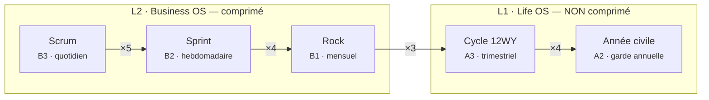
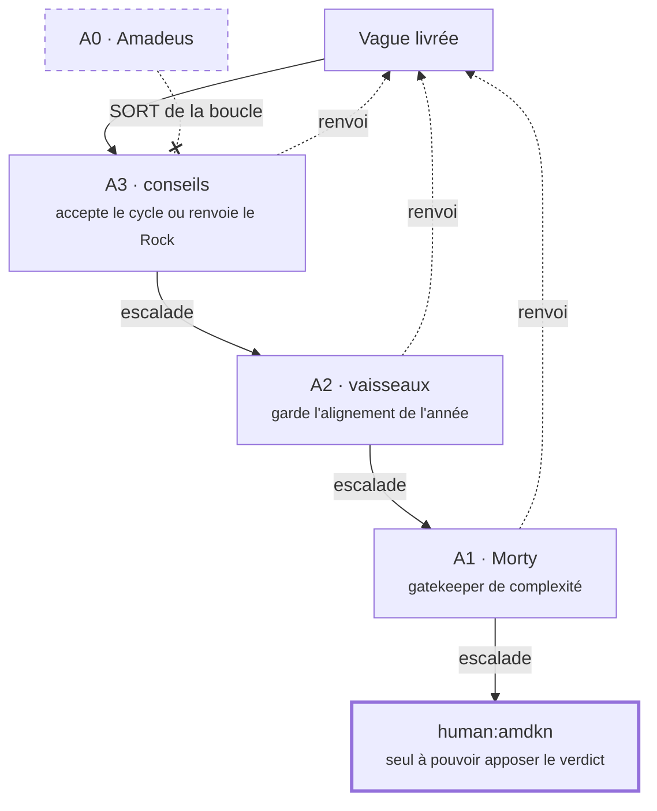
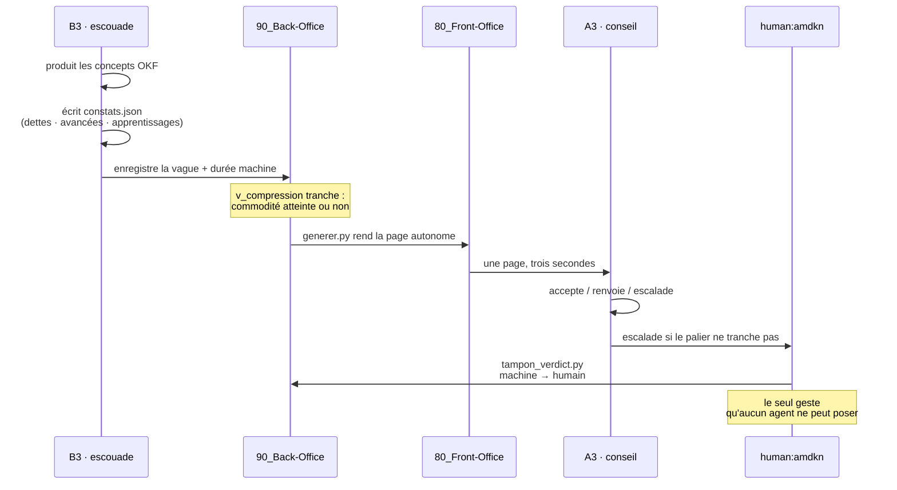

# La cadence et l'escalade, en diagrammes

Ces trois schémas sont la **même vérité que `schema/01_cadence.sql`**, sous
une forme qui se lit d'un coup d'œil. S'ils divergent du SQL, c'est le SQL
qui fait foi — lui seul peut refuser une donnée.

## 1. L'emboîtement — de la plus petite unité à l'année

La vague de Scrum est la seule unité réelle. Tout le reste est un agrégat,
et chaque agrégat porte sa règle de compte.

**La frontière entre les deux sous-graphes est la frontière de compression.**
Business OS accélère ; Life OS garde le temps réel, délibérément, pour que
l'arbitrage humain reste observable.

## 2. L'escalade de revue — et la sortie d'A0

A0 n'a **aucune arête entrante**. Sa sortie de la boucle n'est pas une
consigne écrite en marge : c'est la forme du graphe. La table
`palier_revue` du SQL le fait respecter de la même façon — A0 n'y figure pas.

## 3. Le flux d'une vague, de la production au verdict

## Ce que ces schémas ne disent pas

Ils décrivent la cadence **cible**. Ils ne disent pas où l'on en est.

À la date du 2026-08-20 : **37 concepts sur 424 portent un verdict humain**,
et aucune vague n'a encore été enregistrée dans la base. Les diagrammes
décrivent une machine dont une seule pièce tourne.
